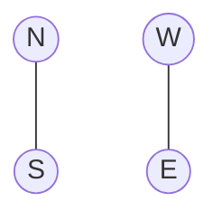

0533CH14



# Finding Directions ...

[An illustration of a Siberian Crane is shown next to a speech bubble.]

> I visited the Bharatpur Bird Sanctuary in Rajasthan and saw an amazing bird called the Siberian Crane!

[An illustration of a boy in an orange shirt.]

> Wow! Do you know that these birds fly all the way from Siberia, a very cold place, to India?

[An illustration of a girl in a green shirt.]

> I wonder how they find their path.

[An illustration of a boy in a white shirt.]

> Human beings also keep track of directions. One of the ways we figure out directions is by facing the rising Sun. Let’s try!

### Four Little Chicks

[An illustration shows four little chicks flying and then resting in a nest with their mother.]

“Four Little Chicks of a bird set out to fly,
Spreading their wings they all flew high.
They flew away from East to West,
flew North to South, without any rest.

As they flew and explored the land,
finally, they returned home, hand in hand.
With their mother, they had so much to share,
Our home is the best, beyond compare!”

[An illustration shows three children in a field with mountains in the background. One boy, Manu, is standing with his arms outstretched, facing the rising sun. Two other children are standing nearby watching him.]

Manu is facing the rising Sun.
That direction is ___________.
His left hand is pointing in the___________
direction.
His right hand is pointing in the
___________ direction.
which way is west?

> **Note for Teachers:** Help the learners in naming the four cardinal directions. Ask the children to figure out the directions by facing the rising sun. Also, discuss with them other ways of finding directions, such as using a compass. To spark curiosity, you may talk about or encourage the learners to find out how birds find their directions during migration.

# Bird Watching!

Children are at a bird-watching camp. Read the clues and colour the tents in the camp accordingly.

The image shows a landscape with a winding road on the left. To the west of the road is one tent. To the east of the road is a lake with ducks. There are three tents around the lake: one to the north, one very close to its western edge, and one to the south. The area is filled with green and yellow trees and several birds.

*   The tent to the west of the road is blue.
*   The tent closest to the lake is green.
*   The tent north of the green tent is purple.
*   The tent south of the lake is yellow.
*   Now, draw a tent to the east of the lake.

```
    N
    ↑
W ← ┼ → E
    ↓
    S
```

# Map of a Room

Write the directions of the following in relation to the girl.

The image shows a girl standing in the center of a room. Behind her (North) is a window. To her left (West) is a tall blue cupboard. To her right (East) is a bed with a purple blanket. In front of her (South) is a circular rug on the floor. To the south-east, next to the bed, is a small round bedside table with a glass and a bottle on it. A mirror and a small stool are also visible to the west.

<table>
  <tbody>
    <tr>
        <td>Window</td>
        <td>________________</td>
    </tr>
    <tr>
        <td>Bed</td>
        <td>________________</td>
    </tr>
    <tr>
        <td>Cupboard</td>
        <td>________________</td>
    </tr>
    <tr>
        <td>Bedside table</td>
        <td>________________</td>
    </tr>
  </tbody>
</table>

```
    N
    ↑
W ← ┼ → E
    ↓
    S
```

Make a drawing of your room and locate the direction in which different things have been placed in relation to you standing at the centre of the room. Make the direction arrow for your room.

Write the names of the things that are placed in the following directions.

East _________________________

West _________________________

North ________________________

South ________________________

## Zoo Trip

Children! Be ready at your nearby bus stop by 8:00 a.m. The school bus will take you to the Qutb Minar in Delhi. After that, we will visit the zoo by a metro train.

The street map shows the bus route with dotted lines. The bus will pick up children from Stop 1 and Stop 2 marked on the map.

Observe the map carefully and help the children board the bus.

## Bus Route

The bus will start from the parking area. It will go north and then it will take a right turn onto ___________ Road driving in the ___________ direction to reach Stop 1(S1).

To reach Stop 2(S2), it will turn _______ (right/left) onto ___________ Road driving in the ___________ direction.

The map below shows the neighborhood layout and the bus route:

**Compass:**
A compass rose indicates the directions: North (N) is up, South (S) is down, East (E) is right, and West (W) is left.

**Locations and Landmarks:**
- **Houses:** Lali's House, Rohan's House, Ravi's House (all on the west side); Tinku's House, Golu's House, Jaideep's House (central); Prem's House, Raju's House (east side).
- **Facilities:** Hospital (with Stop 1 - S1), Children's Park, Basketball Court, Shopping Centre (with Stop 2 - S2), Parking area.
- **Natural Features:** A pond is located near Jaideep's house.

**Roads:**
- **Hospital Road:** Runs east-west between the Hospital and the central houses.
- **Park Road:** Runs north-south along the eastern side of the central area.
- **Market Road:** Runs east-west between the Basketball Court and the Shopping Centre.

**Bus Route (Red dashed line with arrows):**
- The route begins at the **Parking** area, heads west, then turns north.
- It travels north along the western edge, passing Ravi's, Rohan's, and Lali's houses.
- It turns east onto **Hospital Road**, reaching **Stop 1 (S1)** at the Hospital.
- It continues east on Hospital Road, then turns south onto **Park Road**.
- It travels south along Park Road, then turns west onto **Market Road**, reaching **Stop 2 (S2)** at the Shopping Centre.

(a) Whose houses are situated to the east of Jaideep's house?____________
(b) Mark the route from Ravi's house to the children's park.
(c) Which stop is closer to Lali's house? __________________
(d) Golu is running late. Trace the route to help him reach the nearest bus stop.
(e) In which direction would Prem have to move to reach Stop 2?

> **Note for Teachers:** Encourage the learners to read the street map. Ask them to discuss the distances and directions on the map. Encourage the learners to ask questions by looking at the map.

# Delhi Metro Train Stations

Children will get off the bus at the Qutb Minar metro station. To reach the zoo, they need to get off the metro at the Supreme Court metro station.

Here is the metro map for your reference.

* Read the key to the symbols and identify them on the map.
* What do the different coloured lines represent?
* Mark the Qutb Minar station on the Yellow Line and the Supreme Court station on the Blue Line.

## Metro Map

The image shows a schematic map of the Delhi Metro network, illustrating various lines and stations. The map includes the Red, Yellow, Blue, Green, Violet, Pink, Magenta, and Airport Express lines. Major stations and interchange points are marked, such as Mundka, Ashok Park, Kashmere Gate, Dilshad Garden, Vaishali, Noida City Centre, Botanical Garden, Badarpur, Qutb Minar, Millenium City Centre Gurugram, Dwarka Sec 21, Airport, Delhi Aerocity, Janakpuri West, Rajouri Garden, Kriti Nagar, New Delhi Stn., Rajiv Chowk, Supreme Court, Central Secretariat, INA, Hauz Khas, Kalkaji Mandir, Mayur Vihar, and Yamuna Bank. The map also depicts the Yamuna River flowing through the city.

<table>
  <thead>
    <tr>
        <th colspan="6">KEYS</th>
    </tr>
  </thead>
  <tbody>
    <tr>
        <td>1.</td>
        <td>Red Line</td>
        <td>5.</td>
        <td>Green Line</td>
        <td>9. ○</td>
        <td>Metro Station</td>
    </tr>
    <tr>
        <td>2.</td>
        <td>Yellow Line</td>
        <td>6.</td>
        <td>Violet Line</td>
        <td>10. ⬭</td>
        <td>Interchange Line</td>
    </tr>
    <tr>
        <td>3.</td>
        <td>Blue Line</td>
        <td>7.</td>
        <td>Pink Line</td>
        <td colspan="2"></td>
    </tr>
    <tr>
        <td>4.</td>
        <td>Airport Express Line</td>
        <td>8.</td>
        <td>Magenta Line</td>
        <td colspan="2"></td>
    </tr>
  </tbody>
</table>

Study the map carefully and answer the questions that follow.

> **Note for Teachers:** Encourage the learners to observe the metro map carefully. Let them understand what different symbols mean on the map. Discuss with them that the coloured lines indicate different metro routes, making it easier for passengers to identify and navigate the routes. Let the learners work in groups to answer the questions.

(a) Look at the metro map and trace different routes from the Qutb Minar metro station to the Supreme Court metro station.

(b) Lali says, “We can take the Yellow Line and change the metro at Hauz Khas to take the Magenta Line.”
If the children follow Lali’s suggestion, at which station(s) do they need to change the metro line again to reach the Supreme Court metro station?

(c) Which route has the least number of stations between Qutb Minar and Supreme Court?

(d) Which metro route(s), do you think, is/are the best way to reach the zoo from Qutb Minar? __________________________

# Let Us Do

Make a map showing the different places in your school. Make a key for the symbols used in the map. Hide some objects in these places.

Mark the positions where things are hidden with red dots or flags. Now, challenge your friends to find the hidden things by reading the map.

A sample map and its key are given below.

The sample map is a hand-drawn plan of a school area. It is enclosed by a fence and a wall. A gate on the left side connects to an external road. Inside the area, there are three large rectangular buildings on the right and one smaller one at the bottom. A circular tank is located in the top right corner. Several garden areas with wavy lines and a tree are scattered throughout. Dotted paths connect different parts of the grounds. Five red circles, representing hidden objects, are marked at various locations: one near the gate, one on a path in the bottom-left, one near the top wall, one near a tree in the center-right, and one in the bottom-right corner.

<table>
  <thead>
    <tr>
        <th>Symbol Description (Left)</th>
        <th>Symbol Description (Right)</th>
    </tr>
  </thead>
  <tbody>
    <tr>
        <td>Gate (two small rectangles with diagonal lines)</td>
        <td>Wall (thick hatched line)</td>
    </tr>
    <tr>
        <td>Road (two parallel horizontal lines)</td>
        <td>Fence (line with vertical cross-hatches)</td>
    </tr>
    <tr>
        <td>Building (rectangle)</td>
        <td>Seat/Bench (small rectangle with legs)</td>
    </tr>
    <tr>
        <td>Tank (circular gear-like shape)</td>
        <td>Path (dotted area)</td>
    </tr>
    <tr>
        <td>Hidden Objects (red circle)</td>
        <td>Garden (wavy lines)</td>
    </tr>
    <tr>
        <td>-</td>
        <td>Tree (cloud-like shape)</td>
    </tr>
  </tbody>
</table>

To collect food, the ant can only crawl along the dotted lines on the grid. The arrows show the direction in which the ant can move.

<table>
  <tbody>
    <tr>
        <td>[colspan=2 rowspan=2] Compass<br/>N<br/>W + E<br/>S</td>
        <td></td>
        <td></td>
        <td></td>
        <td></td>
        <td></td>
        <td></td>
        <td></td>
        <td></td>
        <td colspan="2">Scale:<br/>1cm x 1cm</td>
    </tr>
    <tr>
        <td></td>
        <td></td>
        <td></td>
        <td></td>
        <td></td>
        <td>Sugar</td>
        <td></td>
        <td></td>
        <td></td>
        <td></td>
        <td></td>
    </tr>
    <tr>
        <td></td>
        <td></td>
        <td></td>
        <td></td>
        <td></td>
        <td>↑</td>
        <td></td>
        <td></td>
        <td></td>
        <td></td>
        <td></td>
    </tr>
    <tr>
        <td></td>
        <td></td>
        <td></td>
        <td></td>
        <td></td>
        <td>↑</td>
        <td></td>
        <td></td>
        <td></td>
        <td></td>
        <td></td>
    </tr>
    <tr>
        <td></td>
        <td></td>
        <td>←</td>
        <td>←</td>
        <td>Ant</td>
        <td>→</td>
        <td>→</td>
        <td>Laddoos</td>
        <td></td>
        <td></td>
        <td></td>
    </tr>
    <tr>
        <td></td>
        <td></td>
        <td>↓</td>
        <td></td>
        <td>↓</td>
        <td></td>
        <td></td>
        <td></td>
        <td></td>
        <td></td>
        <td></td>
    </tr>
    <tr>
        <td></td>
        <td></td>
        <td>↓</td>
        <td></td>
        <td>↓</td>
        <td></td>
        <td>Apple</td>
        <td></td>
        <td></td>
        <td></td>
        <td></td>
    </tr>
    <tr>
        <td></td>
        <td></td>
        <td>Bread</td>
        <td></td>
        <td>↓</td>
        <td></td>
        <td>↓</td>
        <td></td>
        <td></td>
        <td></td>
        <td></td>
    </tr>
    <tr>
        <td></td>
        <td></td>
        <td></td>
        <td></td>
        <td>↓</td>
        <td>→</td>
        <td>→</td>
        <td colspan="4"></td>
    </tr>
  </tbody>
</table>

Fill in the blanks below with the distances and the directions in which the ant must move from its starting position.

(a) To get to the laddoos, the ant has to crawl 2 cm towards the east.
(b) To get to the sugar, the ant has to crawl \_\_\_\_cm in the \_\_\_\_\_\_\_direction.
(c) To get to the bread, the ant has to crawl \_\_\_\_cm in the \_\_\_\_\_\_\_ direction; then \_\_\_\_cm in the \_\_\_\_\_\_\_direction.
(d) To get to the apple, the ant needs to crawl \_\_\_\_\_\_cm towards \_\_\_\_\_\_\_\_\_, and then \_\_\_\_cm towards \_\_\_\_\_\_\_\_\_, and finally \_\_\_cm towards\_\_\_\_\_\_.

Identify other routes to reach the point where apple is located. Which one is the shortest?

# Locating the Animals in the Zoological Park (Zoo)

```
    N
W < + > E
    S
```

Children observe a map of the zoo drawn on a grid. Each vertical line (column) and horizontal line (row) is marked with a number.

To reach the Panda, we will start from zero. Move one step horizontally east and reach the first column.

Move up (vertically) one step north and reach the first row.

The panda is where the first row and the first column meet.

### Zoo Map Grid
<table>
  <thead>
    <tr>
        <th>y \ x</th>
        <th>0</th>
        <th>1</th>
        <th>2</th>
        <th>3</th>
        <th>4</th>
        <th>5</th>
        <th>6</th>
        <th>7</th>
        <th>8</th>
        <th>9</th>
        <th>10</th>
        <th>11</th>
        <th>12</th>
    </tr>
  </thead>
  <tbody>
    <tr>
        <td>12</td>
        <td></td>
        <td></td>
        <td></td>
        <td></td>
        <td></td>
        <td></td>
        <td></td>
        <td></td>
        <td></td>
        <td></td>
        <td></td>
        <td></td>
        <td></td>
    </tr>
    <tr>
        <td>11</td>
        <td></td>
        <td>Parrot</td>
        <td></td>
        <td></td>
        <td></td>
        <td></td>
        <td></td>
        <td></td>
        <td></td>
        <td></td>
        <td></td>
        <td>Toucan</td>
        <td></td>
    </tr>
    <tr>
        <td>10</td>
        <td></td>
        <td></td>
        <td></td>
        <td>Flamingo</td>
        <td></td>
        <td></td>
        <td></td>
        <td></td>
        <td></td>
        <td></td>
        <td></td>
        <td></td>
        <td></td>
    </tr>
    <tr>
        <td>9</td>
        <td></td>
        <td></td>
        <td></td>
        <td></td>
        <td></td>
        <td></td>
        <td></td>
        <td></td>
        <td></td>
        <td>Giraffe</td>
        <td></td>
        <td>Zebra</td>
        <td></td>
    </tr>
    <tr>
        <td>8</td>
        <td></td>
        <td></td>
        <td></td>
        <td></td>
        <td></td>
        <td></td>
        <td></td>
        <td>Hippo</td>
        <td></td>
        <td></td>
        <td></td>
        <td></td>
        <td></td>
    </tr>
    <tr>
        <td>7</td>
        <td></td>
        <td></td>
        <td></td>
        <td></td>
        <td></td>
        <td></td>
        <td></td>
        <td></td>
        <td>Cheetah</td>
        <td></td>
        <td></td>
        <td></td>
        <td></td>
    </tr>
    <tr>
        <td>6</td>
        <td></td>
        <td></td>
        <td>Tiger</td>
        <td></td>
        <td></td>
        <td></td>
        <td></td>
        <td></td>
        <td></td>
        <td></td>
        <td></td>
        <td>Deer</td>
        <td></td>
    </tr>
    <tr>
        <td>5</td>
        <td></td>
        <td></td>
        <td></td>
        <td></td>
        <td></td>
        <td></td>
        <td></td>
        <td></td>
        <td></td>
        <td></td>
        <td></td>
        <td></td>
        <td></td>
    </tr>
    <tr>
        <td>4</td>
        <td></td>
        <td>Snake</td>
        <td></td>
        <td></td>
        <td></td>
        <td></td>
        <td></td>
        <td>Elephant</td>
        <td></td>
        <td></td>
        <td></td>
        <td></td>
        <td></td>
    </tr>
    <tr>
        <td>3</td>
        <td></td>
        <td></td>
        <td></td>
        <td>Lion</td>
        <td></td>
        <td></td>
        <td></td>
        <td></td>
        <td></td>
        <td></td>
        <td></td>
        <td>Monkey</td>
        <td></td>
    </tr>
    <tr>
        <td>2</td>
        <td></td>
        <td></td>
        <td></td>
        <td></td>
        <td></td>
        <td></td>
        <td></td>
        <td></td>
        <td></td>
        <td></td>
        <td></td>
        <td></td>
        <td></td>
    </tr>
    <tr>
        <td>1</td>
        <td></td>
        <td>Panda</td>
        <td></td>
        <td></td>
        <td>Tortoise</td>
        <td></td>
        <td></td>
        <td>ZOO</td>
        <td></td>
        <td></td>
        <td></td>
        <td>Crocodile</td>
        <td></td>
    </tr>
    <tr>
        <td>0</td>
        <td colspan="13"></td>
    </tr>
  </tbody>
</table>

> 💡 First move horizontally from 0 and then vertically.

We write the meeting point of the first row and the first column as (1,1).

To reach the tortoise, move \_\_\_\_\_\_\_\_ steps towards east and reach the \_\_\_\_\_\_\_\_\_ column.

Then move \_\_\_\_\_\_\_ step(s) \_\_\_\_\_\_\_ and reach the first \_\_\_\_\_\_\_.

The location of the tortoise is (4,1). What is at (1,4)?

Answer the following questions now—

1. Locate the animal at the following positions on the map.
   (a) (11,11) \_\_\_\_\_\_\_\_ (c) (6,4) \_\_\_\_\_\_\_\_ (e) (11,3) \_\_\_\_\_\_\_\_
   (b) (2,6) \_\_\_\_\_\_\_\_ (d) (3,10) \_\_\_\_\_\_\_\_ (f) (10,9) \_\_\_\_\_\_\_\_

2. Write the position of the following animals on the map.
   (a) Lion \_\_\_\_\_\_\_\_\_ (c) Tortoise \_\_\_\_\_\_\_\_ (e) Panda \_\_\_\_\_\_\_\_\_
   (b) Elephant \_\_\_\_ (d) Deer \_\_\_\_\_\_\_\_\_ (f) Crocodile \_\_\_\_\_\_

3. Place dots of different colours on the following positions.
   (a) (8,3) (Red) (c) (7,3) (Blue) (e) (8,6) (Black)
   (b) (2,9) (Green) (d) (3,8) (Orange) (f) (6, 6) (Pink)