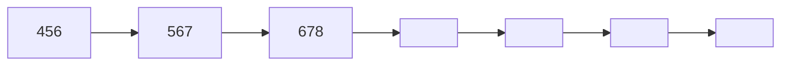
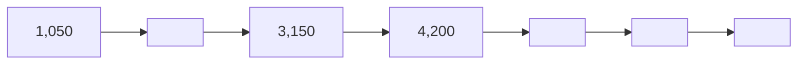
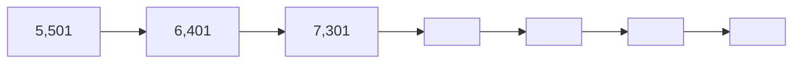
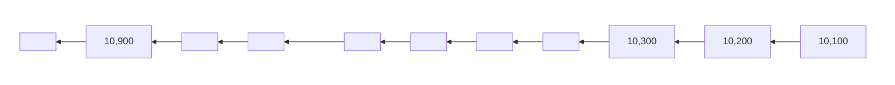
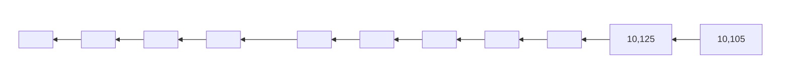
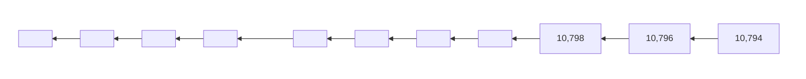
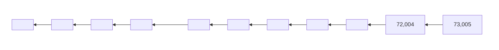
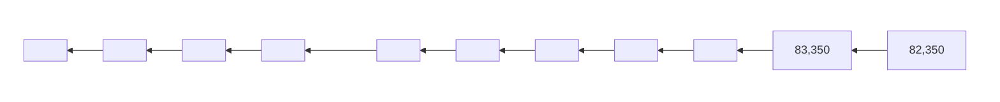
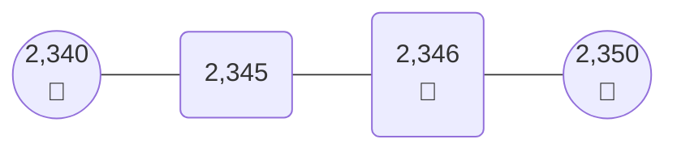

When was the last time you went on a long trip? Where did you go? How did you travel? What was the duration of your trip? How much distance did you cover? Ask the elders who went with you to help you answer these questions.

An illustration shows a rural scene with two bullock carts being pulled by oxen along a dirt path.

Another illustration shows a man riding a bicycle on a paved city street with buildings and other pedestrians in the background.

Human beings have always been interested in travelling. About a hundred years ago, there were far fewer vehicles than today. There were animal-drawn carts, cars, and trains. Long before this, thousands of years ago, people travelled long distances on foot or used animals to travel from one place to another. They also built boats and ships to travel across lakes, rivers, and seas. Boats were probably the first form of transport invented by humans, much before bullock carts! Do you know how many vehicles are currently there in your state?

An illustration shows a modern multi-lane highway packed with a dense traffic jam of cars, vans, and buses stretching into the distance.

**Reading and writing large numbers**

How do you write numbers to show several thousand objects?

Let us start with 1,000. What numbers do we get when we keep adding a thousand?

[1,000] [2,000] [ ] [ ] [ ] [ ] [ ] [ ] [9,000]

What number do we get when we add a thousand to 9,000? We get **ten thousand**. How do we write this number?

Look at the table below and notice the pattern of writing numbers. In the place value chart, we have added another column, **TTh**. It stands for ten thousand.

<table>
  <thead>
    <tr>
        <th></th>
        <th>×10</th>
        <th>×10</th>
        <th>×10</th>
        <th>×10</th>
        <th></th>
    </tr>
    <tr>
        <th></th>
        <th>TTh</th>
        <th>Th</th>
        <th>H</th>
        <th>T</th>
        <th>O</th>
    </tr>
  </thead>
  <tbody>
    <tr>
        <td></td>
        <td></td>
        <td></td>
        <td></td>
        <td></td>
        <td>1</td>
    </tr>
    <tr>
        <td></td>
        <td></td>
        <td></td>
        <td></td>
        <td>1</td>
        <td>0</td>
    </tr>
    <tr>
        <td></td>
        <td></td>
        <td></td>
        <td>1</td>
        <td>0</td>
        <td>0</td>
    </tr>
    <tr>
        <td></td>
        <td></td>
        <td>1</td>
        <td>0</td>
        <td>0</td>
        <td>0</td>
    </tr>
    <tr>
        <td></td>
        <td>1</td>
        <td>0</td>
        <td>0</td>
        <td>0</td>
        <td>0</td>
    </tr>
  </tbody>
</table>

*   1 unit square = 1
*   10 unit squares = 10 Ones = 1 Ten = 10
*   10x10 grid of unit squares = 10 Tens = 1 Hundred = 100
*   10x10x10 cube of unit squares = 10 Hundreds = 1 Thousand = 1,000

In the same way, 10 Thousands = Ten Thousand = 10,000

(1,000) (1,000) (1,000) (1,000) (1,000)
(1,000) (1,000) (1,000) (1,000) (1,000) $\rightarrow$ (10,000)

> *We use a comma to help us read large numbers easily*

Do you remember how we read and write numbers in the Indian place value system? We use the same ten digits 0–9 in different places to write larger numbers.

For example,

**1,380 = 1 Thousand + 3 Hundreds + 8 Tens + 0 Ones.**

*   (1,000)
*   (100) (100) (100)
*   (10) (10) (10) (10) (10) (10) (10) (10)

**9,123 = 9 Thousands + 1 Hundred + 2 Tens + 3 Ones.**

*   (1,000) (1,000) (1,000)
*   (1,000) (1,000) (1,000)
*   (1,000) (1,000) (1,000)
*   (100)
*   (10) (10)
*   (1) (1) (1)

Let us see how we write numbers beyond 10,000 and how we name them. We write them in the same way as numbers below 9,999. You can use the tokens given in the end of the book.

<table>
  <tbody>
    <tr>
        <td>Token(s)</td>
        <td>Number</td>
        <td>TTh</td>
        <td>Th</td>
        <td>H</td>
        <td>T</td>
        <td>O</td>
        <td>Number Name</td>
    </tr>
    <tr>
        <th>10,000, 1</th>
        <th>10,001</th>
        <th>1</th>
        <th>0</th>
        <th>0</th>
        <th>0</th>
        <th>1</th>
        <th>Ten thousand<br/>one</th>
    </tr>
    <tr>
        <th>10,000, 1, 1</th>
        <th>10,002</th>
        <th>1</th>
        <th>0</th>
        <th>0</th>
        <th>0</th>
        <th>2</th>
        <th>Ten thousand<br/>two</th>
    </tr>
    <tr>
        <th>10,000, 10</th>
        <th>10,010</th>
        <th>1</th>
        <th>0</th>
        <th>0</th>
        <th>1</th>
        <th>0</th>
        <th>Ten thousand<br/>ten</th>
    </tr>
    <tr>
        <th>10,000, 10, 10,<br/>1, 1, 1,<br/>1</th>
        <th>10,024</th>
        <th>1</th>
        <th>0</th>
        <th>0</th>
        <th>2</th>
        <th>4</th>
        <th>Ten thousand<br/>twenty-four</th>
    </tr>
    <tr>
        <th>10,000, 10, 10,<br/>10, 1, 1,<br/>1</th>
        <th></th>
        <th></th>
        <th></th>
        <th></th>
        <th></th>
        <th></th>
        <th>Ten thousand<br/>thirty-three</th>
    </tr>
    <tr>
        <th>10,000, 100, 100,<br/>100, 100, 10,<br/>10, 10, 10,<br/>10, 1, 1,<br/>1, 1, 1,<br/>1, 1, 1</th>
        <th>10,458</th>
        <th></th>
        <th></th>
        <th></th>
        <th></th>
        <th></th>
        <th>Ten thousand<br/>four hundred<br/>fifty-eight</th>
    </tr>
  </tbody>
</table>

<table>
  <thead>
    <tr>
        <th>Token(s)</th>
        <th>Number</th>
        <th>TTh</th>
        <th>Th</th>
        <th>H</th>
        <th>T</th>
        <th>O</th>
        <th>Number Name</th>
    </tr>
  </thead>
  <tbody>
    <tr>
        <td>10,000, 1,000, 100<br/>100, 10, 1<br/>1, 1, 1</td>
        <td></td>
        <td>1</td>
        <td>1</td>
        <td>2</td>
        <td>1</td>
        <td>4</td>
        <td></td>
    </tr>
    <tr>
        <td>10,000, 1,000, 1,000<br/>1,000, 100, 100<br/>100, 100, 100<br/>10, 10</td>
        <td>13,520</td>
        <td></td>
        <td></td>
        <td></td>
        <td></td>
        <td></td>
        <td>Thirteen thousand five hundred twenty</td>
    </tr>
    <tr>
        <td>10,000, 10,000</td>
        <td>20,000</td>
        <td></td>
        <td></td>
        <td></td>
        <td></td>
        <td></td>
        <td>Twenty thousand</td>
    </tr>
    <tr>
        <td>10,000, 10,000<br/>10,000, 10,000<br/>1,000, 1,000, 1,000<br/>1,000, 1,000, 100<br/>100, 100, 100<br/>100, 100, 100<br/>100, 10, 10<br/>10, 10, 10<br/>10, 1, 1<br/>1, 1, 1<br/>1, 1</td>
        <td>45,867</td>
        <td></td>
        <td></td>
        <td></td>
        <td></td>
        <td></td>
        <td>Forty-five thousand eight hundred sixty-seven</td>
    </tr>
  </tbody>
</table>

# Let Us Do

1. Fill in the blanks by continuing the pattern in each of the following sequences. Discuss the patterns in class.

(a)


(b)


(c)


(d)


(e)


(f)


(g)


(h)


(i)


2. Fill in the blanks appropriately. Use commas as required.

<table>
  <thead>
    <tr>
        <th>Number</th>
        <th>Number Name</th>
    </tr>
  </thead>
  <tbody>
    <tr>
        <td>8,045</td>
        <td>Eight thousand forty-five</td>
    </tr>
    <tr>
        <td>7,209</td>
        <td></td>
    </tr>
    <tr>
        <td>10,599</td>
        <td></td>
    </tr>
    <tr>
        <td></td>
        <td>Ten thousand seven hundred forty-three</td>
    </tr>
    <tr>
        <td>20,869</td>
        <td>Twenty thousand eight hundred sixty-nine</td>
    </tr>
    <tr>
        <td>13,579</td>
        <td></td>
    </tr>
    <tr>
        <td></td>
        <td>Ten thousand ten</td>
    </tr>
    <tr>
        <td></td>
        <td>Fifty-six thousand four hundred ninety-one</td>
    </tr>
    <tr>
        <td>45,045</td>
        <td></td>
    </tr>
    <tr>
        <td>39,593</td>
        <td></td>
    </tr>
    <tr>
        <td>50,005</td>
        <td></td>
    </tr>
    <tr>
        <td>26,050</td>
        <td></td>
    </tr>
    <tr>
        <td>81,200</td>
        <td></td>
    </tr>
    <tr>
        <td></td>
        <td>Ninety thousand nine</td>
    </tr>
    <tr>
        <td></td>
        <td>Twenty-three thousand two hundred thirty</td>
    </tr>
    <tr>
        <td></td>
        <td>Thirty-six thousand one</td>
    </tr>
  </tbody>
</table>

3. Arrange the numbers below in increasing order. You can use the number line below, if required.

`40,347` `34,407` `40,473` `34,740` `73,404` `74,430` `47,340` `18,926`

```mermaid
graph LR
    A[0] --- B[20,000]
    B --- C[40,000]
    C --- D[60,000]
    D --- E[80,000]
    
    style A fill:none,stroke:none
    style B fill:none,stroke:none
    style C fill:none,stroke:none
    style D fill:none,stroke:none
    style E fill:none,stroke:none

    subgraph NumberLine [" "]
    direction LR
    L1[|] --- L2[|] --- L3[|] --- L4[|] --- L5[|]
    end

    A -.-> L1
    B -.-> L2
    C -.-> L3
    D -.-> L4
    E -.-> L5
```

4.  A student said 9,990 is greater than 49,014 because 9 is greater than 4. Is the student correct? Why or why not?

Use the number line below to find the position of the numbers. Fill in the blanks.

---
![Number line with 10 tick marks and boxes below each]
<table>
  <tbody>
    <tr>
        <td>[5,000]</td>
        <td>[10,000]</td>
        <td>[ ]</td>
        <td>[ ]</td>
        <td>[ ]</td>
        <td>[ ]</td>
        <td>[ ]</td>
        <td>[ ]</td>
        <td>[ ]</td>
        <td>[50,000]</td>
    </tr>
  </tbody>
</table>
---

<table>
  <thead>
    <tr>
        <th>TTh</th>
        <th>Th</th>
        <th>H</th>
        <th>T</th>
        <th>O</th>
    </tr>
  </thead>
  <tbody>
    <tr>
        <td></td>
        <td>9</td>
        <td>9</td>
        <td>9</td>
        <td>0</td>
    </tr>
    <tr>
        <td>4</td>
        <td>9</td>
        <td>0</td>
        <td>1</td>
        <td>4</td>
    </tr>
  </tbody>
</table>
> You can use this place value chart to compare the numbers.

5.  Digit swap
    (a) In the number 1,478, interchanging the digits 7 and 4 gives 1,748. Now, interchange any two digits in the number 1,478 to make a number that is larger than 5,500
    (b) Interchange two digits of 10,593 to make a number
        i) Between 11,000 and 15,000.
        ii) More than 35,000.
    (c) Interchange two digits of 48,247 to make a number
        i) As small as possible.
        ii) As big as possible.

# Nearest Tens (10s), Hundreds (100s), and Thousands (1,000s)

A rabbit is hungry. Its location is given in the pictures below. Its food has been kept at two places. Help the rabbit to reach its food.

---
![Number line showing rabbit at 2,346 and food at 2,340 and 2,350]

---

The rabbit is at 2,346. Its food has been kept at its neighbouring tens. On which tens should the rabbit go to get its food, with the least number of steps.

2,350 is the nearest ten of 2,346. It will need 4 jumps to reach 2,350.

The rabbit is at 2,346. Its food has been kept at its neighbouring hundreds. Which of the two hundreds should the rabbit go to?

_______ is the nearest hundred of 2,346. It will need ______ jumps to reach ______.

<table>
  <tbody>
    <tr>
        <td>2,300</td>
        <td colspan="2">2,346</td>
        <td>2,400</td>
    </tr>
    <tr>
        <td>Carrot</td>
        <td>Rabbit</td>
        <td>2,350</td>
        <td>Carrot</td>
    </tr>
  </tbody>
</table>

The rabbit is at 2,346. Its food has been kept at its neighbouring thousands. Which number should the rabbit go to?

<table>
  <tbody>
    <tr>
        <td>2,000	2,346	2,500	3,000</td>
        <td></td>
    </tr>
    <tr>
        <td>Carrot	Rabbit</td>
        <td>Carrot</td>
    </tr>
  </tbody>
</table>

_________ is the nearest thousand of 2,346. It will need _______ jumps to reach ______.

Fill in the boxes appropriately.

<table>
  <thead>
    <tr>
        <th>Number</th>
        <th>Nearest Tens</th>
        <th>Nearest Hundreds</th>
        <th>Nearest Thousands</th>
    </tr>
  </thead>
  <tbody>
    <tr>
        <td>3,176</td>
        <td></td>
        <td></td>
        <td></td>
    </tr>
    <tr>
        <td>4,017</td>
        <td></td>
        <td></td>
        <td></td>
    </tr>
    <tr>
        <td>5,789</td>
        <td></td>
        <td></td>
        <td></td>
    </tr>
    <tr>
        <td>8,203</td>
        <td colspan="3"></td>
    </tr>
  </tbody>
</table>

# Let Us Think

1. Vijay rounded off a number to the nearest hundred. Suma rounded off the same number to the nearest thousand. Both got the same result. Circle the numbers they might have used.
   **7,126      7,835      7,030      6,999**

> **Note for Teachers:** Help the learners notice the placement of numbers in the neighbouring range of tens, hundreds, and thousands. Encourage them to use such images till they get comfortable identifying the nearest ten, hundred, and thousand.

2. Think and write two numbers that have the same—
   (a) Nearest ten.
   (b) Nearest hundred.
   (c) Nearest thousand.

   > For example, 19 and 21 have the same nearest ten, that is, 20.

3. Think and write the numbers that have the same—
   (a) Nearest ten and nearest hundred.
   (b) Nearest hundred and nearest thousand.
   (c) Nearest ten, hundred and thousand.

# Travelling, Now and Then

© NCERT
not to be republished

We learnt that people in the past travelled on foot, on animals, and used boats and sailing ships. The animals that have been used for travelling include bullocks, horses, donkeys, mules, and elephants. In hilly and snow-covered regions, yaks, dogs, and reindeers have been used, while camels have been used in deserts.

Now, people use bicycles, motorbikes, cars, buses, trains, ships, and aeroplanes to travel from one place to another. Submarines are used to go deep under water. Humans are also using spacecraft to travel to outer space.

<table>
    <tr>
        <td>[Illustration of a sailing ship]</td>
        <td>[Illustration of an aeroplane]</td>
        <td>[Illustration of an electric bicycle]</td>
    </tr>
    <tr>
        <td>[Illustration of a train]</td>
        <td>[Illustration of a bus]</td>
        <td>[Illustration of a dog sled pulled by huskies]</td>
    </tr>
    <tr>
        <td>[Illustration of a space shuttle]</td>
        <td>[Illustration of a submarine]</td>
        <td></td>
    </tr>
</table>

In an hour a person can generally travel—
(a) 3–5 km on foot.
(b) 10–15 km on horseback.
(c) 12–20 km by cycle.
(d) 40–60 km by motorbike.
(e) 40–160 km by train.
(f) 25–45 km by ship.
(g) 750–920 km by aircraft.
(h) minimum 28,000 km by spacecraft.

# Let Us Do

1. A cyclist can cover 15 km in one hour. How much distance will she cover in 4 hours, if she maintains the same speed?
2. A school has 461 girls and 439 boys. How many vehicles are needed for all of them to go on a trip using the following modes of travel?
   The numbers in the bracket indicates the number of people that can travel in one vehicle.
   (a) Bicycle (2)
   (b) Autorickshaw (3)
   (c) Car (4)
   (d) Big car (6)
   (e) Tempo traveller (10)
   (f) Boat (20)
   (g) Minibus (25)
   (h) Aeroplane (180)

# Finding Large Numbers Around Us

We saw that the distance (in kilometre) covered by different means of transport in an hour can range from a 1-digit number to a 5-digit number. Can we find other contexts around us that contain numbers in this range? Let us consider the situation below.

A book has around 200 pages, and each page has about 50 words. The book therefore has about 10,000 words in all.

Find something in the textbook whose count is a 4-digit number.

Now, let us try this with our school.
(a) Our school has ________ classrooms.
(b) There are ________ students in my class.
(c) Our classroom has ________ books in total.

> Usually, we measure distances in sea and air using nautical miles. For now, we will use $$1 \text{ km} = 1,000 \text{ m}$$. By now, you know different units of measuring length. We will study the units for measuring length, kilometre, in detail in a later chapter.

Find something in the classroom whose count is a—
(i) 4-digit number. (ii) 5-digit number.

List some quantities whose count is a 4-digit or a 5-digit number in the context of—
(i) A tree.
(ii) Your village/town/city, or any other place of your choice.

# Pastime Mathematics

Sanju and Mira are traveling on a train. To pass time, they challenge each other with games and puzzles.

1. Mira poses the **river crossing puzzle** to Sanju.

A boatman wants to cross a river in a boat. He has to take a lion, a sheep, and a bundle of grass with him. He can take one of them at a time. If the sheep and grass are left on the shore, the sheep will eat the grass. And, if the sheep and lion are left on the shore, the lion will eat the sheep.

An illustration shows a woman and two children, a girl and a boy, sitting on a blue bench inside a train carriage.

How can the boatman take the lion, sheep, and grass across the river?

Help him so that he can ferry the lion, sheep, and grass across the river safely, and in the minimum number of trips.

An illustration shows a boatman in a small wooden boat rowing across a river. On the left bank of the river, a bundle of grass, a lion, and a sheep are waiting. In the background, there are green hills and a blue sky with white clouds.

2. Sanju introduces a game called **pile of pebbles** to Mira.

There are two piles of pebbles. Each pile contains 7 pebbles. Each player can pick as many pebbles they want from either of the piles. The player who picks the last pebble wins.

Try this game with your friends. Now, how do you play so that you win?

To find a winning strategy, try playing with 1 pebble in each pile, two in each, three in each, and so on.

Two piles of grey, flat, rounded pebbles are shown, each containing 7 pebbles.

3. Now, it's Mira's turn. She gives a fun puzzle to Sanju with the following steps—

<table>
    <tr>
        <th>Step</th>
        <th>For example</th>
    </tr>
    <tr>
        <td>(a) Take any two different digits.</td>
        <td>$\longrightarrow$ 3 and 7</td>
    </tr>
    <tr>
        <td>(b) Make two 2-digit numbers using them.</td>
        <td>$\longrightarrow$ 37 and 73</td>
    </tr>
    <tr>
        <td>(c) Subtract the smaller number from the bigger number.</td>
        <td>$\longrightarrow$ 73 - 37 = 36</td>
    </tr>
</table>Now, use the two digits in the difference and repeat steps (b) and (c).

Continue this process until you get a 1-digit number. Even before everyone could finish, Mira exclaimed, "Mind you! No matter which two numbers you choose, you will get 9 in the end."

The whole process will look as shown below.

$$
\begin{array}{r}
73 \\
- 37 \\
\hline
36
\end{array}
\longrightarrow
\begin{array}{r}
63 \\
- 36 \\
\hline
27
\end{array}
\longrightarrow
\begin{array}{r}
72 \\
- 27 \\
\hline
45
\end{array}
\longrightarrow
\begin{array}{r}
54 \\
- 45 \\
\hline
9
\end{array}
$$

How did Mira know what the 1-digit number in the end would be?

Let us explore.

(1) Observe the differences you get in each step above. Do you notice anything in common?
(2) Try the puzzle using any other pair of digits. What is common to these differences? What do you get in the end?
(3) What digits can you choose so that you get a 1-digit number in the first step itself? Give some examples. Describe the pattern in the digits.

> **Note for Teachers:** Encourage the students to think logically and strategically while solving these puzzles. Such thinking underlies all of mathematics.

(4) Now, find different digits such that the difference between the numbers is 27.

(5) Mira found an interesting relationship between the two digits and the difference obtained. Can you see it in the table that Mira made?

<table>
  <thead>
    <tr>
        <th>Digits</th>
        <th>Differences in digits</th>
        <th>Difference in numbers<br/>formed by the digits</th>
    </tr>
  </thead>
  <tbody>
    <tr>
        <td>3, 7</td>
        <td>$$7 - 3 = 4$$</td>
        <td>$$73 - 37 = 36$$</td>
    </tr>
    <tr>
        <td>1, 9</td>
        <td>$$9 - 1 = 8$$</td>
        <td>$$91 - 19 = 72$$</td>
    </tr>
    <tr>
        <td>2, 8</td>
        <td>$$8 - 2 = 6$$</td>
        <td>$$82 - 28 = 54$$</td>
    </tr>
    <tr>
        <td>4, 5</td>
        <td>$$5 - 4 = 1$$</td>
        <td>$$54 - 45 = 9$$</td>
    </tr>
  </tbody>
</table>

Extend this table by choosing appropriate digits so that the resulting differences are 2, 3, 5, and 7 respectively.

What do the differences between the digits indicate?

List the numbers that give a 1-digit number in the third subtraction.

Identify pairs of digits that lead to the 1-digit number after the maximum possible number of subtractions. Compare your answers with your friends.

# Let Us Do

1. Write 5 numbers between the numbers 23,568 and 24,234.
   ___________, ___________, ___________, ___________, and ___________

2. Write 5 numbers that are more than 38,125 but less than 38,600.
   ___________, ___________, ___________, ___________, and ___________

3. Ravi’s car has been driven for 56,987 km till now. Sheetal’s car has been driven 67,543 km. Whose car has been driven more? ________________.

4. The following are the prices of different electric bikes. Arrange the prices in ascending (increasing) order.

   ₹90,000    ₹89,999    ₹94,983    ₹49,900    ₹93,743    ₹39,999

5. The following table shows the population of some towns. Arrange them in a descending (decreasing) order.


<table>
  <tbody>
    <tr>
      <td><b>Town</b></td>
      <td><b>Population</b></td>
    </tr>
    <tr>
      <td>Town 1</td>
      <td>65,232</td>
    </tr>
    <tr>
      <td>Town 2</td>
      <td>53,231</td>
    </tr>
    <tr>
      <td>Town 3</td>
      <td>56,380</td>
    </tr>
    <tr>
      <td>Town 4</td>
      <td>51,336</td>
    </tr>
    <tr>
      <td>Town 5</td>
      <td>45,858</td>
    </tr>
    <tr>
      <td>Town 6</td>
      <td>66,540</td>
    </tr>
  </tbody>
</table>

__________, __________, __________, __________, __________, __________,

6. Find numbers between 42,750 and 53,500 such that the ones, tens, and hundreds digits are all 0? __________.

7. Write the following numbers in the expanded form. One has been done for you.

(a) 783 = `700 + 80 + 3`

(b) 8,062 = __________.

(c) 9,980 = __________.

(d) 10,304 = __________.

(e) 23,004 = __________.

(f) 70,405 = __________.

8. Fill in the blanks with the correct answer. Share your thoughts in class.

(a) 983 = 90 Tens + `83` Ones

> 90 Tens is 900, so remaining 83 will be Ones

(b) 68 = __Tens + 18 Ones

(c) $607 = 4 \text{ Hundreds} + \_\_\_ \text{Ones}$

(d) $5,621 = 4 \text{ Thousand} + \_\_\_ \text{Hundreds} + 2 \text{ Tens} + \_\_\_ \text{Ones}$

(e) $7,069 = \_\_\_ \text{Thousand} + 20 \text{ Hundreds} + \_\_\_ \text{Ones}$

(f) $37,608 = \_\_\_ \text{Ten Thousand} + 17 \text{ Thousand} + \_\_\_ \text{Hundreds} + 8 \text{ Ones}$

(g) $43,001 = 3 \text{ Ten Thousand} + \_\_\_\_ \text{Thousand} + \_\_\_\_ \text{Hundreds} + 1 \text{ Ones}$

9. Fill in the blanks with the correct answers.

> [!NOTE]
> *3 Tens is 30, 90 Tens in 900, and 700 Tens in 7000*

(a) How many notes of ₹10 are there in ₹7,934? **793**

(b) How many notes of ₹100 are there in ₹7,934? \_\_\_\_\_\_\_\_\_\_\_\_\_\_\_\_\_

(c) How many thousands are there in 7,934? \_\_\_\_\_\_\_\_\_\_\_\_\_\_\_\_\_

(d) How many ₹500 notes are there in ₹7,934? \_\_\_\_\_\_\_\_\_\_\_\_\_\_\_\_\_
**(Hint: Observe the answer of (iii))**

(e) How many notes of ₹10 are there in ₹65,342? \_\_\_\_\_\_\_\_\_\_\_\_\_\_\_\_\_

(f) How many notes of ₹100 are there in ₹65,342? \_\_\_\_\_\_\_\_\_\_\_\_\_\_\_\_\_

(g) How many thousands are there in 65,342? \_\_\_\_\_\_\_\_\_\_\_\_\_\_\_\_\_

(h) How many ₹500 notes are there in ₹65,342? \_\_\_\_\_\_\_\_\_\_\_\_\_\_\_\_\_

# King’s Horses

Once upon a time, there was a king who was very fond of horses. He had 20 horses of the best breed. The horses were kept in the royal stable, and cared for by a caretaker.

One night, a thief stole one of the horses. Fearing punishment, the caretaker arranged the horses in the stable as shown in the picture here.

The next day, when the king came to check on the horses, the caretaker led him around the square stable. “Please count the number of horses along each side, your majesty,” he said.

<table>
  <thead>
    <tr>
        <th></th>
        <th colspan="4">The image shows a 4x4 grid representing a stable. The center 2x2 area is empty. The outer cells contain red dots representing horses.</th>
    </tr>
    <tr>
        <th>1 dot</th>
        <th>2 dots</th>
        <th>2 dots</th>
        <th>1 dot</th>
        <th></th>
    </tr>
  </thead>
  <tbody>
    <tr>
        <td>1 dot</td>
        <td>[colspan=2 rowspan=2] (Empty Center)</td>
        <td>2 dots</td>
        <td colspan="2"></td>
    </tr>
    <tr>
        <td>3 dots</td>
        <td>3 dots</td>
        <td colspan="3"></td>
    </tr>
    <tr>
        <td>1 dot</td>
        <td>2 dots</td>
        <td>3 dots</td>
        <td>1 dot</td>
        <td></td>
    </tr>
  </tbody>
</table>

The dots above show how the horses were arranged in the stable.

The king counted 5 horses along each side. "We have 5 horses along each side and there are 4 sides. So there are a total of 20 horses, your majesty," the caretaker explained.

Satisfied with the explanation, the king returned to his palace.

But wait, were there really 20 horses in the stable? Count the horses one by one and check! What was the mistake in the caretaker's explanation?

The following night, the thief stole another horse from the stable. Now, only 18 horses remained. The caretaker once again cleverly arranged the 18 horses, so that there were 5 horses on each side of the square stable. How do you think he was able to do it? Arrange the 18 horses in the stable with 5 on each side.

How many more horses can the thief steal before the king notices something is wrong? Try making the arrangements yourself.

<table>
  <thead>
    <tr>
        <th></th>
        <th></th>
        <th></th>
        <th></th>
    </tr>
  </thead>
  <tbody>
    <tr>
        <td></td>
        <td>[colspan=2 rowspan=2]</td>
        <td colspan="2"></td>
    </tr>
  </tbody>
</table>
<table>
  <thead>
    <tr>
        <th></th>
        <th></th>
        <th></th>
        <th></th>
    </tr>
  </thead>
  <tbody>
    <tr>
        <td></td>
        <td>[colspan=2 rowspan=2]</td>
        <td colspan="2"></td>
    </tr>
  </tbody>
</table>