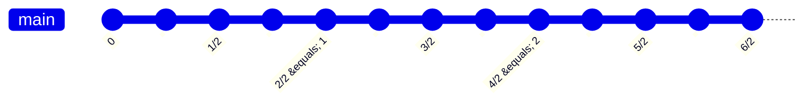

Tamanna is a student of Grade 5. She has two chocolates of different sizes. She says that $\frac{1}{3}$ of one of her chocolates is bigger than $\frac{1}{2}$ of the other chocolate. Is that correct? Explain why this is so.

<table>
  <tbody>
    <tr>
        <td rowspan="2"></td>
        <td rowspan="2"></td>
    </tr>
    <tr>
        <td rowspan="2"></td>
    </tr>
  </tbody>
</table>
Identify $\frac{1}{2}$ of the chocolate

<table>
  <tbody>
    <tr>
        <td rowspan="2"></td>
        <td rowspan="2"></td>
        <td rowspan="2"></td>
    </tr>
    <tr>
        <td rowspan="2"></td>
        <td rowspan="2"></td>
    </tr>
    <tr>
        <td rowspan="2"></td>
        <td rowspan="2"></td>
        <td rowspan="2"></td>
    </tr>
  </tbody>
</table>
Identify $\frac{1}{3}$ of the chocolate

When can we say that $\frac{1}{2}$ of something is greater than $\frac{1}{3}$ of something?

**To compare two fractions of two wholes, the wholes from which the fractions are derived must be the same.**

## Playing with a Grid

### A
<table>
</table>

### B
<table>
</table>

### C
<table>
</table>

*   Shade $\frac{1}{8}$ of Grid A in **red**.
*   Shade $\frac{1}{6}$ of Grid B in **blue**.
*   Shade $\frac{1}{12}$ of Grid C in **yellow**.
*   Do you see $\frac{1}{3}$ in any of the grids? Mark it.

# Is $$\frac{1}{3}$$ equal to $$\frac{2}{6}$$? Let us find out.

Look at the picture and identify the fractions.

<table>
  <thead>
    <tr>
        <th></th>
        <th>Shaded</th>
        <th>Shaded</th>
        <th>Unshaded</th>
        <th>Unshaded</th>
        <th>Unshaded</th>
        <th>Unshaded</th>
    </tr>
  </thead>
</table>

Are there two different ways to write the fraction represented by the shaded part? \_\_\_\_\_\_\_\_\_\_\_\_\_\_\_\_\_\_\_

Do you see that $$\frac{1}{3} = \frac{2}{6}$$? Yes. These are called '**equivalent fractions**'.

Let us see how equivalent fractions can be generated.

## Fun with Fraction Kit

Gurpreet is playing with his fraction kit (a kit is given at the end of the textbook). Do you remember how to make a whole with pieces of the same size? How many $$\frac{1}{5}$$ pieces will you need to make a whole?

He makes a whole using two different fraction pieces. The whole looks like the following.

<table>
  <tbody>
    <tr>
        <td colspan="2">$$\frac{1}{2}$$</td>
    </tr>
    <tr>
        <td>$$\frac{1}{4}$$</td>
        <td>$$\frac{1}{4}$$</td>
    </tr>
  </tbody>
</table>

One piece of $$\frac{1}{2}$$ and two pieces of $$\frac{1}{4}$$ make a whole.

What is the relation between $$\frac{1}{2}$$ and $$\frac{1}{4}$$? Discuss in class.

$$\frac{1}{2} = \frac{2}{4}$$ ($$\frac{1}{2}$$ is equivalent to $$\frac{2}{4}$$).

When a $$\frac{1}{2}$$ piece is broken into 2 equal parts, each part is a $$\frac{1}{4}$$ piece.

2 pieces of $$\frac{1}{4}$$ are equal to $$\frac{1}{2}$$.

What else is equivalent to $$\frac{1}{2}$$?

$$\frac{1}{2} = \frac{2}{4} = \_\_\_\_\_\_ = \_\_\_\_\_\_ = \_\_\_\_\_\_$$

1. In groups of 3 or 4, find different ways of making a whole with different fraction pieces from your kit. Write the equivalent fractions for the following that you may find in the process.
   (a) $\frac{1}{3} = \text{___} = \text{___} = \text{___}$
   (b) $\frac{1}{4} = \text{___} = \text{___} = \text{___}$
   (c) $\frac{1}{5} = \text{___} = \text{___} = \text{___}$
   (d) $\frac{1}{6} = \text{___} = \text{___} = \text{___}$

Do you see how to generate equivalent fractions for any given fraction? Discuss in class.

2. Find the following using your kit. You can also shade and check by shading the following. The first one is partially done for you.
   A. How many $\frac{1}{6}$s make $\frac{1}{3}$?

   <table>
  <tbody>
    <tr>
        <td>[shaded]</td>
        <td></td>
        <td></td>
    </tr>
    <tr>
        <td>[shaded]</td>
        <td colspan="2"></td>
    </tr>
  </tbody>
</table>
   *(Note: The table above represents a $2 \times 3$ grid where the first column is shaded green.)*

   > The shaded part is $\frac{1}{3}$. Identify $\frac{1}{6}$ in the same whole and find how many $\frac{1}{6}$s fit into $\frac{1}{3}$?

   B. How many $\frac{1}{8}$s make
      (a) $\frac{1}{4}$?
      (b) $\frac{1}{2}$?

   (a)
   <table>
</table>
   *(Note: The table above represents a $2 \times 4$ grid with blue borders.)*

   (b)
   <table>
</table>
   *(Note: The table above represents a $2 \times 4$ grid with pink borders.)*

   C. How many $\frac{1}{12}$s make
      (a) $\frac{1}{2}$
      (b) $\frac{1}{3}$
      (c) $\frac{1}{4}$
      (d) $\frac{1}{6}$?

   (a)
   <table>
</table>
   *(Note: The table above represents a $3 \times 4$ grid with orange borders.)*

   (b)
   <table>
</table>
   *(Note: The table above represents a $3 \times 4$ grid with purple borders.)*

   (c)
   <table>
</table>
   *(Note: The table above represents a $3 \times 4$ grid with green borders.)*

   (d)
   <table>
</table>
   *(Note: The table above represents a $3 \times 4$ grid with red borders.)*

3. Do as instructed using your fraction kit.

    * Make a whole using only $\frac{1}{6}$ and $\frac{1}{12}$ pieces.
    * Make a whole using $\frac{1}{12}$, $\frac{1}{4}$, and $\frac{1}{2}$ pieces.
    * Make a whole using any five pieces of the same size.
    * Make a whole using any seven pieces.

Play in a group with this kit and find other interesting combinations to make a whole. Write or draw your findings.

He observes an interesting pattern and says that $\frac{1}{3}$, $\frac{2}{6}$, $\frac{3}{9}$, and $\frac{4}{12}$ show the same shaded region.

$\frac{2}{6}$, $\frac{3}{9}$, and $\frac{4}{12}$ are all equivalent to $\frac{1}{3}$. We use the word **'equivalent'** to indicate the same part of a whole, with different names.

Divide the wholes given below into more equal parts and find fractions equivalent to $\frac{1}{3}$. Write them in the boxes below the images.

[Three identical squares are shown, each divided into three vertical columns with the middle column shaded yellow. Below each square is an empty blue rounded rectangular box.]

[ ] [ ] [ ]

Do you see any pattern in all the equivalent fractions that you found?

$\frac{1}{3} = \frac{2}{6} = \frac{3}{9} = \frac{4}{12} = \text{______} = \text{______} = \text{______} = \frac{[ ]}{24} = \frac{[ ]}{36}$

How do you know when a fraction is equivalent to another? Discuss in class.

The below pictures show $\frac{2}{5}$ of a whole. Find the different fractions that are equivalent to $\frac{2}{5}$ and write your fractions below each image.

[Four rectangles are shown, each divided into five horizontal rows. The second and fourth rows are shaded purple.]

1. [Rectangle divided into 5 horizontal rows, 2nd and 4th shaded.]
   $\frac{2}{5}$

2. [Rectangle divided into a 5x2 grid, 2nd and 4th rows shaded.]
   $\frac{4}{10}$

3. [Rectangle divided into a 5x3 grid, 2nd and 4th rows shaded.]
   $\frac{[ ]}{[ ]}$

4. [Rectangle divided into a 5x4 grid, 2nd and 4th rows shaded.]
   $\frac{[ ]}{[ ]}$

$\frac{2}{5} = \frac{4}{10} = \text{______} = \text{______} = \text{______} = \frac{[ ]}{50} = \frac{[ ]}{100}$

1. Fill in the blanks with equivalent fractions. There may be more than one answer.
   (a) $\frac{1}{7} = \text{\_\_\_\_\_\_}$ (b) $\frac{2}{3} = \text{\_\_\_\_\_\_}$
   (c) $\frac{3}{4} = \text{\_\_\_\_\_\_}$ (d) $\frac{3}{5} = \text{\_\_\_\_\_\_}$

2. Put a tick ($\checkmark$) against the fractions that are equivalent.
   (a) $\frac{2}{3}$ and $\frac{3}{4}$ (b) $\frac{3}{5}$ and $\frac{6}{10}$
   (c) $\frac{4}{12}$ and $\frac{2}{6}$ (d) $\frac{6}{9}$ and $\frac{1}{3}$

3. Fill in the boxes such that the fractions become equivalent.
   (a) $\frac{2}{5} = \frac{[ ]}{10}$ (b) $\frac{3}{4} = \frac{[ ]}{16}$
   (c) $\frac{4}{7} = \frac{8}{[ ]}$ (d) $\frac{5}{9} = \frac{25}{[ ]}$

# Comparing Fractions—Same Denominator

Sevi and Shami divided a piece of *chikki* between themselves. Sevi ate $\frac{1}{3}$ and Shami ate the rest, that is, $\frac{2}{3}$. Who ate more?

> 2 pieces of $\frac{1}{3}$ are more than 1 piece of $\frac{1}{3}$. So, Shami ate more.
> $$\frac{2}{3} > \frac{1}{3}$$

The illustration shows a rectangular piece of *chikki* (peanut brittle) divided into three equal horizontal sections. A girl and a boy are shown next to the *chikki*, with the boy pointing towards it.

## Let Us Do

1. Compare the fractions given below using < and > signs.

<table>
  <tbody>
    <tr>
        <td>(a) $\frac{1}{4}$ ______ $\frac{3}{4}$</td>
        <td>(d) $\frac{7}{8}$ ______ $\frac{3}{8}$</td>
    </tr>
    <tr>
        <td>(b) $\frac{3}{5}$ ______ $\frac{4}{5}$</td>
        <td>(e) $\frac{5}{10}$ ______ $\frac{6}{10}$</td>
    </tr>
    <tr>
        <td>(c) $\frac{5}{7}$ ______ $\frac{2}{7}$</td>
        <td>(f) $\frac{2}{6}$ ______ $\frac{1}{6}$</td>
    </tr>
  </tbody>
</table>

## Comparing Fractions—Same Numerator

*   **Sevi:** "I ate $\frac{4}{6}$ paratha yesterday evening."
*   **Shami:** "I ate $\frac{4}{5}$ paratha yesterday evening."

Between Sevi and Shami, can you tell who ate more? Use your fraction kit to find the answer.

Do the following pictures help you reason? Share your thoughts in the class.

The image shows two parathas:
*   One paratha is divided into 5 equal pieces, each labeled $\frac{1}{5}$.
*   The other paratha is divided into 6 equal pieces, each labeled $\frac{1}{6}$.

> $\frac{1}{6}$ piece is smaller than $\frac{1}{5}$ piece. Therefore, $\frac{4}{6} < \frac{4}{5}$.

## Let Us Do

1. Compare the following fractions using < and > signs.

<table>
  <tbody>
    <tr>
        <td>(a) $\frac{3}{8}$ ______ $\frac{3}{7}$</td>
        <td>(b) $\frac{4}{9}$ ______ $\frac{4}{10}$</td>
    </tr>
    <tr>
        <td>(c) $\frac{2}{7}$ ______ $\frac{2}{5}$</td>
        <td>(d) $\frac{5}{7}$ ______ $\frac{5}{6}$</td>
    </tr>
    <tr>
        <td>(e) $\frac{6}{9}$ ______ $\frac{6}{10}$</td>
        <td>(f) $\frac{7}{9}$ ______ $\frac{7}{11}$</td>
    </tr>
  </tbody>
</table>

Raman’s father makes nice soft parathas. He cuts the parathas either into halves (2 equal parts) or fourths (4 equal parts) before serving them. He asks his children (Raman and Radhika) each day to find out the number of parathas he made.

*Maa* took 5 pieces of $\frac{1}{2}$ paratha. How many parathas did she eat?

The image shows five half-parathas grouped to represent whole units:
- Two halves are grouped together and labeled "1 paratha".
- Another two halves are grouped together and labeled "1 paratha".
- One single half is labeled "$\frac{1}{2}$ paratha".
An illustration shows a man rolling out dough on a board next to a bowl of flour.

---

> $$\frac{1}{2} + \frac{1}{2} + \frac{1}{2} + \frac{1}{2} + \frac{1}{2}$$
> (The first two halves are grouped as 1, and the next two halves are grouped as 1)
>
> 5 pieces of $\frac{1}{2}$ paratha = $$\frac{5}{2}$$ parathas
> = $$2 + \frac{1}{2}$$ parathas
> = $$2\frac{1}{2}$$ parathas

> We can also show the same on a number line. Divide the distance between 0 and 1 in two equal parts. Each part is $$\frac{1}{2}$$. 2 halves make 1. Placing 5 halves next to each other takes us to $$\frac{5}{2}$$ or $$2\frac{1}{2}$$.

---

**Number line showing 0 to 1:**
A number line with points marked at 0, $$\frac{1}{2}$$, and $$\frac{2}{2} = 1$$. Two arrows above the line indicate two steps of $$\frac{1}{2}$$ each.

**Number line showing 0 to $\frac{5}{2}$:**
A number line with points marked at:
0, $$\frac{1}{2}$$, $$\frac{2}{2} = 1$$, $$\frac{3}{2}$$, $$\frac{4}{2} = 2$$, and $$\frac{5}{2}$$.

Raman’s sister Radhika took 6 pieces of $\frac{1}{2}$ paratha. How many parathas did she eat?

$(\frac{1}{2} + \frac{1}{2}) + (\frac{1}{2} + \frac{1}{2}) + (\frac{1}{2} + \frac{1}{2}) = \frac{6}{2}$ parathas = 3 parathas.
$\quad 1 \quad \quad + \quad \quad 1 \quad \quad + \quad \quad 1$

*Dadiji* had 7 pieces of $\frac{1}{2}$ paratha. How many parathas did she eat? Find out.

<table>
    <tr>
        <td>&lt;br/&gt;&lt;br/&gt;&lt;br/&gt;&lt;br/&gt;&lt;br/&gt;&lt;br/&gt;</td>
    </tr>
</table>**Try This:**

If the length of an ant is $\frac{1}{4}$ cm—then what is the total length of 16 such ants walking in a line? Use the number line given below.

Raman ate 6 pieces of $\frac{1}{2}$ paratha, *Dadaji* ate 7 pieces of $\frac{1}{2}$ paratha and *Baba* ate 5 pieces of $\frac{1}{2}$ paratha. How many parathas did each of them eat?

Use the number line to find the answer.

Quantity of Raman’s paratha
<table>
    <tr>
        <td>+</td>
        <td>+</td>
        <td>+</td>
        <td>+</td>
        <td>+</td>
        <td>+</td>
        <td>+</td>
        <td>+</td>
        <td>+</td>
    </tr>
    <tr>
        <td>0</td>
        <td></td>
        <td></td>
        <td></td>
        <td>1</td>
        <td></td>
        <td></td>
        <td></td>
        <td></td>
    </tr>
</table>Quantity of *Dadaji’s* paratha
<table>
    <tr>
        <td>+</td>
        <td>+</td>
        <td>+</td>
        <td>+</td>
        <td>+</td>
        <td>+</td>
        <td>+</td>
        <td>+</td>
        <td>+</td>
    </tr>
    <tr>
        <td>0</td>
        <td></td>
        <td></td>
        <td></td>
        <td>1</td>
        <td></td>
        <td></td>
        <td></td>
        <td></td>
    </tr>
</table>Quantity of Baba’s paratha
<table>
    <tr>
        <td>+</td>
        <td>+</td>
        <td>+</td>
        <td>+</td>
        <td>+</td>
        <td>+</td>
        <td>+</td>
        <td>+</td>
        <td>+</td>
    </tr>
    <tr>
        <td>0</td>
        <td></td>
        <td></td>
        <td></td>
        <td>1</td>
        <td></td>
        <td></td>
        <td></td>
        <td></td>
    </tr>
</table>

How many parathas were made on this day? Find out.

[Empty rectangular box]

Another day, Raman’s father cut all the parathas in $\frac{1}{4}$. Dadaji took 9 pieces of $\frac{1}{4}$ paratha. How many parathas did he eat?

The image shows two whole parathas, each divided into four equal quarters, and one additional quarter of a paratha.
- Under the first whole paratha is a bracket labeled "1 paratha".
- Under the second whole paratha is a bracket labeled "1 paratha".
- Under the single quarter is a bracket labeled "$\frac{1}{4}$ paratha".

The calculation is shown as:
$$\underbrace{\frac{1}{4} + \frac{1}{4} + \frac{1}{4} + \frac{1}{4}}_{1} + \underbrace{\frac{1}{4} + \frac{1}{4} + \frac{1}{4} + \frac{1}{4}}_{1} + \frac{1}{4} = \frac{9}{4} \text{ parathas} =$$
$$2 + \frac{1}{4} \text{ parathas}$$
$$= 2\frac{1}{4} \text{ parathas}$$

The following diagram shows a number line from 0 to 1 divided into four equal parts:
<table>
  <thead>
    <tr>
        <th>0	$\frac{1}{4}$	$\frac{2}{4}$	$\frac{3}{4}$	$\frac{4}{4}=1$</th>
        <th colspan="4"></th>
    </tr>
  </thead>
  <tbody>
    <tr>
        <td>|</td>
        <td></td>
        <td></td>
        <td></td>
        <td></td>
    </tr>
  </tbody>
</table>
(Above the line, four arrows indicate the four $\frac{1}{4}$ steps from 0 to 1.)

> We can also show the same on a number line. Divide the distance between 0 and 1 into four equal parts. Each part is $\frac{1}{4}$. 4 one-fourths make 1. Placing 9 one-fourths next to each other takes us to $\frac{9}{4}$ or $2\frac{1}{4}$.

The following diagram shows a longer number line representing the total amount:
<table>
  <thead>
    <tr>
        <th>0	$\frac{1}{4}$	$\frac{2}{4}$	$\frac{3}{4}$	$\frac{4}{4}=1$	$\frac{5}{4}$	$\frac{6}{4}$	$\frac{7}{4}$	$\frac{8}{4}=2$	$\frac{9}{4}$</th>
        <th colspan="9"></th>
    </tr>
  </thead>
  <tbody>
    <tr>
        <td>|</td>
        <td></td>
        <td></td>
        <td></td>
        <td></td>
        <td></td>
        <td></td>
        <td></td>
        <td></td>
        <td></td>
    </tr>
  </tbody>
</table>

Raman ate 7 pieces of $\frac{1}{4}$, Radhika ate 6 pieces of $\frac{1}{4}$, *Maa* ate 8 pieces of $\frac{1}{4}$, *Dadiji* ate 10 pieces of $\frac{1}{4}$, and *Baba* ate 12 pieces of $\frac{1}{4}$ paratha. Use a number line to find out how many parathas were eaten by each of them.

Quantity of Raman’s paratha
+—————+—————
0     1
Quantity of Radhika’s paratha
+—————+—————
0     1
Quantity of Maa’s paratha
+—————+—————
0     1
Quantity of Dadiji’s paratha
+—————+—————
0     1
Quantity of Baba’s paratha
+—————+—————
0     1

How many parathas were made on this day? Find out.

Raman’s family of 6 members ordered 2 pizzas and cut each pizza into 3 equal slices so that each family member had one slice. *Dadiji* and *Dadaji* gave their slices to Raman, *Maa*, and *Baba* gave theirs to Radhika. How much pizza do each of them have after this?

The image shows a single slice of pizza, representing $\frac{1}{3}$ of a whole pizza.
**Raman’s slice**

The image shows a whole pizza divided into three equal slices, representing $\frac{3}{3}$ or 1 whole pizza.
**Raman’s total share**

> $$\frac{1}{3} + \frac{1}{3} + \frac{1}{3} = \frac{3}{3} = 1$$

Raman’s total share—whole pizza

<table>
  <tbody>
    <tr>
        <td>0	1/3	2/3	3/3 = 1</td>
        <td colspan="3"></td>
    </tr>
    <tr>
        <td>|</td>
        <td></td>
        <td></td>
        <td></td>
    </tr>
  </tbody>
</table>
*(The number line above shows three consecutive jumps of $\frac{1}{3}$ starting from 0 to reach 1.)*

Raman could eat only 2 slices of pizza. So, he gave 1 to Radhika. How much pizza does Radhika have now?

[Image: A single slice of pizza representing $\frac{1}{3}$ of a whole.]
Radhika's slice

[Image: A whole pizza divided into three equal slices, plus one additional slice, representing a total of $\frac{4}{3}$ or $1\frac{1}{3}$ pizzas.]
Radhika's total share

$$\underbrace{\frac{1}{3} + \frac{1}{3} + \frac{1}{3}}_{1} + \frac{1}{3} = \frac{4}{3} = 1 + \frac{1}{3} = 1\frac{1}{3}$$

[Image: A number line with a horizontal axis. Points are marked and labeled at $0, \frac{1}{3}, \frac{2}{3}, \frac{3}{3}=1, \text{ and } \frac{4}{3}$. Three horizontal arrows above the line start at 0 and end at $\frac{1}{3}$, $\frac{2}{3}$, and $\frac{3}{3}$ respectively.]

# Let Us Do

1. Use parathas and number lines to show the following fractions in your notebook.
   (a) $\frac{2}{3}$ and $\frac{5}{3}$
   (b) $\frac{3}{4}$ and $\frac{5}{4}$
   (c) $\frac{4}{8}$ and $\frac{9}{8}$

2. Circle the fractions that are greater than one (whole). How do you know? Discuss your reasoning in the class.

<table>
  <tbody>
    <tr>
        <td>$\frac{7}{9}$</td>
        <td>$\frac{3}{9}$</td>
        <td>$\frac{7}{11}$</td>
        <td>$\frac{9}{4}$</td>
        <td>$\frac{4}{9}$</td>
        <td>$\frac{9}{4}$</td>
    </tr>
    <tr>
        <td>$\frac{2}{5}$</td>
        <td>$\frac{5}{7}$</td>
        <td>$\frac{5}{4}$</td>
        <td>$\frac{7}{3}$</td>
        <td>$\frac{13}{11}$</td>
        <td>$\frac{12}{5}$</td>
    </tr>
    <tr>
        <td>$\frac{2}{3}$</td>
        <td>$\frac{12}{8}$</td>
        <td colspan="4"></td>
    </tr>
  </tbody>
</table>

# Comparing Fractions With Reference to 1

Let us compare some more fractions. Between Sevi and Shami can you tell who ate less?

*   **Sevi:** "I ate $\frac{7}{8}$ paratha yesterday evening."
*   **Shami:** "I ate $\frac{8}{6}$ paratha yesterday evening."

<table>
  <thead>
    <tr>
        <th>Fraction</th>
        <th>Visual Representation</th>
    </tr>
  </thead>
  <tbody>
    <tr>
        <td>$\frac{7}{8}$</td>
        <td>A circle divided into 8 equal parts, with 7 parts shown. Each part is labeled $\frac{1}{8}$.</td>
    </tr>
    <tr>
        <td>$\frac{8}{6}$</td>
        <td>Two circles divided into 6 equal parts each. The first circle is complete (6 parts), and the second circle has 2 parts shown. Each part is labeled $\frac{1}{6}$.</td>
    </tr>
  </tbody>
</table>

> $\frac{7}{8}$ is less than 1 and $\frac{8}{6}$ is more than 1. So, $\frac{7}{8} < \frac{8}{6}$.

# Let Us Do

1. Compare the following fractions using 1 as a reference. Share your reasoning in the class.

<table>
  <tbody>
    <tr>
        <td>(a) $\frac{8}{7}$ ______ $\frac{9}{15}$</td>
        <td>(b) $\frac{13}{20}$ ______ $\frac{17}{15}$</td>
        <td>(c) $\frac{7}{6}$ ______ $\frac{8}{8}$</td>
    </tr>
    <tr>
        <td>(d) $\frac{6}{6}$ ______ $\frac{19}{12}$</td>
        <td>(e) $\frac{12}{9}$ ______ $\frac{4}{5}$</td>
        <td>(f) $\frac{15}{5}$ ______ $\frac{16}{4}$</td>
    </tr>
  </tbody>
</table>

# Comparing Fractions with Reference to $\frac{1}{2}$

<table>
  <thead>
    <tr>
        <th>Fraction</th>
        <th>Visual Representation</th>
        <th>Equality</th>
    </tr>
  </thead>
  <tbody>
    <tr>
        <td>$\frac{4}{8}$</td>
        <td>A circle divided into 8 equal parts, with 4 parts shaded. Each shaded part is labeled $\frac{1}{8}$.</td>
        <td>$\frac{4}{8} = \frac{1}{2}$</td>
    </tr>
    <tr>
        <td>$\frac{3}{6}$</td>
        <td>A circle divided into 6 equal parts, with 3 parts shaded. Each shaded part is labeled $\frac{1}{6}$.</td>
        <td>$\frac{3}{6} = \frac{1}{2}$</td>
    </tr>
  </tbody>
</table>

1. Circle the fractions below that are equal to $\frac{1}{2}$.

<table>
  <tbody>
    <tr>
        <td>$\frac{2}{4}$</td>
        <td colspan="2"></td>
        <td>$\frac{5}{7}$</td>
        <td>$\frac{7}{14}$</td>
        <td>$\frac{5}{10}$</td>
        <td>$\frac{8}{16}$</td>
    </tr>
    <tr>
        <td colspan="2"></td>
        <td>$\frac{3}{5}$</td>
        <td colspan="4"></td>
    </tr>
    <tr>
        <td>$\frac{5}{9}$</td>
        <td colspan="2"></td>
        <td>$\frac{6}{12}$</td>
        <td>$\frac{10}{20}$</td>
        <td>$\frac{6}{8}$</td>
        <td></td>
    </tr>
  </tbody>
</table>

2. Some fractions are written in the box below. Circle the fractions that are less than half. How do you know? Discuss your reasoning in the class.

<table>
  <tbody>
    <tr>
        <td>$\frac{3}{9}$</td>
        <td>$\frac{2}{4}$</td>
        <td>$\frac{12}{15}$</td>
        <td>$\frac{8}{15}$</td>
        <td>$\frac{11}{12}$</td>
        <td>$\frac{3}{15}$</td>
    </tr>
    <tr>
        <td>$\frac{4}{8}$</td>
        <td>$\frac{1}{3}$</td>
        <td>$\frac{7}{11}$</td>
        <td>$\frac{11}{16}$</td>
        <td>$\frac{15}{31}$</td>
        <td>$\frac{6}{18}$</td>
    </tr>
  </tbody>
</table>

Now let us compare fractions using $\frac{1}{2}$.

*   **Girl:** I ate $\frac{5}{8}$ paratha yesterday evening
*   **Boy:** I ate $\frac{3}{6}$ paratha yesterday evening

Who do you think ate more paratha?

The image shows two parathas:
- The first paratha is divided into 8 equal slices, with 5 slices highlighted. Each highlighted slice is labeled $\frac{1}{8}$.
- The second paratha is divided into 6 equal slices, with 3 slices highlighted. Each highlighted slice is labeled $\frac{1}{6}$.

> $\frac{3}{6}$ is half. But $\frac{5}{8}$ is more than $\frac{1}{2}$.
>
> So, $\frac{5}{8} > \frac{3}{6}$.

## Let Us Do

1. Compare the following fractions. Where possible, compare the fractions with $\frac{1}{2}$.

<table>
  <tbody>
    <tr>
        <td>$\frac{2}{9}$ and $\frac{4}{7}$</td>
        <td>$\frac{11}{14}$ and $\frac{7}{20}$</td>
        <td>$\frac{5}{7}$ and $\frac{3}{9}$</td>
        <td>$\frac{6}{7}$ and $\frac{4}{10}$</td>
    </tr>
    <tr>
        <td>$\frac{9}{17}$ and $\frac{3}{15}$</td>
        <td>$\frac{7}{12}$ and $\frac{3}{11}$</td>
        <td>$\frac{1}{3}$ and $\frac{5}{9}$</td>
        <td>$\frac{3}{9}$ and $\frac{4}{7}$</td>
    </tr>
  </tbody>
</table>

## Try This:

If the length of an ant is $\frac{1}{4}$ cm—then what is the total length of 16 such ants walking in a line? Use the number line given below.

A horizontal number line shows 16 ants walking in a line, head-to-tail. The line begins at 0. The end of the first ant is marked with a tick and labeled $\frac{1}{4}$ cm.