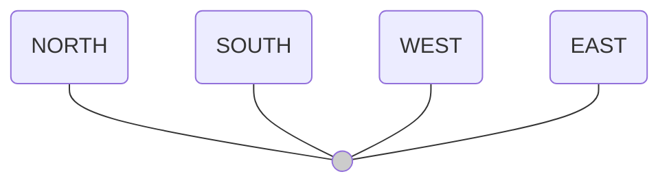

[A QR code is present at the top center of the page with the code 0533CH03 below it. To the right, there is an illustration of a boy standing at a desk, looking at a book.]

Can you recognise the child in the picture who has made a full turn? Who has made a half turn? How do you know? Discuss in class.

[The following illustrations show a teacher and four students labeled A, B, C, and D playing a game.]

**Illustration 1:**
The teacher says, "Let us play 'Statue'. Keep turning around ..."
All four students (A, B, C, and D) are standing and facing forward towards the viewer.

**Illustration 2:**
The teacher shouts, "STATUE!"
The students stop in their current positions:
- Student A is now facing away from the viewer (a half turn).
- Students B, C, and D are facing forward, back to their original orientation (a full turn).

Give examples of real-life situations where you observe turns.

[An illustration shows two children, Ashutosh and Sahana, standing on circular paths on the ground.]

Ashutosh and Sahana are making circles, each having one foot fixed and rotating at one spot on the ground.

Ashutosh made a complete circle by making a full turn. Sahana is making a half-moon shape with a half turn.

<table>
  <tbody>
    <tr>
        <td>The minute hand makes a full turn when it comes back to the initial position.</td>
        <td>[Two clock faces are shown. The first clock shows a blue minute hand at the 12 o'clock position and a red hand at the 5. The second clock shows the blue minute hand having traveled all the way around the circle and returning to the 12 o'clock position, representing one full turn.]</td>
    </tr>
  </tbody>
</table>

> **Note for Teachers:** Encourage the learners to play the "statue" game. Learners can be asked to rotate themselves around and stop as the teacher announces "statue". The learners can notice how much they have turned with respect to their original position.

A giant wheel makes a full turn when it comes back to the starting position E.

Reema takes two half turns in the same direction.
It is like a ________turn.

What happens if she takes 2 quarter turns in the same direction?
It is like a ________turn.

What happens if she takes 4 quarter turns in the same direction?
It is like a ____ turn.

The image shows a large Ferris wheel (giant wheel) with many passenger cars. A girl is standing to the right of it. The top of the wheel is labeled with a circled 'E' to indicate the starting position.

Write some of the everyday objects that involve turns. For example, taps, ________, ________, ________, ________, and ________.

What is the maximum possible turn in each of these cases? Check and tick.

<table>
  <thead>
    <tr>
        <th>Object</th>
        <th>Less than a $\frac{1}{4}$ turn</th>
        <th>$\frac{1}{4}$ turn</th>
        <th>More than a $\frac{1}{4}$ turn</th>
    </tr>
  </thead>
  <tbody>
    <tr>
        <td>Clothes clip</td>
        <td></td>
        <td></td>
        <td></td>
    </tr>
    <tr>
        <td>Door with hinge</td>
        <td></td>
        <td></td>
        <td></td>
    </tr>
    <tr>
        <td>Tongs</td>
        <td></td>
        <td></td>
        <td></td>
    </tr>
    <tr>
        <td>Scissors</td>
        <td></td>
        <td></td>
        <td></td>
    </tr>
    <tr>
        <td>File cover</td>
        <td colspan="3"></td>
    </tr>
  </tbody>
</table>

*   Do any of the above objects make a half turn? Write their names below—
    ................................................................................................

*   Do any of the above objects make a full turn? Write their names below—
    ................................................................................................

The image shows two hands holding two straws (one green and one yellow) joined at an angle by paper clips. There are also separate images of the straws and paper clips.

> Pragya joined a green and yellow straw with paper clips. She holds the green straw steady and turns the yellow straw around. Observe different turns of the yellow straw.

> I made a quarter ($\frac{1}{4}$) of a full turn, so it looks like a right angle.
>
> I made less than a quarter turn, so it looks like an acute angle.
>
> Now I made more than a quarter turn, but less than a half turn. That looks like an obtuse angle.
>
> I made two quarter turns. I wonder what it is called?

[The following diagrams are shown within the girl's speech bubble area:]
*   **A right angle**: Two sticks joined at one end forming a 90-degree angle.
*   **An acute angle**: Two sticks joined at one end forming an angle less than 90 degrees.
*   **An obtuse angle**: Two sticks joined at one end forming an angle greater than 90 degrees but less than 180 degrees.

[A diagram shows a stick being turned 180 degrees to form a straight line.]
> **Boy:** It is a straight angle.

Angles arise in situations that involve a turn.

## Let Us Do

(a) Making a paper fan. Take a rectangular paper, fold every 2 cm as shown in the picture. Paste ice cream sticks as shown below to create a paper fan.

1.  [A rectangular green paper with vertical dashed lines indicating folds every 2 cm.]
2.  [The paper being folded back and forth in an accordion style.]
3.  [The paper completely folded into a single narrow strip.]
4.  [Two ice cream sticks are being pasted to the outer sides of the folded paper. Red arrows point to the sticks with the label "Paste".]
5.  [The completed paper fan opened up.]

Use your paper fan to show different acute angles and obtuse angles.

[Three images of the paper fan opened to different widths, demonstrating various angles between the ice cream sticks.]

Let us look at the turns made by the paper fan, keeping one side fixed.

<table>
  <thead>
    <tr>
        <th>Full turn</th>
        <th>$$\frac{1}{2}$$ turn (straight angle)</th>
        <th>$$\frac{1}{4}$$ turn (right angle)</th>
        <th>Less than a $$\frac{1}{4}$$ turn (acute angle)</th>
        <th>Between a $$\frac{1}{4}$$ and $$\frac{1}{2}$$ turn (obtuse angle)</th>
    </tr>
  </thead>
  <tbody>
    <tr>
        <td>A paper fan fully opened into a complete circle.</td>
        <td>A paper fan opened halfway into a semi-circle.</td>
        <td>A paper fan opened to a quarter-circle, forming a right angle.</td>
        <td>A paper fan opened less than a quarter-circle, forming an acute angle.</td>
        <td>A paper fan opened more than a quarter-circle but less than a semi-circle, forming an obtuse angle.</td>
    </tr>
  </tbody>
</table>

Make an acute turn with the straws or fan. Continue to make another acute turn. Can the two acute turns together make another acute turn?

The following diagrams show turns within a circle:

*   **Diagram 1**: A circle with a shaded quadrant and a red arrow indicating a $$\frac{1}{4}$$ turn.
    > This shows a $$\frac{1}{4}$$ turn, or a right angle.
*   **Diagram 2**: A circle with a shaded semi-circle and a red arrow indicating a $$\frac{1}{2}$$ turn.
    > This shows a $$\frac{1}{2}$$ turn, or a straight angle.
*   **Diagram 3**: A circle with three-quarters shaded and a red arrow indicating a $$\frac{3}{4}$$ turn.
    > This shows a $$\frac{3}{4}$$ turn, which is more than a straight angle.

(b) You might have built houses using the hard covers of notebooks or cardboard pieces.

Look at the angles marked in the house. What angles are you able to see in this house?

Write your answers as right, acute or obtuse angle.

The image shows a boy and a girl building a structure with blocks and cardboard. Various angles are labeled with letters A through H.

<table>
  <tbody>
    <tr>
        <td>A: ______________</td>
        <td>B: ______________</td>
    </tr>
    <tr>
        <td>C: ______________</td>
        <td>D: ______________</td>
    </tr>
    <tr>
        <td>E: ______________</td>
        <td>F: ______________</td>
    </tr>
    <tr>
        <td>G: ______________</td>
        <td>H: ______________</td>
    </tr>
  </tbody>
</table>

(c) Make a 5-sided shape with 2 right angles, 2 obtuse angles, and 1 acute angle in your notebook.

(d) Look at the angle formation between the legs of these gymnasts. Identify whether the angles are acute, obtuse, right or straight.

<table>
  <thead>
    <tr>
        <th>Gymnast Pose</th>
        <th>Angle Type</th>
        <th>Angle Diagram</th>
    </tr>
  </thead>
  <tbody>
    <tr>
        <td>Gymnast with legs forming an acute angle</td>
        <td></td>
        <td>Diagram of an acute angle</td>
    </tr>
    <tr>
        <td>Gymnast with legs forming a right angle</td>
        <td></td>
        <td>Diagram of a right angle</td>
    </tr>
    <tr>
        <td>Gymnast with legs forming an obtuse angle</td>
        <td></td>
        <td>Diagram of an obtuse angle</td>
    </tr>
    <tr>
        <td>Gymnast with legs forming a wider obtuse angle</td>
        <td></td>
        <td>Diagram of a wider obtuse angle</td>
    </tr>
    <tr>
        <td>Gymnast performing a split, legs forming a straight angle</td>
        <td></td>
        <td>Diagram of a straight angle</td>
    </tr>
  </tbody>
</table>

# Angle Measuring Tool

Let us make our tool to measure turns.

(a) Cut out a circle from a tracing paper and fold it to make 8 equal parts. Attach a straw to the centre and mark the starting point as shown.

[A circular tool divided into 8 equal sectors by dashed lines. A straw is attached at the center, pointing horizontally to the right towards a label "Point (A)".]

(b) Now, try this.
* Show a $\frac{1}{8}$ turn of the straw.
* Show a $\frac{2}{8}$ turn. Show a $\frac{1}{4}$ turn. Show a $\frac{3}{8}$ turn.
* What angle have you made with a $\frac{2}{8}$ turn? A $\frac{1}{8}$ turn is half of a quarter turn.
* What angle have you made with a $\frac{4}{8}$ turn?
Continue turning by $\frac{5}{8}$, $\frac{6}{8}$, $\frac{7}{8}$, and $\frac{8}{8}$. Check when you have completed a $\frac{3}{4}$ turn and a full turn.
Now, cut out $\frac{1}{8}$ part and $\frac{2}{8}$ parts of the circle and paste them on a thicker paper or board. Use these as angle measuring tools.

# Let Us Think

1. In the following circles, the end points of $\frac{1}{2}$, $\frac{1}{4}$, and $\frac{1}{8}$ turns are shown. Draw arrows to show the starting points.

<table>
  <thead>
    <tr>
        <th>$\frac{1}{2}$ turn</th>
        <th>$\frac{1}{8}$ turn</th>
        <th>$\frac{1}{4}$ turn</th>
    </tr>
  </thead>
  <tbody>
    <tr>
        <td>Circle with a red arrow pointing South-East and a dashed green arc showing a clockwise half-turn.</td>
        <td>Circle with a red arrow pointing East and a dashed green arc showing a clockwise $\frac{1}{8}$ turn.</td>
        <td>Circle with a red arrow pointing North-West and a dashed green arc showing a clockwise $\frac{1}{4}$ turn.</td>
    </tr>
    <tr>
        <td>Circle with a red arrow pointing North-East and a dashed green arc showing a clockwise half-turn.</td>
        <td>Circle with a red arrow pointing South-East and a dashed green arc showing a clockwise $\frac{1}{8}$ turn.</td>
        <td>Circle with a red arrow pointing South and a dashed green arc showing a clockwise $\frac{1}{4}$ turn.</td>
    </tr>
  </tbody>
</table>

Now, cut out a circle from a tracing paper. First, fold the circle in half, and then fold it again into 3 equal parts. Attach a straw at the centre of the circle. Mark the starting point and show the turns equal to $\frac{1}{6}$, $\frac{2}{6}$, and so on until you complete a full circle.

Cut out $\frac{1}{6}$ part and $\frac{2}{6}$ part of the circle. Fold one of the $\frac{1}{6}$ parts into half.

Can you guess what turn of the straw will be equal to half of a $\frac{1}{6}$ turn? This is the same as a $\frac{1}{12}$ turn.

Paste these parts on a thicker paper or board and you can use them as angle measuring tools.

**Steps:**
- (i) A circle folded in half.
- (ii) The half-circle folded into three equal parts.
- (iii) A circle with dashed lines showing it divided into six equal parts.
- (iv) The circle cut into its six equal parts.
- (v) One of the $\frac{1}{6}$ parts being folded in half.

> **Note for Teachers:** Help the learners to make the angle measuring tools using tracing paper. Use these for measuring various angles. Let them mark the starting point. Also, help them fix a straw at the centre and measure the turns with respect to the starting point.

# Let Us Do

1. Guess the measures of each of the angles shown below. Then, check using your angle measuring tools. You may need to use a combination of measures. Also, state whether each of the angles is acute, right, or obtuse.

    [A light green dotted grid containing six different angles. Each angle has a white box next to it for recording the measurement.]

2. Guess the measure of the turns made by the arrow in each of the following cases. Verify with a combination of angle measuring tools.

<table>
  <tbody>
    <tr>
        <td>(a)</td>
        <td>[A circle divided into four colored quadrants: blue (top-right), red (top-left), yellow (bottom-left), and green (bottom-right). An arrow starts at the North position and turns clockwise to the South-East position.]</td>
        <td>$\frac{1}{4} + \frac{1}{8}$ turn or $\frac{3}{8}$ turn</td>
        <td>(c)</td>
        <td>[A circle divided into four colored quadrants. An arrow starts at the North position and turns clockwise to the North-East position.]</td>
        <td>[ ] turn</td>
    </tr>
    <tr>
        <td>(b)</td>
        <td>[A circle divided into four colored quadrants. An arrow starts at the North position and turns clockwise past the South position to the South-West position.]</td>
        <td>[ ] turn</td>
        <td>(d)</td>
        <td>[A circle divided into four colored quadrants. An arrow starts at the North position and turns clockwise past the South-West position to the North-East position.]</td>
        <td>[ ] turn</td>
    </tr>
  </tbody>
</table>

3. Measure each angle in the given shapes. Write the measure of the angles in terms of turns and describe whether they are acute, obtuse or right angles.

    (a)
    [Two intersecting line segments $A-B$ and $A'-B'$ crossing at point $C$. Angles are marked with blue arcs at vertices $A$ and $B'$.]

    (b)
    [A quadrilateral with vertices labeled $D, E, D', E'$. Angles at each vertex are marked with pink arcs.]

    (c)
    [A quadrilateral with vertices labeled $F, G, F', G'$. The angle at vertex $F'$ is indicated with a square symbol as a right angle. The angle at vertex $G$ is marked with a yellow arc, and the angle at vertex $F$ is marked with a blue arc.]

4. Draw angles for the given measures of turns using the given lines.

> Within a dashed box, several lines are provided as starting points for drawing angles:
> *   A vertical line with the label $\frac{1}{2}$ turn.
> *   A diagonal line sloping downwards from left to right with the label $\frac{1}{4}$ turn.
> *   A vertical line with the label $\frac{1}{8}$ turn.
> *   A horizontal line with the label $\frac{1}{4}$ turn.
> *   A diagonal line sloping upwards from left to right with the label $\frac{1}{12}$ turn.

5. Draw the angles formed by the following turns in your notebook.
   $\frac{1}{2}$ turn, $\frac{1}{4}$ turn, $\frac{2}{4}$ turn, $\frac{1}{6}$ turn, $\frac{4}{6}$ turn, $\frac{3}{12}$ turn, $\frac{1}{2} + \frac{1}{4}$ turn, and $\frac{1}{8} + \frac{1}{6}$ turn.

6. Guess the measure of turns the minute hand of a clock makes in each of the following cases. The initial position of the minute hand is given. Draw the final position of the minute hand on the clock face. Discuss your reasoning in class.

   (a) When the minute hand moves by 15 minutes, it has made a \_\_\_\_\_\_\_ turn of the circle.
       *(The accompanying clock face shows the minute hand pointing at 12.)*

   (b) When the minute hand moves by 30 minutes, it has made a \_\_\_\_\_\_\_ turn of the circle.
       *(The accompanying clock face shows the minute hand pointing at 12.)*

   (c) When the minute hand moves by 45 minutes, it has made a \_\_\_\_\_\_\_ turn of the circle.
       *(The accompanying clock face shows the minute hand pointing at 12.)*

   (d) When the minute hand has turned by $\frac{1}{12}$ of a full turn, it has moved by \_\_\_\_\_\_ minutes.
       *(The accompanying clock face shows the minute hand pointing at 1.)*

   (e) When the minute hand has turned a full-circle, it has moved by \_\_\_\_\_\_ minutes.
       *(The accompanying clock face shows the minute hand pointing at 12.)*

(f) When the minute hand has turned by $\frac{1}{6}$ of a full turn, it has moved by \_\_\_\_\_\_ minutes.
(The accompanying clock image shows the minute hand moving from 12 to 2.)

(g) When the minute hand has turned by $\frac{4}{12}$ of a full turn, it has moved by \_\_\_\_\_\_ minutes.
(The accompanying clock image shows the minute hand moving from 12 to 4.)

## Which direction?

In which direction do the hands of a clock move?

The direction in which the hands of the clock move is called clockwise movement. The opposite movement is called anti-clockwise movement.

The creatures below have made a quarter turn once. Tick the direction in which they have moved.

<table>
  <thead>
    <tr>
        <th>Creature Turn 1</th>
        <th>Creature Turn 2</th>
    </tr>
  </thead>
  <tbody>
    <tr>
        <td>A ladybug facing right turns to face downwards. (Clockwise/Anti-clockwise)</td>
        <td>A snail facing right turns to face upwards. (Clockwise/Anti-clockwise)</td>
    </tr>
    <tr>
        <td>A bee facing right turns to face upwards. (Clockwise/Anti-clockwise)</td>
        <td>An ant facing right turns to face downwards. (Clockwise/Anti-clockwise)</td>
    </tr>
  </tbody>
</table>

### Try these

Observe the direction of movement while opening a tap, unscrewing a lid or loosening a nut. Do they move clockwise or anti-clockwise?

## Fun with Turns

1. The children in a class are playing a game in which the teacher tells them the direction in which they should rotate. Complete the table by filling the direction the children will face on completing the given turns.

The starting direction is given in the table.

<table>
  <thead>
    <tr>
        <th>Starting Direction</th>
        <th>Turns</th>
        <th>Ending Direction</th>
    </tr>
  </thead>
  <tbody>
    <tr>
        <td>North</td>
        <td>Two right angles, clockwise</td>
        <td></td>
    </tr>
    <tr>
        <td>South</td>
        <td>Two right angles, anti-clockwise</td>
        <td></td>
    </tr>
    <tr>
        <td>East</td>
        <td>Four right angles, anti-clockwise</td>
        <td></td>
    </tr>
    <tr>
        <td>West</td>
        <td>Four right angles, clockwise</td>
        <td></td>
    </tr>
    <tr>
        <td>North</td>
        <td>5 right angles, clockwise</td>
        <td></td>
    </tr>
    <tr>
        <td>South</td>
        <td>3 right angles clockwise, $\frac{1}{2}$ right angle clockwise, $\frac{1}{2}$ right angle clockwise</td>
        <td></td>
    </tr>
    <tr>
        <td>West</td>
        <td>2 right angles clockwise, four $\frac{1}{2}$ right angles anti-clockwise</td>
        <td></td>
    </tr>
  </tbody>
</table>

2. Padma is facing the toy shop. What place will she face if she takes a half turn clockwise?

The illustration shows Padma standing in the center of four locations:
- **TOY DUKAN** (in front of her)
- **Ice Cream** cart (behind her)
- **BOOKSTORE** (to her left)
- **PARKING** area with an ENTRY sign and a security guard (to her right)

What other way can she turn to face the same place?