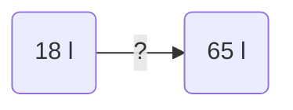
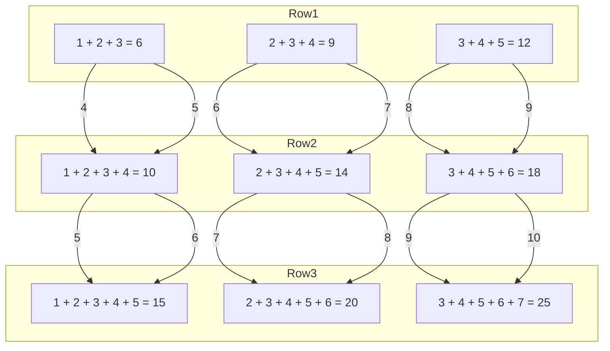
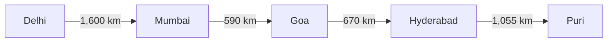
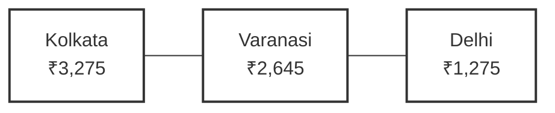
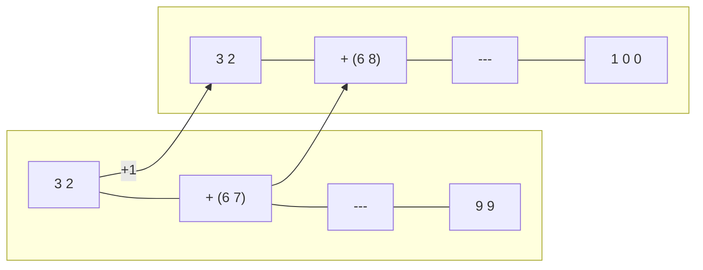
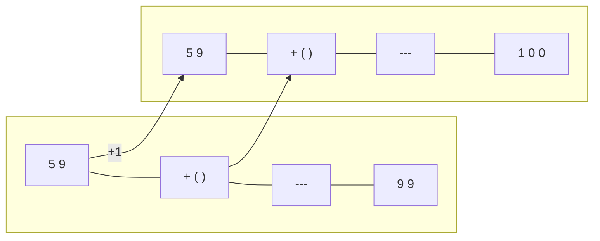

## Making Sums Equal

In each of the following, there are two groups of numbers. Look carefully at the numbers in each group and their sums. Interchange pairs of numbers between the two groups to make their sums equal. Try to do this using the least number of moves. You could write each number on a small piece of paper.

*Think what will happen to the sums if we interchange 2 and 5? Try interchanging other pairs of numbers and find the one that will make the sums equal.*

(a)
<table>
  <thead>
    <tr>
        <th>(a)</th>
        <th></th>
    </tr>
  </thead>
  <tbody>
    <tr>
        <td>1</td>
        <td>3</td>
    </tr>
    <tr>
        <td>2</td>
        <td>4</td>
    </tr>
    <tr>
        <td>7</td>
        <td>5</td>
    </tr>
    <tr>
        <td>+ 9</td>
        <td>+ 9</td>
    </tr>
    <tr>
        <td>---</td>
        <td>---</td>
    </tr>
    <tr>
        <td>19</td>
        <td>21</td>
    </tr>
  </tbody>
</table>
*(Note: An arrow in the original image indicates interchanging the number 2 from the first group with the number 5 from the second group.)*

(b)
<table>
  <thead>
    <tr>
        <th>(b)</th>
        <th></th>
    </tr>
  </thead>
  <tbody>
    <tr>
        <td>5</td>
        <td>9</td>
    </tr>
    <tr>
        <td>7</td>
        <td>11</td>
    </tr>
    <tr>
        <td>12</td>
        <td>13</td>
    </tr>
    <tr>
        <td>+ 15</td>
        <td>+ 14</td>
    </tr>
    <tr>
        <td>---</td>
        <td>---</td>
    </tr>
    <tr>
        <td>39</td>
        <td>47</td>
    </tr>
  </tbody>
</table>

(c)
<table>
  <thead>
    <tr>
        <th>(c)</th>
        <th></th>
    </tr>
  </thead>
  <tbody>
    <tr>
        <td>11</td>
        <td>13</td>
    </tr>
    <tr>
        <td>15</td>
        <td>17</td>
    </tr>
    <tr>
        <td>19</td>
        <td>21</td>
    </tr>
    <tr>
        <td>+ 23</td>
        <td>+ 25</td>
    </tr>
    <tr>
        <td>---</td>
        <td>---</td>
    </tr>
    <tr>
        <td>68</td>
        <td>76</td>
    </tr>
  </tbody>
</table>

(d)
<table>
  <thead>
    <tr>
        <th>(d)</th>
        <th></th>
    </tr>
  </thead>
  <tbody>
    <tr>
        <td>77</td>
        <td>81</td>
    </tr>
    <tr>
        <td>78</td>
        <td>82</td>
    </tr>
    <tr>
        <td>79</td>
        <td>83</td>
    </tr>
    <tr>
        <td>+ 80</td>
        <td>+ 84</td>
    </tr>
    <tr>
        <td>---</td>
        <td>---</td>
    </tr>
    <tr>
        <td>314</td>
        <td>330</td>
    </tr>
  </tbody>
</table>

Different vehicles need different quantities of fuel. This quantity can vary from 5 to 15 litres in the case of motorbikes, 15 to 50 litres in the case of cars, 150 to 500 litres in the case of lorries and trucks, and 5,000 litres in the case of a train.

> Remember—We must save fuel as it is a limited resource. Reducing fuel usage also helps in cutting down pollution. Electric vehicles are now available that help conserve natural fuel and reduce pollution.

1. A lorry has 28 litres of fuel in its tank. An additional 75 litres is filled. What is the total quantity of fuel in the lorry?

The total quantity of fuel in the tank is 28 $l$ + 75 $l$.

> Do you remember how to add two numbers using place value of numbers?

<table>
  <thead>
    <tr>
        <th>H</th>
        <th>T</th>
        <th>O</th>
    </tr>
  </thead>
  <tbody>
    <tr>
        <td>(1)</td>
        <td>(1)</td>
        <td></td>
    </tr>
    <tr>
        <td></td>
        <td>2</td>
        <td>8</td>
    </tr>
    <tr>
        <td>+</td>
        <td>7</td>
        <td>5</td>
    </tr>
    <tr>
        <td>1</td>
        <td>0</td>
        <td>~~1~~3</td>
    </tr>
  </tbody>
</table>
Regroup, 10 Ones = 1 Ten

Let us try one more.

2. Find the sum of 49 and 89.

<table>
  <thead>
    <tr>
        <th>H</th>
        <th>T</th>
        <th>O</th>
    </tr>
  </thead>
  <tbody>
    <tr>
        <td>( )</td>
        <td>( )</td>
        <td></td>
    </tr>
    <tr>
        <td></td>
        <td>4</td>
        <td>9</td>
    </tr>
    <tr>
        <td>+</td>
        <td>8</td>
        <td>9</td>
    </tr>
    <tr>
        <td>[ ]</td>
        <td>[ ]</td>
        <td>[ ]</td>
    </tr>
  </tbody>
</table>

# Let Us Solve

Add the following numbers. Wherever possible, find easier ways to add the pairs of numbers.

1. 15 + 79
2. 46 + 99
3. 38 + 35
4. 5 + 89
5. 76 + 28
6. 69 + 20

# Relationship Between Addition and Subtraction

1. Find the relationship between the numbers in the given statements and fill in the blanks appropriately.
   (a) If 46 + 21 = 67, then,
       67 – 21 = _______.
       67 – 46 = _______.
   (b) If 198 – 98 = 100, then,
       100 + _______ = 198.
       198 – _______ = 98.
   (c) If 189 + 98 = 287, then,
       287 – 98 = _______.
       287 – 189 = _______.
   (d) If 872 – 672 = 200, then,
       200 + _______ = 872.
       872 – _______ = 672.

2. In each of the following, write the subtraction and addition sentences that follow from the given sentence.

   > (a) If 78 + 164 = 242, then,
   > ____________________________________________________.
   > ____________________________________________________.

   > (b) If 462 + 839 = 1301, then,
   > ____________________________________________________.
   > ____________________________________________________.

   > (c) If 921 – 137 = 784, then,
   > ____________________________________________________.
   > ____________________________________________________.

   > (d) If 824 – 234 = 590, then,
   > ____________________________________________________.
   > ____________________________________________________.

## More Fuel Arithmetic

A minibus has 18 $l$ of fuel left. After refuelling, the fuel meter indicates 65 $l$. How much fuel has been filled in the fuel tank of the minibus?

The quantity of fuel filled is 65 $l$ – 18 $l$.

<table>
  <thead>
    <tr>
        <th></th>
        <th>T</th>
        <th>O</th>
    </tr>
  </thead>
  <tbody>
    <tr>
        <td></td>
        <td>~~5~~ 5</td>
        <td>15</td>
    </tr>
    <tr>
        <td>-</td>
        <td>~~6~~ 6</td>
        <td>~~5~~ 5</td>
    </tr>
    <tr>
        <td></td>
        <td>1</td>
        <td>8</td>
    </tr>
    <tr>
        <td></td>
        <td>4</td>
        <td>7</td>
    </tr>
  </tbody>
</table>
*Regroup, 1 Tens = 10 Ones*

*Check if 18 + 47 = 65?*

# Let Us Solve

1. What is the difference between 82 and 37?

<table>
  <thead>
    <tr>
        <th></th>
        <th>T</th>
        <th>O</th>
    </tr>
  </thead>
  <tbody>
    <tr>
        <td></td>
        <td>◯</td>
        <td>◯</td>
    </tr>
    <tr>
        <td></td>
        <td>8</td>
        <td>2</td>
    </tr>
    <tr>
        <td>-</td>
        <td>3</td>
        <td>7</td>
    </tr>
    <tr>
        <td></td>
        <td>☐</td>
        <td>☐</td>
    </tr>
  </tbody>
</table>

> Remember subtraction using place value? Try this.

> Check your answer.
> Is $37 + \_\_\_\_ = 82$?

2. $57 - 11 =$ \_\_\_\_\_\_\_\_
3. $23 - 19 =$ \_\_\_\_\_\_\_\_
4. $49 - 21 =$ \_\_\_\_\_\_\_\_
5. $56 - 18 =$ \_\_\_\_\_\_\_\_
6. $93 - 35 =$ \_\_\_\_\_\_\_\_
7. $84 - 23 =$ \_\_\_\_\_\_\_\_
8. $70 - 43 =$ \_\_\_\_\_\_\_\_
9. $65 - 47 =$ \_\_\_\_\_\_\_\_

# Sums of Consecutive Numbers

Numbers that follow one another in order without skipping any number are called **consecutive numbers**. Here are some examples—

*   1, 2, 3, 4, 5
*   29, 30, 31, 32
*   512, 513
*   2023, 2024, 2025

### Sum of 2 consecutive numbers.
*   $1 + 2 = 3$
*   $2 + 3 = 5$
*   $3 + 4 = 7$
*   $4 + 5 = 9$

### Sum of 3 consecutive numbers.
*   $1 + 2 + 3 = 6$
*   $2 + 3 + 4 = 9$
*   $3 + 4 + 5 = 12$
*   $4 + 5 + 6 = 15$

### Sum of 4 consecutive numbers.
*   $1 + 2 + 3 + 4 = 10$
*   $2 + 3 + 4 + 5 = 14$
*   $3 + 4 + 5 + 6 = 18$
*   $4 + 5 + 6 + 7 = 22$

1. In each of the boxes above, state whether the sums are even or odd. Explain why this is happening.
2. What is the difference between two successive sums in each box? Is it the same throughout?
3. What will be the difference between two successive sums for—
    (a) 5 consecutive numbers
    (b) 6 consecutive numbers

Let us see some more interesting patterns in sums.

Notice how the sums of 3, 4, and 5 consecutive numbers are related to the numbers being added. Use your understanding to find the following sums without adding the numbers directly.

(a) $67 + 68 + 69$
(b) $24 + 25 + 26+ 27$
(c) $48 + 49 + 50 + 51 + 52$
(d) $237 + 238 + 239 + 240 + 241 + 242$

# The Longest Land Route—Adding Large Numbers

The longest distance one can travel by road is between Talon (in Russia) and Sagres (in Portugal). It is 15,150 km long.

In 2019, the North–South Corridor was the longest land route within India, starting from Srinagar in Jammu and Kashmir and ending at Kanniyakumari in Tamil Nadu. Do you know how long it was? Let us find out.

One of the places on the North–South Corridor was 1,855 km from Srinagar and 1,862 km from Kanniyakumari. What was the total length of the North–South Corridor in 2019?

The image shows a map of India with the North-South Corridor marked by a dashed line from Srinagar to Kanniyakumari. The route is divided into two segments:
- From Srinagar to a central point: **1885 km**
- From that central point to Kanniyakumari: **1862 km**

The map labels various states and union territories of India: Ladakh, Jammu & Kashmir, Himachal Pradesh, Punjab, Uttarakhand, Haryana, Delhi, Rajasthan, Uttar Pradesh, Gujarat, Madhya Pradesh, Maharashtra, Chhattisgarh, Odisha, Telangana, Goa, Karnataka, Andhra Pradesh, Tamil Nadu, Kerala, Sikkim, Bihar, Jharkhand, West Bengal, Assam, Arunachal Pradesh, Nagaland, Manipur, Mizoram, Tripura, Meghalaya, and the city label **PUDUCHERRY**. It also shows the Lakshadweep (India) and Andaman & Nicobar Islands (India).

The total length of the North–South Corridor was 1,855 km + 1,862 km.

Do you remember how to add large numbers?

<table>
  <thead>
    <tr>
        <th>Th</th>
        <th>H</th>
        <th>T</th>
        <th>O</th>
    </tr>
  </thead>
  <tbody>
    <tr>
        <td>(1)</td>
        <td>(1)</td>
        <td></td>
        <td></td>
    </tr>
    <tr>
        <td>1</td>
        <td>8</td>
        <td>5</td>
        <td>5</td>
    </tr>
    <tr>
        <td>+ 1</td>
        <td>8</td>
        <td>6</td>
        <td>2</td>
    </tr>
    <tr>
        <td>3</td>
        <td>~~1~~7</td>
        <td>~~1~~1</td>
        <td>7</td>
    </tr>
  </tbody>
</table>

*Regroup, 10 Tens = 1 Hundred*

The total length of the North–South Corridor was 3,717 km in 2019.

Now, let us try finding the sum of 5-digit numbers.

Mahesh and his family decide to drive from Srinagar to Kanniyakumari. He spends ₹21,880 on fuel and toll tax, and ₹38,900 on other expenses during this journey. How much did he spend in total?

<table>
  <thead>
    <tr>
        <th>TTh</th>
        <th>Th</th>
        <th>H</th>
        <th>T</th>
        <th>O</th>
    </tr>
  </thead>
  <tbody>
    <tr>
        <td>(1)</td>
        <td>(1)</td>
        <td>( )</td>
        <td>( )</td>
        <td></td>
    </tr>
    <tr>
        <td>2</td>
        <td>1</td>
        <td>8</td>
        <td>8</td>
        <td>0</td>
    </tr>
    <tr>
        <td>+ 3</td>
        <td>8</td>
        <td>9</td>
        <td>0</td>
        <td>0</td>
    </tr>
    <tr>
        <td>6</td>
        <td>~~1~~0</td>
        <td>~~1~~7</td>
        <td>8</td>
        <td>0</td>
    </tr>
  </tbody>
</table>

*Adding larger numbers is the same as adding smaller numbers*

If we keep the digits aligned—Ones below Ones, Tens below Tens, and so on, we do not need to label each place value.

<table>
  <tbody>
    <tr>
        <td>(1)</td>
        <td>(1)</td>
        <td>( )</td>
        <td></td>
    </tr>
    <tr>
        <td></td>
        <td>2</td>
        <td>6</td>
        <td>7</td>
    </tr>
    <tr>
        <td>+</td>
        <td></td>
        <td>5</td>
        <td>4</td>
    </tr>
    <tr>
        <td></td>
        <td>3</td>
        <td>~~1~~2</td>
        <td>~~1~~1</td>
    </tr>
  </tbody>
</table>

*Mentally track the positions of the digits as you add.*

# Let Us Solve

1. Find the following sums. Try not to write TTh, Th, H, T, and O at the top. Just align the digits properly, at least for the smaller numbers.
    * (a) 238 + 367
    * (b) 1,234 + 12,345
    * (c) 12 + 123
    * (d) 46,120 + 12,890
    * (e) 878 + 8,789
    * (f) 1,749 + 17,490

2. The great Indian road trip!
Nazrana and her friends planned a road trip across India, starting from Delhi. They first drove to Mumbai, then Goa, then Hyderabad, and finally Puri.

Look at the distances marked on the map and help them find the total distance travelled.

The map shows a route across India with the following distances:

3. Find 2 numbers among 5,205, 6,220, 7,095, 8,455, and 4,840 whose sum is closest to the following.
    * (a) 10,000
    * (b) 15,000
    * (c) 13,000
    * (d) 16,000

# Subtracting Large Numbers

The place where passengers board a bus is called a bus stand or bus station.

Similarly, a railway station is the place where people board trains.

The place where people board ships is called a port.

The ports of Mumbai and Chennai are two of the important ports of India. Ships going from Mumbai to Chennai must pass by another important port—Cochin Port. Spot these places on the map of India.

The map of India shows the sea route along the coast:
- **Mumbai Port** to **Cochin Port**: 1,083 km
- Total distance from **Mumbai Port** to **Chennai Port**: 2,700 km

The total distance of the sea route from Mumbai to Chennai is 2,700 km. A ship starting from Mumbai first reaches the Cochin port, travelling 1,083 km by sea. How much more distance does it have to travel to reach the Chennai port?

The remaining distance to be travelled by the ship is 2,700 km – 1,083 km.

Do you remember how to subtract numbers using place value?

<table>
  <thead>
    <tr>
        <th>Th</th>
        <th>H</th>
        <th>T</th>
        <th>O</th>
    </tr>
  </thead>
  <tbody>
    <tr>
        <td></td>
        <td>6</td>
        <td>9</td>
        <td>10</td>
    </tr>
    <tr>
        <td>2</td>
        <td>~~7~~</td>
        <td>~~0~~</td>
        <td>~~0~~</td>
    </tr>
    <tr>
        <td>- 1</td>
        <td>0</td>
        <td>8</td>
        <td>3</td>
    </tr>
    <tr>
        <td>1</td>
        <td>6</td>
        <td>1</td>
        <td>7</td>
    </tr>
  </tbody>
</table>

Regroup $1\text{ H} = 10\text{ T.}$
and $1\text{ T} = 10\text{ O}$

Check if the solution is correct.

The ship has to travel 1,617 km more to reach Chennai.

As you learnt earlier, the longest land route is 15,150 km between Talon (Russia) and Sagres (Portugal). The longest highway in Africa is 10,228 km long, connecting the cities of Cairo, in Egypt and Cape Town, in South Africa. How much longer is the land route between Talon and Sagres compared to the highway between Cairo and Cape Town?

The difference between the two roads is 15,150 km – 10,228 km.

<table>
    <tr>
        <th></th>
        <th>TTh</th>
        <th>Th</th>
        <th>H</th>
        <th>T</th>
        <th>O</th>
        <th></th>
    </tr>
    <tr>
        <td></td>
        <td></td>
        <td>4</td>
        <td>11</td>
        <td>4</td>
        <td>10</td>
        <td>*We subtract large numbers in the same way as smaller numbers.*</td>
    </tr>
    <tr>
        <td></td>
        <td>1</td>
        <td>~~5~~</td>
        <td>~~1~~</td>
        <td>~~5~~</td>
        <td>~~0~~</td>
        <td></td>
    </tr>
    <tr>
        <td>**-**</td>
        <td>1</td>
        <td>0</td>
        <td>2</td>
        <td>2</td>
        <td>8</td>
        <td>*Check if the answer is correct.*</td>
    </tr>
    <tr>
        <td></td>
        <td>0</td>
        <td>4</td>
        <td>9</td>
        <td>2</td>
        <td>2</td>
        <td></td>
    </tr>
</table>The land route connecting Talon and Sagres is 4,922 km or longer than the road connecting Cairo and Cape Town.

Like addition, here too we can try not to write the positions of the digits and align the numbers appropriately.

For example:

<table>
    <tr>
        <td></td>
        <td>5</td>
        <td>10</td>
        <td>13</td>
        <td></td>
    </tr>
    <tr>
        <td></td>
        <td>~~6~~</td>
        <td>~~1~~</td>
        <td>~~3~~</td>
        <td>*Keep track of the position of the digits mentally.*</td>
    </tr>
    <tr>
        <td>**-**</td>
        <td>1</td>
        <td>5</td>
        <td>4</td>
        <td></td>
    </tr>
    <tr>
        <td></td>
        <td>4</td>
        <td>5</td>
        <td>9</td>
        <td></td>
    </tr>
</table># Let Us Solve

1. Subtract the following. Try not to write TTh, Th, H, T, and O at the top. Align the digits carefully.

   (a) 4,578 – 2,222                      (c) 5,423 – 423                      (e) 77,777 – 777
   (b) 15,324 – 11,780                  (d) 123 – 12                            (f) 826 – 752

2. Mary’s train journey to Delhi.
Mary is on a train journey. She starts from Kolkata with ₹12,540.
She spends ₹3,275 on food and other expenses during her trip to Varanasi. In Varanasi, her uncle gives her a gift worth ₹4,900. She then travels to Delhi, spending ₹2,645 on the train ticket. She spends ₹1,275 on souvenirs in Delhi.
How much money is Mary left with at the end of the Delhi trip?

The illustration shows a journey map from Kolkata to Delhi via Varanasi, with associated costs at each stop. Next to it is an illustration of a souvenir shop in Delhi where a man and a young woman are looking at various handicrafts, including bags, wall hangings, and pottery. One of the bags has "DELHI" printed on it.

3. Members of a school council have raised ₹70,500. They plan to setup a Maths Lab with some games and models worth ₹39,785, buy library books worth ₹9,545, and purchase sports equipment worth ₹19,548.
    (a) Estimate whether the school council has raised enough money to make the purchases. Share your thoughts in the class.
    (b) Check your estimate with calculations.

4. A truck can carry 8,250 kg of goods. A factory loads 3,675 kg of cement and 2,850 kg of steel on it.
    (a) What is the total weight loaded onto the truck?
    (b) How much more weight can the truck carry before reaching its maximum capacity?

# Quick Sums and Differences

4. Sukanta likes the numbers 10, 100, 1,000, and 10,000. He wants to figure out what number he should add to a given number such that the sum is 100 or 1,000. Help him fill in the blanks with an appropriate number.

32 + \_\_\_\_\_\_ = 100

Sukanta’s friend Piku shows him an interesting way to solve the problems.

> *Do you think this method will always work?*

$59 + \_\_\_\_\_\_ = 100$

Try this method for the number 59.

Now, use this method to solve the following.

$877 + \_\_\_\_\_\_ = 1,000$ and $666 + \_\_\_\_\_\_ = 1,000$
$4,103 + \_\_\_\_\_\_ = 10,000$ and $5,555 + \_\_\_\_\_\_ = 10,000$

Will this method work if the units digit is 0? What do you think? What other methods can you use to find the missing number to fill in the blanks? Share your thoughts in the class.

(a) $180 + \_\_\_\_\_\_ = 1,000$
(b) $760 + \_\_\_\_\_\_ = 1,000$
(c) $400 + \_\_\_\_\_\_ = 1,000$

Namita likes the number 9. She wants to subtract 9 or 99 from any number. Find a way to quickly subtract 9 or 99 from any number.

(a) $67 - 9 = \_\_\_\_\_\_$ (d) $187 - 99 = \_\_\_\_\_\_$
(b) $83 - 9 = \_\_\_\_\_\_$ (e) $247 - 99 = \_\_\_\_\_\_$
(c) $144 - 9 = \_\_\_\_\_\_$ (f) $763 - 99 = \_\_\_\_\_\_$

Now, use the above solutions to find answers to the following problems. Do not calculate again.

Namita wonders if she can get 9 or 99 as the answer to any subtraction problem. Find a way to get the desired answer.

(a) $32 - \_\_\_\_\_\_ = 9$ (c) $877 - \_\_\_\_\_\_ = 99$
(b) $56 - \_\_\_\_\_\_ = 9$ (d) $666 - \_\_\_\_\_\_ = 99$

# Let Us Think and Solve

1. Nitin likes numbers that read the same when read from left to right or from right to left. Such numbers are called **palindrome numbers**. The numbers 22, 363, 404, and 8,558 are some examples.
    * List all palindrome numbers between 100 and 200.
    * List all palindrome numbers between 900 and 1,200.
    * List all palindrome numbers between 25,000 and 27,000.

2. In a 3×3 grid, arrange the numbers 1 to 9 such that each row and each column has numbers in an increasing (inc) order. Each number should be used only once.

<table>
  <thead>
    <tr>
        <th></th>
        <th></th>
        <th></th>
        <th>inc</th>
    </tr>
  </thead>
  <tbody>
    <tr>
        <td></td>
        <td></td>
        <td></td>
        <td>inc</td>
    </tr>
    <tr>
        <td></td>
        <td></td>
        <td></td>
        <td>inc</td>
    </tr>
    <tr>
        <td>inc</td>
        <td>inc</td>
        <td>inc</td>
        <td></td>
    </tr>
  </tbody>
</table>

This time, fill the grid such that each row and column has numbers in decreasing (dec) order.

<table>
  <thead>
    <tr>
        <th></th>
        <th></th>
        <th></th>
        <th>dec</th>
    </tr>
  </thead>
  <tbody>
    <tr>
        <td></td>
        <td></td>
        <td></td>
        <td>dec</td>
    </tr>
    <tr>
        <td></td>
        <td></td>
        <td></td>
        <td>dec</td>
    </tr>
    <tr>
        <td>dec</td>
        <td>dec</td>
        <td>dec</td>
        <td></td>
    </tr>
  </tbody>
</table>

Now, fill the grids below with numbers (1–9) based on the inc (increasing) and dec (decreasing) conditions, as indicated below.

<table>
  <thead>
    <tr>
        <th></th>
        <th></th>
        <th></th>
        <th>dec</th>
    </tr>
  </thead>
  <tbody>
    <tr>
        <td></td>
        <td></td>
        <td></td>
        <td>dec</td>
    </tr>
    <tr>
        <td></td>
        <td></td>
        <td></td>
        <td>dec</td>
    </tr>
    <tr>
        <td>inc</td>
        <td>inc</td>
        <td>inc</td>
        <td></td>
    </tr>
  </tbody>
</table>
<table>
  <thead>
    <tr>
        <th></th>
        <th></th>
        <th></th>
        <th>dec</th>
    </tr>
  </thead>
  <tbody>
    <tr>
        <td></td>
        <td></td>
        <td></td>
        <td>dec</td>
    </tr>
    <tr>
        <td></td>
        <td></td>
        <td></td>
        <td>inc</td>
    </tr>
    <tr>
        <td>dec</td>
        <td>dec</td>
        <td>inc</td>
        <td></td>
    </tr>
  </tbody>
</table>
<table>
  <thead>
    <tr>
        <th></th>
        <th></th>
        <th></th>
        <th>inc</th>
    </tr>
  </thead>
  <tbody>
    <tr>
        <td></td>
        <td></td>
        <td></td>
        <td>inc</td>
    </tr>
    <tr>
        <td></td>
        <td></td>
        <td></td>
        <td>dec</td>
    </tr>
    <tr>
        <td>inc</td>
        <td>dec</td>
        <td>dec</td>
        <td></td>
    </tr>
  </tbody>
</table>

# Even and Odd Numbers

1. Circle the numbers that are even.

<table>
  <tbody>
    <tr>
        <td>(a) 297</td>
        <td>(e) 199</td>
        <td>(i) 846</td>
    </tr>
    <tr>
        <td>(b) 498</td>
        <td>(f) 789</td>
        <td>(j) 111</td>
    </tr>
    <tr>
        <td>(c) 724</td>
        <td>(g) 49</td>
        <td>(k) 222</td>
    </tr>
    <tr>
        <td>(d) 100</td>
        <td>(h) 6,893</td>
        <td>(l) 1,023</td>
    </tr>
  </tbody>
</table>

2. Observe the given arrangement.

<table>
  <tbody>
    <tr>
        <td>○</td>
        <td>○</td>
        <td>○</td>
        <td>○</td>
        <td>○</td>
        <td>○</td>
        <td>○</td>
        <td>○</td>
        <td>○</td>
    </tr>
    <tr>
        <td>○</td>
        <td>○</td>
        <td>○</td>
        <td>○</td>
        <td>○</td>
        <td>○</td>
        <td>○</td>
        <td>○</td>
        <td>○</td>
    </tr>
  </tbody>
</table>
Paired arrangement for 18

<table>
  <tbody>
    <tr>
        <td>○</td>
        <td>○</td>
        <td>○</td>
        <td>○</td>
        <td>○</td>
        <td>○</td>
        <td>○</td>
        <td>○</td>
        <td>○</td>
        <td>○</td>
        <td>○</td>
        <td></td>
    </tr>
    <tr>
        <td>○</td>
        <td>○</td>
        <td>○</td>
        <td>○</td>
        <td>○</td>
        <td>○</td>
        <td>○</td>
        <td>○</td>
        <td>○</td>
        <td>○</td>
        <td>○</td>
        <td>○</td>
    </tr>
  </tbody>
</table>
Paired arrangement for 23

Add 2 to 18. What changes or does not change in the arrangement?
Add 2 to 23. What changes or does not change in the arrangement?

3. What do you notice about the sums in each of the following cases? Do you think it will be true for all pairs of such numbers? Explain your observations. You may use the paired arrangement to explain your thinking.
    (a) 12 and 6 are a pair of even numbers. Choose 5 such pairs of even numbers. Add the numbers in each of the pairs.
    (b) 13 and 9 are a pair of odd numbers. Choose 5 such pairs of odd numbers. Add the numbers in each of the pairs.
    (c) 7 and 12 are a pair of odd and even numbers. Choose 5 such pairs of odd and even numbers. Add the numbers in each of the pairs.

## Let Us Think

1. Jincy opened her piggy bank. She found 8 coins of ₹1, 9 coins of ₹2 and 5 coins of ₹5. She wants to buy stickers worth ₹38. What possible combination of coins can she use to pay the exact amount?
2. Raghu is fond of his grandfather’s torch. He starts playing with it. He presses the switch once and the light turns ON. He presses it a second time and the light turns OFF. He presses the switch a third time and the light turns ON. He keeps doing this several times. Will the torch be ON or OFF after the 23rd press? How do you know?

For what number of presses will the torch be ON? For what number of presses of the switch will the torch be OFF?

# 3. Mountain climbing

Priyanka Mohite is the first Indian woman to climb five Himalayan peaks above 8,000 metres. In addition to that, she has also climbed mountain peaks in other parts of the world. Read the table below and answer the questions that follow.

<table>
  <thead>
    <tr>
        <th>Mountain Range</th>
        <th>Height (in metres)</th>
        <th>Climbed in the Year</th>
    </tr>
  </thead>
  <tbody>
    <tr>
        <td>Mount Kanchenjunga (India and Nepal border)</td>
        <td>8,586</td>
        <td>2022</td>
    </tr>
    <tr>
        <td>Mount Everest (Nepal–China border)</td>
        <td>8,848</td>
        <td>2013</td>
    </tr>
    <tr>
        <td>Mount Makalu (China–Nepal border)</td>
        <td>8,485</td>
        <td>2019</td>
    </tr>
    <tr>
        <td>Mount Lhotse (Tibet–Nepal border)</td>
        <td>8,516</td>
        <td>2018</td>
    </tr>
    <tr>
        <td>Mount Kilimanjaro (Africa)</td>
        <td>5,895</td>
        <td>2016</td>
    </tr>
    <tr>
        <td>Mount Elbrus (Russia)</td>
        <td>5,642</td>
        <td>2017</td>
    </tr>
    <tr>
        <td>Mount Annapurna I (Nepal)</td>
        <td>8,091</td>
        <td>2021</td>
    </tr>
  </tbody>
</table>

The page includes photographs of Priyanka Mohite in her climbing gear against a snowy mountain backdrop.

(a) Which is the highest peak she climbed?
(b) What is the difference in height between the highest and lowest peaks she has climbed, as per the table.
(c) What is the difference between heights of Mount Elbrus and Mount Kanchenjunga?
(d) If Priyanka was 20 years old when she summited Mount Everest in 2013, in which year was she born?

> The Tenzing Norgay National Adventure Award, formerly called the National Adventure Award is the highest adventure sports honour in India. Priyanka Mohite received this award in 2020.

A grand Math Metric Mela was held at the district level to celebrate young math whizzes. Every participating student was to receive a certificate of participation. The organisers got certificates printed for each district before the Mela. The number of certificates printed and the number of students who attended the competition in each district are as follows.

<table>
  <thead>
    <tr>
        <th>District</th>
        <th>Certificates Printed</th>
        <th>Students Attended</th>
    </tr>
  </thead>
  <tbody>
    <tr>
        <td>Chittoor, A.P.</td>
        <td>18,225</td>
        <td>18,104</td>
    </tr>
    <tr>
        <td>Jaunpur, U.P.</td>
        <td>19,043</td>
        <td>19,265</td>
    </tr>
    <tr>
        <td>Raigad, Maharashtra</td>
        <td>20,863</td>
        <td>19,974</td>
    </tr>
  </tbody>
</table>

> For each district, find out if the number of certificates were sufficient?
> 
> If insufficient, calculate how many certificates fell short.
> 
> If extra, calculate how many certificates were in excess.

# Let Us Do

1. Add.
   (a) 2,009 + 7,388
   (b) 26,444 + 71,111
   (c) 777 + 888
   (d) 1,234 + 1,234
   (e) 56 + 56,789
   (f) 777 + 77,777
   (f) 5,922 + 9,221
   (g) 4,321 + 8,765
   (h) 50,050 + 55,000

2. Subtract.
   (a) 458 – 226
   (b) 7,777 – 4,449
   (c) 65,447 – 47,299
   (d) 1,234 – 123
   (e) 12,345 – 1,234
   (f) 56,789 – 56
   (f) 87,326 – 11,111
   (g) 878 – 52
   (h) 749 – 222

3. Ambrish saved ₹92,375 over a year to buy cows and goats. He buys a cow for ₹26,000 and a goat for ₹17,000. He also buys a milking machine for ₹19,873. Does he have enough money to buy these? How much more or less does he have than he needs?

4. A factory produces 54,000 nuts and bolts in a day. An order is placed for 85,300 nuts and bolts. How many more nuts and bolts does the factory need to produce to complete the order?

5. Virat Kohli has scored 27,599 runs. He has 6,758 runs less than Sachin Tendulkar. How many runs has Sachin Tendulkar scored?