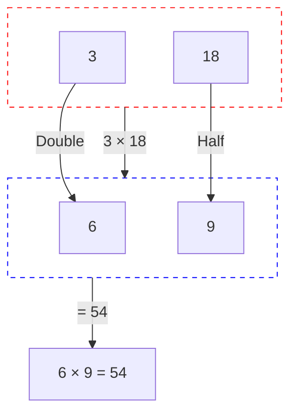
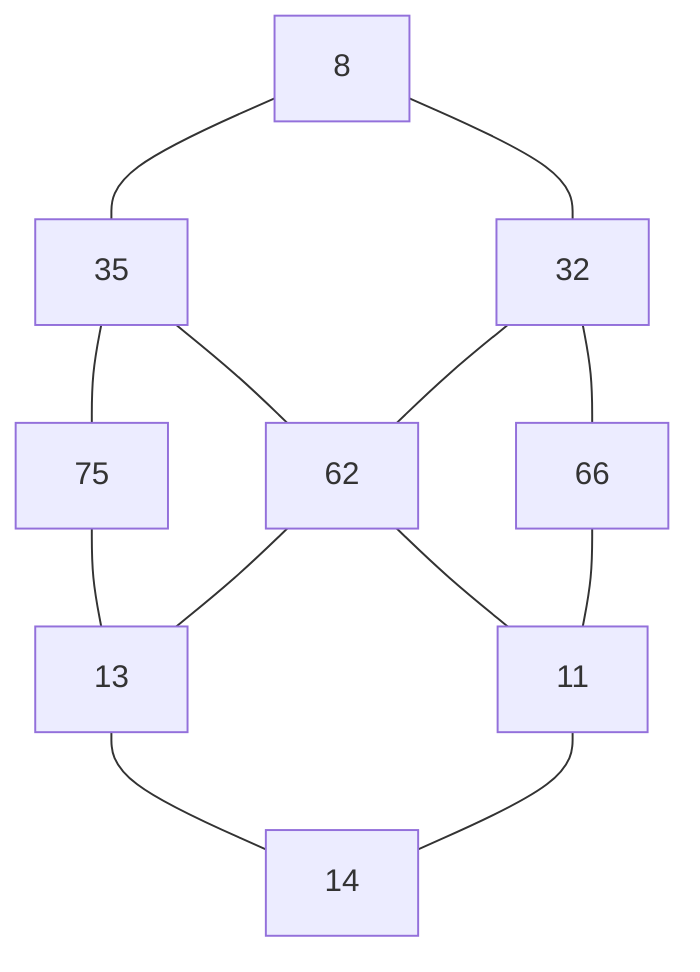

By now, we know several multiplication facts. We have also learnt how to multiply two numbers. We will continue to explore different ways of multiplying in this chapter.

## Let Us Think

1. The given shapes stand for numbers between 1 and 24. The same shape denotes the same number across all problems. Find the numbers hiding in all the shapes.

a) [Blue Rectangle] $\times$ [Pink Circle] = [Purple Triangle]
d) [Orange Diamond] $\times$ [Green Pentagon] = [Orange Diamond]

b) [Blue Rectangle] $\times$ [Blue Rectangle] = [White Cross]
e) [Yellow Parallelogram] $\times$ [Pink Circle] = [Light Blue Semicircle]

c) [Yellow Parallelogram] $\times$ [Orange Diamond] = [Purple Triangle]
f) [Light Blue Semicircle] $\times$ [Blue Rectangle] = [Yellow Parallelogram] $\times$ [Purple Triangle]

2. Place the digits 2, 5, and 3 appropriately to get a product close to 100. Share your reasoning in class.

<table>
  <tbody>
    <tr>
        <td>[ ]</td>
        <td>[ ]</td>
        <td></td>
    </tr>
    <tr>
        <td>$\times$</td>
        <td></td>
        <td>[ ]</td>
    </tr>
    <tr>
        <td>---</td>
        <td>---</td>
        <td>---</td>
    </tr>
  </tbody>
</table>

3. A dairy has packed butter milk pouches in the following manner. Find the number of pouches kept in each arrangement. One is done for you.

**Arrangement 1:**
The image shows two blocks of pouches separated by a vertical line. Each block contains 5 rows and 6 columns of pouches, totaling 30 pouches per block.
$30 \times 2 = 60$

**Arrangement 2:**
The image shows four blocks of pouches separated by vertical lines. Each block contains 5 rows and 3 columns of pouches, totaling 15 pouches per block.
$\_\_\_ \times \_\_\_ = 60$

The image shows two different arrangements of 60 milk packets.

Arrangement 1: 6 groups of 10 packets each.
___ × ___ = 60

Arrangement 2: 5 rows of 12 packets each.
___ × ___ = 60
*What other groups can you make?*

4. Which number am I?
   I am a two-digit number. Find me with the help of the following clues.
   (a) I am greater than 8.
   (b) I am not a multiple of 4.
   (c) I am a multiple of 9.
   (d) I am an odd number.
   (e) I am not a multiple of 11.
   (f) I am less than 50.
   (g) My ones digit is even
   (h) My tens digit is odd.

<table>
  <tbody>
    <tr>
        <td>0</td>
        <td>1</td>
        <td>2</td>
        <td>3</td>
        <td>4</td>
        <td>5</td>
        <td>6</td>
        <td>7</td>
        <td>8</td>
        <td>9</td>
    </tr>
    <tr>
        <td>10</td>
        <td>11</td>
        <td>12</td>
        <td>13</td>
        <td>14</td>
        <td>15</td>
        <td>16</td>
        <td>17</td>
        <td>18</td>
        <td>19</td>
    </tr>
    <tr>
        <td>20</td>
        <td>21</td>
        <td>22</td>
        <td>23</td>
        <td>24</td>
        <td>25</td>
        <td>26</td>
        <td>27</td>
        <td>28</td>
        <td>29</td>
    </tr>
    <tr>
        <td>30</td>
        <td>31</td>
        <td>32</td>
        <td>33</td>
        <td>34</td>
        <td>35</td>
        <td>36</td>
        <td>37</td>
        <td>38</td>
        <td>39</td>
    </tr>
    <tr>
        <td>40</td>
        <td>41</td>
        <td>42</td>
        <td>43</td>
        <td>44</td>
        <td>45</td>
        <td>46</td>
        <td>47</td>
        <td>48</td>
        <td>49</td>
    </tr>
    <tr>
        <td>50</td>
        <td>51</td>
        <td>52</td>
        <td>53</td>
        <td>54</td>
        <td>55</td>
        <td>56</td>
        <td>57</td>
        <td>58</td>
        <td>59</td>
    </tr>
    <tr>
        <td>60</td>
        <td>61</td>
        <td>62</td>
        <td>63</td>
        <td>64</td>
        <td>65</td>
        <td>66</td>
        <td>67</td>
        <td>68</td>
        <td>69</td>
    </tr>
    <tr>
        <td>70</td>
        <td>71</td>
        <td>72</td>
        <td>73</td>
        <td>74</td>
        <td>75</td>
        <td>76</td>
        <td>77</td>
        <td>78</td>
        <td>79</td>
    </tr>
    <tr>
        <td>80</td>
        <td>81</td>
        <td>82</td>
        <td>83</td>
        <td>84</td>
        <td>85</td>
        <td>86</td>
        <td>87</td>
        <td>88</td>
        <td>89</td>
    </tr>
    <tr>
        <td>90</td>
        <td>91</td>
        <td>92</td>
        <td>93</td>
        <td>94</td>
        <td>95</td>
        <td>96</td>
        <td>97</td>
        <td>98</td>
        <td>99</td>
    </tr>
  </tbody>
</table>

   A cartoon girl asks:
   > Did you use all the clues to find the number? Which clues did not help you in finding the number?

5. Make your own numbers.
   Choose any two numbers and one operation from the grid. Try to make all the numbers between 0 and 20. For example, 2 can be formed as 4 – 2. Could you make all the numbers?

<table>
  <tbody>
    <tr>
        <td>100</td>
        <td>25</td>
        <td>5</td>
        <td>-</td>
    </tr>
    <tr>
        <td>10</td>
        <td>2</td>
        <td>36</td>
        <td>×</td>
    </tr>
    <tr>
        <td>12</td>
        <td>4</td>
        <td>3</td>
        <td>+</td>
    </tr>
    <tr>
        <td colspan="3"></td>
        <td>÷</td>
    </tr>
  </tbody>
</table>

   Which numbers could you not make? Is it possible to make these numbers using three numbers? You can use two operations, if needed. Which numbers between 0–20 can you get in more than one way?

# Order of Numbers in Multiplication

Daljeet Kaur runs a milk processing unit. She has arranged the butter packets in the following ways. Find the number of butter packets in each case. What pattern do you notice (or observe)? Discuss in class.

a)
[The image shows two arrangements of squares representing butter packets.]
- First arrangement: 2 rows of 3 squares. Equation: $2 \times 3 =$
- Second arrangement: 3 rows of 2 squares. Equation: $3 \times 2 =$

b)
[The image shows two arrangements of squares representing butter packets.]
- First arrangement: 5 rows of 8 squares. Equation: $5 \times 8 =$
- Second arrangement: 8 rows of 5 squares. Equation: $8 \times 5 =$

[The image shows two grids of squares. The first grid is horizontal with 6 rows and 13 columns. The second grid is vertical with 13 rows and 6 columns. Red arrows indicate that the number of groups and group size are interchanged between the two arrangements.]
- Number of groups: 6
- Group size: 13
- $6 \times 13 =$
- $13 \times 6 =$

e) $10 \times 5 =$
   $5 \times 10 =$

f) $8 \times 20 =$
   $20 \times 8 =$

g) $12 \times 9 =$
   $9 \times 12 =$

What is $9 \times 0$? $0 \times 9$?

*Is this true for the product of any two numbers? Discuss in class.*

The number of groups and the group size are interchanged in each case above, but the total number of butter packets remain the same.

# Patterns in Multiplication by 10s and 100s

1. Let us revise multiplication by 10s and 100s.
   a) $4 \times 10 = \_\_\_\_$
   b) $20 \times 10 = \_\_\_\_$
   c) $10 \times 40 = \_\_\_\_$
   d) $10 \times 10 = 100$
   e) $20 \times 50 = \_\_\_\_$
   f) $80 \times 10 = \_\_\_\_$
   g) $3 \times 100 = 100 \times 3 = 300$
   h) $8 \times 100 = \_\_\_\_ = \_\_\_\_$
   i) $10 \times 100 = \_\_\_\_ = \_\_\_\_$

> **Note for Teachers:** Encourage the learners to understand that when we multiply a number by 10, it becomes 10 times, and each digit moves one place value to the left. Multiplying by 100 makes the number 100 times larger, shifting each digit two place value to the left. Let them notice the pattern of zeros in the place value table.

2. Find answers to the following questions. Fill in the table below and describe the pattern. Discuss in class.

* $\underline{1}00 \times \underline{9}0 = \_\_,000$
* $\underline{4}00 \times \underline{1}0 = \_\_\_$
* $\underline{6}0 \times \underline{5}0 = \_\_\_$
* $\underline{3}0 \times \underline{2}0 = \underline{6}00$
* $\underline{7}00 \times \underline{4} = \_,\_00$
* $\underline{1}0 \times \underline{4}5 = \_\_\_$

---

$30 \times 10 = 300$
$\downarrow \times 2$ (on 10) $\quad \downarrow \times 2$ (on 300)
$30 \times 20 = 600$

*Notice the underlined numbers*

$30 \times 20 =$
$3 \times 10 \times 2 \times 10 = 6 \times 100$
(Arrows in the original indicate: $3 \times 2 = 6$ and $10 \times 10 = 100$)

*Notice the underlined numbers.*
*Remember, we can multiply numbers in any order.*

---

How should we write 450 in the table below?

<table>
  <thead>
    <tr>
        <th>Problem</th>
        <th>Th</th>
        <th>H</th>
        <th>T</th>
        <th>O</th>
    </tr>
  </thead>
  <tbody>
    <tr>
        <td>$10 \times 45 =$</td>
        <td></td>
        <td></td>
        <td></td>
        <td></td>
    </tr>
    <tr>
        <td>$30 \times 20 =$</td>
        <td></td>
        <td>6</td>
        <td>0</td>
        <td>0</td>
    </tr>
    <tr>
        <td>$400 \times 10 =$</td>
        <td></td>
        <td></td>
        <td></td>
        <td></td>
    </tr>
    <tr>
        <td>$700 \times 8 =$</td>
        <td></td>
        <td></td>
        <td></td>
        <td></td>
    </tr>
    <tr>
        <td>$100 \times 90 =$</td>
        <td>9</td>
        <td>0</td>
        <td>0</td>
        <td>0</td>
    </tr>
  </tbody>
</table>
<table>
  <thead>
    <tr>
        <th>Problem</th>
        <th>Th</th>
        <th>H</th>
        <th>T</th>
        <th>O</th>
    </tr>
  </thead>
  <tbody>
    <tr>
        <td>$60 \times 50 =$</td>
        <td></td>
        <td></td>
        <td></td>
        <td></td>
    </tr>
    <tr>
        <td>$220 \times 20 =$</td>
        <td></td>
        <td></td>
        <td></td>
        <td></td>
    </tr>
    <tr>
        <td>$11 \times 300 =$</td>
        <td colspan="4"></td>
    </tr>
  </tbody>
</table>
<table>
  <thead>
    <tr>
        <th>Problem</th>
        <th>Th</th>
        <th>H</th>
        <th>T</th>
        <th>O</th>
    </tr>
  </thead>
  <tbody>
    <tr>
        <td>$80 \times 90 =$</td>
        <td></td>
        <td></td>
        <td></td>
        <td></td>
    </tr>
    <tr>
        <td>$10 \times 63 =$</td>
        <td></td>
        <td></td>
        <td></td>
        <td></td>
    </tr>
    <tr>
        <td>$40 \times 12 =$</td>
        <td colspan="4"></td>
    </tr>
  </tbody>
</table>

What will happen if we multiply numbers by 1,000?

$\underline{2} \times \underline{1},000 = 2 \text{ thousand} = \underline{2},000$ [1,000] [1,000]

$\underline{5} \times \underline{1},000 = 5 \text{ thousand} = \underline{5},000$ [1,000] [1,000] [1,000] [1,000] [1,000]

$\underline{10} \times \underline{1},000 = 10 \text{ thousand} = \underline{10},000$

$\underline{20} \times \underline{1},000 = 20 \text{ thousand} = \underline{20},000$

Let us fill in the table and observe the patterns.

<table>
  <thead>
    <tr>
        <th>Problem</th>
        <th>TTh</th>
        <th>Th</th>
        <th>H</th>
        <th>T</th>
        <th>O</th>
    </tr>
  </thead>
  <tbody>
    <tr>
        <td>2 × 1,000 =</td>
        <td></td>
        <td>2</td>
        <td>0</td>
        <td>0</td>
        <td>0</td>
    </tr>
    <tr>
        <td>5 × 1,000 =</td>
        <td></td>
        <td>5</td>
        <td>0</td>
        <td>0</td>
        <td>0</td>
    </tr>
    <tr>
        <td>10 × 1,000 =</td>
        <td>1</td>
        <td>0</td>
        <td>0</td>
        <td>0</td>
        <td>0</td>
    </tr>
    <tr>
        <td>20 × 1,000 =</td>
        <td>2</td>
        <td>0</td>
        <td>0</td>
        <td>0</td>
        <td>0</td>
    </tr>
    <tr>
        <td>3 × 5,000 =</td>
        <td></td>
        <td></td>
        <td></td>
        <td></td>
        <td></td>
    </tr>
    <tr>
        <td>8 × 3,000 =</td>
        <td></td>
        <td></td>
        <td></td>
        <td></td>
        <td></td>
    </tr>
    <tr>
        <td>5 × 7,000 =</td>
        <td colspan="5"></td>
    </tr>
  </tbody>
</table>
<table>
  <thead>
    <tr>
        <th>Problem</th>
        <th>TTh</th>
        <th>Th</th>
        <th>H</th>
        <th>T</th>
        <th>O</th>
    </tr>
  </thead>
  <tbody>
    <tr>
        <td>20 × 100 =</td>
        <td></td>
        <td></td>
        <td></td>
        <td></td>
        <td></td>
    </tr>
    <tr>
        <td>40 × 500 =</td>
        <td></td>
        <td></td>
        <td></td>
        <td></td>
        <td></td>
    </tr>
    <tr>
        <td>60 × 300 =</td>
        <td></td>
        <td></td>
        <td></td>
        <td></td>
        <td></td>
    </tr>
    <tr>
        <td>600 × 30 =</td>
        <td></td>
        <td></td>
        <td></td>
        <td></td>
        <td></td>
    </tr>
    <tr>
        <td>80 × 900 =</td>
        <td></td>
        <td></td>
        <td></td>
        <td></td>
        <td></td>
    </tr>
    <tr>
        <td>70 × 600 =</td>
        <td></td>
        <td></td>
        <td></td>
        <td></td>
        <td></td>
    </tr>
    <tr>
        <td>5 × 7,000 =</td>
        <td colspan="5"></td>
    </tr>
  </tbody>
</table>

# Many Ways to Multiply

What is `18` × `5`

> Do you think they are all correct? Why do you think so?

> Half of 18 is 9. 9×5 is 45 and 9×5 is 45. I added 45 and 45 together to get 90.

> First, I doubled 18 to get 36. Then I doubled 36 to get 72 and then I added 18 to 72 to get 90.

> I separated 18 into 8 and 10. 8×5 is 40. 10×5 is 50. then I added 40 and 50 together to get 90.

> $18 \times 5 = 9 \times 10$. So, 90.

> I did 20×5, which is 100. Then I took away 2×5, which is 10. So, 100-10 = 90.

Butter packets are arranged in the following ways. Let us find some strategies to calculate the total number of packets.

a)
A grid of 3 rows and 18 columns of yellow squares is shown. A vertical red line with a scissors icon cuts the grid in half at the 9th column.

*Discuss why these are the same.*



The grid is rearranged into two blocks of 3 rows and 9 columns, stacked vertically to form a 6x9 grid.

b)
A grid of 22 rows and 5 columns of yellow squares is shown. A horizontal red line with a scissors icon cuts the grid in half at the 11th row.

22 × 5

An arrow points from the $22 \times 5$ box to a rearranged grid. The grid is rearranged into two blocks of 11 rows and 5 columns, placed side-by-side to form an 11x10 grid.

<table>
  <thead>
    <tr>
        <th></th>
        <th>×</th>
        <th></th>
        <th>=</th>
        <th></th>
    </tr>
  </thead>
  <tbody>
    <tr>
        <td>___</td>
        <td>×</td>
        <td>___</td>
        <td>=</td>
        <td>____</td>
    </tr>
  </tbody>
</table>

c) Solve the following problems like the previous ones.

<table>
  <thead>
    <tr>
        <th colspan="2">14 × 3 =</th>
        <th colspan="2">38 × 5 =</th>
    </tr>
  </thead>
  <tbody>
    <tr>
        <td>Half</td>
        <td>Double</td>
        <td>Half</td>
        <td>Double</td>
    </tr>
    <tr>
        <td>[ ]</td>
        <td>[ ]</td>
        <td>[ ]</td>
        <td>[ ]</td>
    </tr>
    <tr>
        <td colspan="2">[ ] × [ ]</td>
        <td colspan="2">[ ] × [ ]</td>
    </tr>
  </tbody>
</table>
<table>
  <thead>
    <tr>
        <th colspan="2">16 × 4 =</th>
        <th colspan="2">35 × 14 =</th>
    </tr>
  </thead>
  <tbody>
    <tr>
        <td>Half</td>
        <td>Double</td>
        <td>Half</td>
        <td>Double</td>
    </tr>
    <tr>
        <td>[ ]</td>
        <td>[ ]</td>
        <td>[ ]</td>
        <td>[ ]</td>
    </tr>
    <tr>
        <td colspan="2">[ ] × [ ]</td>
        <td colspan="2">[ ] × [ ]</td>
    </tr>
  </tbody>
</table>

This halving and doubling strategy works well when we have to multiply with numbers like 5 and 25. Discuss why?

(d) Find the product by halving and doubling either the multiplier or the multiplicand.

<table>
  <tbody>
    <tr>
        <td>1) 5 × 18</td>
        <td>2) 50 × 28</td>
        <td>3) 15 × 22</td>
    </tr>
    <tr>
        <td>4) 25 × 12</td>
        <td>5) 12 × 45</td>
        <td>6) 16 × 45</td>
    </tr>
  </tbody>
</table>

(e) Give 5 examples of multiplication problems where halving and doubling will help in finding the product easily. Find the products as well.

# Nearest Multiple

(a) $4 \times 19$

The image shows a grid of 4 rows and 20 columns. The first 19 columns are shaded yellow, representing $4 \times 19$. The 20th column is unshaded but outlined in red, completing a $4 \times 20$ area. An arrow points from this last column to the following text:

> *Observe the picture and find why we need to subtract 4*

$$
\begin{aligned}
4 \times 19 &= 4 \times 20 - 4 \\
&= 80 - 4 \\
&= 76
\end{aligned}
$$

(b) $14 \times 21$

The image shows a grid of 14 rows and 21 columns. The first 20 columns are shaded yellow, representing $14 \times 20$. The 21st column is shaded green, representing an additional $14 \times 1$. An arrow points from this green column to the following text:

> *Observe the picture and find why we need to add 14.*

$$
\begin{aligned}
14 \times 21 &= 14 \times 20 + 14 \\
&= 280 + 14 \\
&= 294
\end{aligned}
$$

(c) Give 5 examples of problems where you can use the nearest multiple to find the product easily. Find the products as well.

(d) Find the products of the following numbers by finding the nearest multiple.

<table>
  <tbody>
    <tr>
        <td>1) 7 × 52</td>
        <td>2) 12 × 28</td>
        <td>3) 75 × 31</td>
    </tr>
    <tr>
        <td>4) 99 × 15</td>
        <td>5) 8 × 25</td>
        <td>6) 22 × 42</td>
    </tr>
  </tbody>
</table>

Use strategies flexibly to answer the following questions. Discuss your thoughts in class.

1. A school has an auditorium with 35 rows, with 42 seats in each row. How many people can sit in this auditorium?
2. Priya jogs 4 kilometres every day. How many kilometers will she jog in 31 days?
3. A school has received 36 boxes of books with 48 books in each box. How many total books did the school receive in the boxes?
4. Priya uses 16 metres of cloth to make 4 kurtas. How much cloth would she need to make 8 kurtas?
5. Gollappa has 29 cows on his farm. Each cow produces 5 litres of milk per day. How many litres of milk do the cow produce in total, each day?
6. Maska Cow Farm has 297 cows. Each cow requires 18 kg of fodder per day. How much total fodder is needed to feed 297 cows every day?

# Waste and Composting

1. A family of 4 produces around 35 kg of kitchen waste in a month. How much waste will the family produce in a year?

Quantity of kitchen waste in 1 month is 35 kg.
Quantity of kitchen waste in 12 months is $12 \times 35$ kg.

The following grid of numbers represents the multiplication $12 \times 35$ as $(10 + 2) \times (30 + 5)$, with 10 rows in the top section and 2 rows in the bottom section:

<table>
  <tbody>
    <tr>
        <td>10</td>
        <td>10</td>
        <td>10</td>
        <td>1</td>
        <td>1</td>
        <td>1</td>
        <td>1</td>
        <td>1</td>
    </tr>
    <tr>
        <td>10</td>
        <td>10</td>
        <td>10</td>
        <td>1</td>
        <td>1</td>
        <td>1</td>
        <td>1</td>
        <td>1</td>
    </tr>
    <tr>
        <td>10</td>
        <td>10</td>
        <td>10</td>
        <td>1</td>
        <td>1</td>
        <td>1</td>
        <td>1</td>
        <td>1</td>
    </tr>
    <tr>
        <td>10</td>
        <td>10</td>
        <td>10</td>
        <td>1</td>
        <td>1</td>
        <td>1</td>
        <td>1</td>
        <td>1</td>
    </tr>
    <tr>
        <td>10</td>
        <td>10</td>
        <td>10</td>
        <td>1</td>
        <td>1</td>
        <td>1</td>
        <td>1</td>
        <td>1</td>
    </tr>
    <tr>
        <td>10</td>
        <td>10</td>
        <td>10</td>
        <td>1</td>
        <td>1</td>
        <td>1</td>
        <td>1</td>
        <td>1</td>
    </tr>
    <tr>
        <td>10</td>
        <td>10</td>
        <td>10</td>
        <td>1</td>
        <td>1</td>
        <td>1</td>
        <td>1</td>
        <td>1</td>
    </tr>
    <tr>
        <td>10</td>
        <td>10</td>
        <td>10</td>
        <td>1</td>
        <td>1</td>
        <td>1</td>
        <td>1</td>
        <td>1</td>
    </tr>
    <tr>
        <td>10</td>
        <td>10</td>
        <td>10</td>
        <td>1</td>
        <td>1</td>
        <td>1</td>
        <td>1</td>
        <td>1</td>
    </tr>
    <tr>
        <td>10</td>
        <td>10</td>
        <td>10</td>
        <td>1</td>
        <td>1</td>
        <td>1</td>
        <td>1</td>
        <td>1</td>
    </tr>
    <tr>
        <td>10</td>
        <td>10</td>
        <td>10</td>
        <td>1</td>
        <td>1</td>
        <td>1</td>
        <td>1</td>
        <td>1</td>
    </tr>
    <tr>
        <td>10</td>
        <td>10</td>
        <td>10</td>
        <td>1</td>
        <td>1</td>
        <td>1</td>
        <td>1</td>
        <td>1</td>
    </tr>
  </tbody>
</table>

The image shows a woman in a pink sari emptying a bowl of kitchen waste into a composting pit.

**Nida’s solution**

<table>
  <tbody>
    <tr>
        <td>×</td>
        <td>30 kg</td>
        <td>5 kg</td>
    </tr>
    <tr>
        <td>10</td>
        <td>300</td>
        <td>50</td>
    </tr>
    <tr>
        <td>2</td>
        <td>60</td>
        <td>10</td>
    </tr>
    <tr>
        <td></td>
        <td>360</td>
        <td>60</td>
    </tr>
    <tr>
        <td></td>
        <td colspan="2">420</td>
    </tr>
  </tbody>
</table>

Kanti and John tried to solve it in the following ways.

### Kanti's solution
<table>
  <thead>
    <tr>
        <th></th>
        <th>35 ( 30 + 5 )</th>
    </tr>
    <tr>
        <th></th>
        <th>× 12 ( 10 + 2 )</th>
    </tr>
  </thead>
  <tbody>
    <tr>
        <td></td>
        <td>10 ( 2 × 5 )</td>
    </tr>
    <tr>
        <td></td>
        <td>60 ( 2 × 30 )</td>
    </tr>
    <tr>
        <td></td>
        <td>50 ( 10 × 5 )</td>
    </tr>
    <tr>
        <td></td>
        <td>300 ( 10 × 30 )</td>
    </tr>
    <tr>
        <td></td>
        <td>420</td>
    </tr>
  </tbody>
</table>

### John's solution
<table>
  <thead>
    <tr>
        <th></th>
        <th>35 ( 30 + 5 )</th>
    </tr>
    <tr>
        <th></th>
        <th>× 12 ( 10 + 2 )</th>
    </tr>
  </thead>
  <tbody>
    <tr>
        <td></td>
        <td>60 + 10 = 70 (2 × 35)</td>
    </tr>
    <tr>
        <td></td>
        <td>300 + 50 = 350 (10 × 35)</td>
    </tr>
    <tr>
        <td></td>
        <td>= 420</td>
    </tr>
  </tbody>
</table>

The family produces \_\_\_\_\_ kg of waste in a year.

How are these solutions same or different? Discuss in class.

2. The family regularly composts the collected waste. They get around 150 kg of compost each year, which they use in their garden. 1 kg of compost is often sold in the market at ₹24. By creating their own compost, how much money have they saved in a year?

Savings on 1 kg compost is ₹24. Savings on 150 kg will be $₹24 \times 150$.

<table>
  <thead>
    <tr>
        <th>×</th>
        <th>100</th>
        <th>50</th>
    </tr>
  </thead>
  <tbody>
    <tr>
        <td>20</td>
        <td>2,000</td>
        <td>1,000</td>
    </tr>
    <tr>
        <td>4</td>
        <td>400</td>
        <td>200</td>
    </tr>
    <tr>
        <td></td>
        <td>2,400</td>
        <td>1,200</td>
    </tr>
    <tr>
        <td colspan="3">3,600</td>
    </tr>
  </tbody>
</table>
<table>
  <thead>
    <tr>
        <th></th>
        <th>150 (100 + 50)</th>
    </tr>
    <tr>
        <th></th>
        <th>× 24 (20 + 4)</th>
    </tr>
  </thead>
  <tbody>
    <tr>
        <td></td>
        <td>200 (4 × 50)</td>
    </tr>
    <tr>
        <td></td>
        <td>400 (4 × 100)</td>
    </tr>
    <tr>
        <td></td>
        <td>1,000 (20 × 50)</td>
    </tr>
    <tr>
        <td></td>
        <td>2,000 (20 × 100)</td>
    </tr>
    <tr>
        <td></td>
        <td>3,600</td>
    </tr>
  </tbody>
</table>

The family saves ₹3,600.

Another way:
<table>
  <thead>
    <tr>
        <th></th>
        <th>150 (100 + 50)</th>
    </tr>
    <tr>
        <th></th>
        <th>× 24 (20 + 4)</th>
    </tr>
  </thead>
  <tbody>
    <tr>
        <td></td>
        <td>400 + 200 + 0 = 600 (4 × 150)</td>
    </tr>
    <tr>
        <td></td>
        <td>2,000 + 1,000 + 0 = 3,000 (20 × 150)</td>
    </tr>
    <tr>
        <td></td>
        <td>= 3,600</td>
    </tr>
  </tbody>
</table>

> **Note for Teachers:** Help the learners see the similarities and differences between the solutions. Let them discuss and identify the more efficient solution. Draw the similarities between the steps, especially highlighting the place values of the digits, and multiplication by 10s and 100s in each step.

(a) $32 \times 8$

<table>
  <tbody>
    <tr>
        <td>×</td>
        <td>30</td>
        <td>2</td>
    </tr>
    <tr>
        <td>8</td>
        <td></td>
        <td></td>
    </tr>
    <tr>
        <td colspan="3"></td>
    </tr>
  </tbody>
</table>

```
   32 (30 + 2)
x   8
-------------
   ___ (8 × 2)
     0 (8 × 30)
-------------
   256
```

```
   32 (30 + 2)
x   8
-------------
   0 + 16 = 256
```

(b) $69 \times 45$

<table>
  <tbody>
    <tr>
        <td>×</td>
        <td>60</td>
        <td>9</td>
    </tr>
    <tr>
        <td>40</td>
        <td></td>
        <td></td>
    </tr>
    <tr>
        <td>5</td>
        <td></td>
        <td></td>
    </tr>
    <tr>
        <td></td>
        <td>2700</td>
        <td>405</td>
    </tr>
    <tr>
        <td></td>
        <td colspan="2">3105</td>
    </tr>
  </tbody>
</table>

```
   69 (60 + 9)
x  45 (40 + 5)
--------------
   45 (5 × 9)
   ___ 0 (5 × 60)
   ___ 0 (40 × 9)
   ___ 00 (40 × 60)
--------------
   3,105
```

```
      69 (60 + 9)
   x  45 (40 + 5)
-----------------
300 + __ = 345 (5 × 69)
 __ + __ = 2760 (40 × 69)
-----------------
         = 3,105
```

# Let Us Do

1. Solve the following problems like Nida did.
   a) $78 \times 4$
   <table>
  <tbody>
    <tr>
        <td>×</td>
        <td></td>
        <td></td>
        <td></td>
    </tr>
    <tr>
        <td></td>
        <td colspan="3"></td>
    </tr>
  </tbody>
</table>

   b) $83 \times 9$
   <table>
  <tbody>
    <tr>
        <td>×</td>
        <td></td>
        <td></td>
        <td></td>
    </tr>
    <tr>
        <td></td>
        <td colspan="3"></td>
    </tr>
  </tbody>
</table>

   c) $67 \times 28$
   <table>
  <tbody>
    <tr>
        <td>×</td>
        <td></td>
        <td></td>
    </tr>
    <tr>
        <td></td>
        <td colspan="2"></td>
    </tr>
  </tbody>
</table>

   d) $53 \times 37$
   <table>
  <tbody>
    <tr>
        <td>×</td>
        <td></td>
        <td></td>
    </tr>
    <tr>
        <td></td>
        <td colspan="2"></td>
    </tr>
  </tbody>
</table>

2. Solve the following problems like Kanti.
    a) $94 \times 5$
    b) $49 \times 6$
    c) $37 \times 53$
    d) $28 \times 79$

3. Solve the following problems like John.
    a) $86 \times 3$
    b) $72 \times 7$
    c) $94 \times 36$
    d) $66 \times 22$

4. Solve the following problems:
    (a) A movie theater has 8 rows of seats, and each row has 12 seats. If half the seats are filled, how many people are watching the movie? If 3 more rows get filled, how many total people will be there?

    An illustration shows the interior of a movie theater. There are several rows of empty brown seats facing a large screen. The screen displays a colorful cartoon of children with the heading "Child Rights". The theater has blue walls and a blue ceiling with small recessed lights.

    (b) In a test match between India and West Indies, the Indian team hit twenty-four 4s and eighteen 6s across the two innings. How many runs were scored in 4s and 6s each? 234 runs were made by running between the wickets. If 23 runs were extras, how many runs were scored by Indian team in the two innings?

    (c) Anjali buys 15 bulbs and 12 tube lights from Sudha Electricals. Each bulb costs ₹25 and each tube light costs ₹34. How much money should Anjali give to the shopkeeper?

    (d) A shopkeeper sold 28 bags of rice. Each bag costs ₹350. How much money did he earn by selling rice bags?

    (e) A school library has 86 shelves and each shelf has 162 books. Find the number of books in the library.

1. A dairy cooperative in a small town gets its milk from 268 villagers. Each villager has at least 4 milk-giving cows. What is the minimum number of cows the dairy cooperative gets its milk from?

   1 villager has at least 4 milk-giving cows. 268 villagers will have at least $268 \times 4$ cows.

The image shows three women in traditional Indian attire (sarees) at a milk collection point. One woman is pouring milk from a small bucket into a large metal milk churn, while others stand by with their own buckets.

---

**Calculation breakdown:**

<table>
  <tbody>
    <tr>
        <td colspan="2">268 (200 + 60 + 8)</td>
    </tr>
    <tr>
        <td>×</td>
        <td>4</td>
    </tr>
    <tr>
        <td>-----------------------------------</td>
        <td></td>
    </tr>
    <tr>
        <td colspan="2">800 + 240 + 32 = 1,072</td>
    </tr>
  </tbody>
</table>

*   *200 is added to $4 \times 200 = 800$*
*   *30 is added to $4 \times 60 = 240$*

> **Remember!**
> $4 \times 6 \text{ Tens} = 24 \text{ Tens} = 240$
> $4 \times 2 \text{ Hundreds} = 8 \text{ Hundreds} = 800$

---

Mili says her father has taught her to use place values of digits to multiply large numbers.

*   *30 from 32 is added to $4 \times 60$, not to 60*
*   *200 from 270 is added to $4 \times 200$, not to 200*

<table>
  <thead>
    <tr>
        <th>Th</th>
        <th>H</th>
        <th>T</th>
        <th>O</th>
    </tr>
  </thead>
  <tbody>
    <tr>
        <td></td>
        <td>2</td>
        <td>3</td>
        <td></td>
    </tr>
    <tr>
        <td></td>
        <td>2</td>
        <td>6</td>
        <td>8</td>
    </tr>
    <tr>
        <td>×</td>
        <td></td>
        <td></td>
        <td>4</td>
    </tr>
    <tr>
        <td>-----------------------------------------</td>
        <td colspan="3"></td>
    </tr>
    <tr>
        <td>1</td>
        <td>0</td>
        <td>~~2~~ 7</td>
        <td>~~3~~ 2</td>
    </tr>
  </tbody>
</table>

*Discuss how this multiplication is being carried out!*

The dairy cooperative gets milk from a minimum of 1,072 cows.

> Many women dairy entreprenuers are playing significant role in the dairy sector. Jamanaben Maganbhai Naku of village Tuked in Surat possesses 27 Gir cows and rears the cows through Low-cost Farm Investment.

> **Note for Teachers:** The algorithm for multiplication is challenging for learners to understand. While learners should surely be able to multiply large numbers using the ways they have learnt till now, this last step (Mili’s father’s method) need not be over-emphasised. Please support them if your students are ready for this. Otherwise, it is perfectly fine if learners can carry out multiplication of large numbers using John’s methods.

2. The villagers rear various breeds of cows. Gir is an Indian cow breed from Gujarat, with a high milk-producing capacity. Among the villagers, there are 453 Gir cows. Each of these cows give 13 litres of milk each day. How many litres of milk does the dairy cooperative receive from Gir cows everyday?

An illustration shows a brown Gir cow with distinctive long ears and a hump, standing on a patch of green grass.

One Gir cow produces 13 litres of milk.
453 Gir cows will produce, $453 \times 13$ litres of milk.

---

**Multiplication Method 1: Expanded Form**

> $100$ is added to $3 \times 400 = 1200$

<table>
  <tbody>
    <tr>
        <td colspan="2">453 (400 + 50 + 3)</td>
    </tr>
    <tr>
        <td colspan="2">× 13 (10 + 3)</td>
    </tr>
    <tr>
        <td>1200 + 150 + 9 = 1359</td>
        <td>(3 × 453)</td>
    </tr>
    <tr>
        <td>4000 + 500 + 30 = 4530</td>
        <td>(10 × 453)</td>
    </tr>
    <tr>
        <td colspan="2">= 5889</td>
    </tr>
  </tbody>
</table>

*Additional breakdown:*
*   $3 \times 5\text{ T} = 15\text{ T} = 150$
*   $3 \times 4\text{ H} = 12\text{ H} = 1,200$

---

**Mili’s father’s method**

> The 100 from 150 is added to $3 \times 400 = 1200$, not to 400

<table>
  <thead>
    <tr>
        <th>Th</th>
        <th>H</th>
        <th>T</th>
        <th>O</th>
    </tr>
  </thead>
  <tbody>
    <tr>
        <td></td>
        <td>1</td>
        <td></td>
        <td></td>
    </tr>
    <tr>
        <td></td>
        <td>4</td>
        <td>5</td>
        <td>3</td>
    </tr>
    <tr>
        <td>×</td>
        <td></td>
        <td>1</td>
        <td>3</td>
    </tr>
    <tr>
        <td>1</td>
        <td>3</td>
        <td>5</td>
        <td>9</td>
    </tr>
    <tr>
        <td>+ 4</td>
        <td>5</td>
        <td>3</td>
        <td>0</td>
    </tr>
    <tr>
        <td>5</td>
        <td>8</td>
        <td>8</td>
        <td>9</td>
    </tr>
  </tbody>
</table>

> $1\text{ Ten} \times 453 = 453\text{ Tens} = 4530$

The dairy cooperative receives 5,889 litres of milk from Gir cows every day.

---

> **Note for Teachers:** The learners’ attention needs to be drawn continuously to the place values of numbers and their products. Draw similarities with the steps between the different methods. Remind them to put appropriate zeros when multiplying by 10s and 100s.

3. The dairy cooperative sells 1 kg cow ghee for ₹574. The cooperative is able to produce around 125 kg of ghee in a month. How much do they earn by selling ghee in a month?

[Three jars of ghee labeled "GHEE" are shown.]

> *Discuss what the same coloured digits might mean.*

<table>
  <tbody>
    <tr>
        <td colspan="4">574 (500 + 70 + 4)</td>
        <td></td>
    </tr>
    <tr>
        <td></td>
        <td colspan="4">× 125 (100 + 20 + 5)</td>
    </tr>
    <tr>
        <td>-----------------------------------------------------------------</td>
        <td colspan="4"></td>
    </tr>
    <tr>
        <td>2,500 +</td>
        <td>350 +</td>
        <td>20</td>
        <td>= 2,870 (5 × 574)</td>
        <td></td>
    </tr>
    <tr>
        <td>10,000 +</td>
        <td>1,400 +</td>
        <td>80</td>
        <td>= 11,480 (20 × 574)</td>
        <td></td>
    </tr>
    <tr>
        <td>50,000 +</td>
        <td>7,000 +</td>
        <td>400</td>
        <td>= 57,400 (100 × 574)</td>
        <td></td>
    </tr>
    <tr>
        <td>-----------------------------------------------------------------</td>
        <td colspan="4"></td>
    </tr>
    <tr>
        <td></td>
        <td colspan="2"></td>
        <td>= 71,750</td>
        <td></td>
    </tr>
  </tbody>
</table>

*(Note: In the table above, the digits are color-coded in the original image: the first column of numbers (2,500, 10,000, 50,000) has some orange digits, the second column (350, 1,400, 7,000) is blue, and the third column (20, 80, 400) is red.)*

<table>
  <tbody>
    <tr>
        <td>T Th</td>
        <td>Th</td>
        <td>H</td>
        <td>T</td>
        <td>O</td>
        <td></td>
    </tr>
    <tr>
        <td></td>
        <td rowspan="2"></td>
        <td>(1)</td>
        <td rowspan="2"></td>
        <td rowspan="2"></td>
        <td></td>
    </tr>
    <tr>
        <td></td>
        <td>(3)</td>
        <td>(2)</td>
        <td></td>
    </tr>
    <tr>
        <td></td>
        <td colspan="2"></td>
        <td>5</td>
        <td>7</td>
        <td>4</td>
    </tr>
    <tr>
        <td></td>
        <td>×</td>
        <td>1</td>
        <td>2</td>
        <td>5</td>
        <td></td>
    </tr>
    <tr>
        <td>---------------------------------------</td>
        <td colspan="5"></td>
    </tr>
    <tr>
        <td></td>
        <td>~~2~~</td>
        <td>~~2~~ 8</td>
        <td>~~3~~ 7</td>
        <td>~~2~~ 0</td>
        <td rowspan="2">2 Tens × 574 = 2 × 3,740</td>
    </tr>
    <tr>
        <td>1</td>
        <td>~~1~~ 1</td>
        <td>~~1~~ 4</td>
        <td>8</td>
        <td>0</td>
    </tr>
    <tr>
        <td>+ 5</td>
        <td>7</td>
        <td>4</td>
        <td>0</td>
        <td>0</td>
        <td rowspan="2">1 Hundred × 574 <br/> = 574 Hundreds = 57,400</td>
    </tr>
    <tr>
        <td>---------------------------------------</td>
        <td colspan="4"></td>
    </tr>
    <tr>
        <td>7</td>
        <td>1</td>
        <td>7</td>
        <td>5</td>
        <td>0</td>
        <td></td>
    </tr>
  </tbody>
</table>

*(Note: In the column multiplication above, the first row of partial products shows 2,870 with crossed-out carry digits 2, 2, 3, 2 above the main digits. The second row shows 11,480 with crossed-out carry digits 1, 1, 1 above the main digits. Red arrows point from the multiplier digits to the corresponding partial product rows and their explanatory notes. Note that the first note contains a typo in the original image: "2 × 3,740" instead of "2 × 5,740".)*

The cooperative earns ₹71,750 from the sale of cow ghee.

# Let Us Solve

1. Solve the following problems like Nida.
   a) $548 \times 6$
   b) $682 \times 3$
   c) $324 \times 18$
   d) $507 \times 23$
   e) $190 \times 65$

2. Solve the following problems like John.
    a) $123 \times 84$
    b) $368 \times 32$
    c) $159 \times 324$
    d) $239 \times 401$
    e) $592 \times 5$
    f) $101 \times 22$

3. Let us solve a few questions like Mili’s father.

<table>
  <tbody>
    <tr>
        <td>Th</td>
        <td>H</td>
        <td>T</td>
        <td>O</td>
    </tr>
    <tr>
        <td></td>
        <td></td>
        <td>( )</td>
        <td></td>
    </tr>
    <tr>
        <td></td>
        <td>8</td>
        <td>0</td>
        <td>6</td>
    </tr>
    <tr>
        <td>×</td>
        <td></td>
        <td></td>
        <td>9</td>
    </tr>
  </tbody>
</table>
<table>
  <tbody>
    <tr>
        <td>Th</td>
        <td>H</td>
        <td>T</td>
        <td>O</td>
        <td></td>
    </tr>
    <tr>
        <td></td>
        <td>( )</td>
        <td>( )</td>
        <td></td>
        <td></td>
    </tr>
    <tr>
        <td>( )</td>
        <td>( )</td>
        <td>(3)</td>
        <td></td>
        <td></td>
    </tr>
    <tr>
        <td></td>
        <td>4</td>
        <td>5</td>
        <td>5</td>
        <td></td>
    </tr>
    <tr>
        <td>×</td>
        <td></td>
        <td>2</td>
        <td>6</td>
        <td></td>
    </tr>
    <tr>
        <td>[ ]</td>
        <td>[ ]</td>
        <td>[ ]</td>
        <td>[3/]</td>
        <td>[ ]</td>
    </tr>
    <tr>
        <td>[ ]</td>
        <td>[ ]</td>
        <td>[ ]</td>
        <td>[ ]</td>
        <td>[ ]</td>
    </tr>
  </tbody>
</table>
<table>
  <tbody>
    <tr>
        <td>T Th</td>
        <td>Th</td>
        <td>H</td>
        <td>T</td>
        <td>O</td>
        <td></td>
    </tr>
    <tr>
        <td></td>
        <td></td>
        <td>( )</td>
        <td>( )</td>
        <td></td>
        <td></td>
    </tr>
    <tr>
        <td></td>
        <td></td>
        <td>1</td>
        <td>4</td>
        <td>3</td>
        <td></td>
    </tr>
    <tr>
        <td>×</td>
        <td></td>
        <td>2</td>
        <td>0</td>
        <td>8</td>
        <td></td>
    </tr>
    <tr>
        <td></td>
        <td>[ ]</td>
        <td>[ ]</td>
        <td>[3]</td>
        <td>[2]</td>
        <td></td>
    </tr>
    <tr>
        <td></td>
        <td>[ ]</td>
        <td>[ ]</td>
        <td>[ ]</td>
        <td>[ ]</td>
        <td></td>
    </tr>
    <tr>
        <td>+</td>
        <td>[ ]</td>
        <td>[ ]</td>
        <td>[ ]</td>
        <td>[0]</td>
        <td>[0]</td>
    </tr>
  </tbody>
</table>

Now use Mili’s father’s method to solve the following questions.

(a) $807 \times 5$
(d) $450 \times 38$
(g) $604 \times 54$

(b) $143 \times 28$
(e) $584 \times 23$
(h) $112 \times 23$

(c) $309 \times 9$
(f) $302 \times 13$
(i) $237 \times 19$

Check if the following children’s solutions are correct. If correct, explain why the solution is correct. If it is incorrect, then identify the error and correct the solution.

**a) Asma’s solution**
for $46 \times 59$
```
      46
    × 59
  ------
   2,000
     300
     360
      54
  ------
   2,714
```
[An illustration of a girl with glasses, Asma, is shown next to the calculation.]

**b) Pankaj’s solution**
for $203 \times 54$
```
      203
    ×  54
  -------
   80 + 12 =  92
  100 + 15 = 115
  --------------
           = 135
```
[An illustration of a boy wearing a turban, Pankaj, is shown next to the calculation.]

**c) Lado’s solution**
for $38 \times 150$
```
      38
    × 150
  -------
  1,500 + 400 = 1,900
  3,000 + 800 = 3,800
  -------------------
              = 5,700
```
[An illustration of a girl with curly hair, Lado, is shown next to the calculation.]

**d) Kira’s solution**
for $193 \times 272$
```
      193
    × 272
  -------
    200 +    180 +   6 =    386
    700 +    630 +  21 =  1,351
 20,000 + 18,000 + 600 = 38,600
 ------------------------------
                       = 40,337
```
[An illustration of a girl, Kira, is shown next to the calculation.]

**e) Asher’s solution**
[An illustration of a boy, Asher, is shown next to the calculation.]

<table>
  <thead>
    <tr>
        <th>T Th</th>
        <th>Th</th>
        <th>H</th>
        <th>T</th>
        <th>O</th>
    </tr>
  </thead>
  <tbody>
    <tr>
        <td></td>
        <td>(1)</td>
        <td></td>
        <td></td>
        <td></td>
    </tr>
    <tr>
        <td></td>
        <td></td>
        <td>(1)</td>
        <td></td>
        <td></td>
    </tr>
    <tr>
        <td></td>
        <td></td>
        <td></td>
        <td>(1)</td>
        <td></td>
    </tr>
    <tr>
        <td></td>
        <td></td>
        <td>6</td>
        <td>2</td>
        <td>6</td>
    </tr>
    <tr>
        <td></td>
        <td>×</td>
        <td>3</td>
        <td>2</td>
        <td>3</td>
    </tr>
    <tr>
        <td>---------------------------------</td>
        <td colspan="4"></td>
    </tr>
    <tr>
        <td></td>
        <td>1</td>
        <td>8</td>
        <td>7</td>
        <td>1 / 8</td>
    </tr>
    <tr>
        <td></td>
        <td>1</td>
        <td>2</td>
        <td>5</td>
        <td>1 / 2</td>
    </tr>
    <tr>
        <td>+</td>
        <td>1</td>
        <td>8</td>
        <td>7</td>
        <td>1 / 8</td>
    </tr>
    <tr>
        <td>---------------------------------</td>
        <td colspan="4"></td>
    </tr>
    <tr>
        <td></td>
        <td>5</td>
        <td>0</td>
        <td>1</td>
        <td>8</td>
    </tr>
  </tbody>
</table>
*(Note: In the 'O' column, the boxes contain two numbers separated by a diagonal red dotted line: 1/8, 1/2, and 1/8 respectively.)*

1. Identify the problems that have the same answer as the one given at the top of each box. Do not calculate.

<table>
  <thead>
    <tr>
        <th></th>
        <th colspan="2">12 × 17</th>
    </tr>
  </thead>
  <tbody>
    <tr>
        <td>11 × 18</td>
        <td>6 × 34</td>
        <td></td>
    </tr>
  </tbody>
</table>
<table>
  <thead>
    <tr>
        <th></th>
        <th colspan="2">26 × 11</th>
    </tr>
  </thead>
  <tbody>
    <tr>
        <td>26 × 10 and 26 × 1</td>
        <td>20 × 11 and 6 × 11</td>
        <td></td>
    </tr>
  </tbody>
</table>
<table>
  <thead>
    <tr>
        <th></th>
        <th colspan="2">18 × 4</th>
    </tr>
  </thead>
  <tbody>
    <tr>
        <td>9 × 8</td>
        <td>20 × 4 – 8</td>
        <td></td>
    </tr>
  </tbody>
</table>
<table>
  <thead>
    <tr>
        <th></th>
        <th colspan="3">55 × 9</th>
    </tr>
  </thead>
  <tbody>
    <tr>
        <td>50 × 9 and 5 × 9</td>
        <td>54 × 10</td>
        <td>55 × 10 – 55</td>
        <td></td>
    </tr>
  </tbody>
</table>
<table>
  <thead>
    <tr>
        <th></th>
        <th colspan="2">101 × 42</th>
    </tr>
  </thead>
  <tbody>
    <tr>
        <td>100 × 42 and 100</td>
        <td>100 × 42 and 42</td>
        <td></td>
    </tr>
  </tbody>
</table>
<table>
  <thead>
    <tr>
        <th></th>
        <th colspan="2">247 × 8</th>
    </tr>
  </thead>
  <tbody>
    <tr>
        <td>250 × 8 – 24</td>
        <td>247 × 10 – 247</td>
        <td></td>
    </tr>
  </tbody>
</table>
<table>
  <thead>
    <tr>
        <th></th>
        <th colspan="2">1001 × 5</th>
    </tr>
  </thead>
  <tbody>
    <tr>
        <td>1,000 × 6</td>
        <td>1,000 × 5 and 5</td>
        <td></td>
    </tr>
  </tbody>
</table>
<table>
  <thead>
    <tr>
        <th></th>
        <th colspan="2">1999 × 2</th>
    </tr>
  </thead>
  <tbody>
    <tr>
        <td>2,000 × 2 – 4</td>
        <td>2,000 × 2 – 2</td>
        <td></td>
    </tr>
  </tbody>
</table>

2. Find easy ways of solving these problems.
   (a) $16 \times 25$
   (b) $12 \times 125$
   (c) $24 \times 250$
   (d) $36 \times 25$
   (e) $28 \times 75$
   (f) $300 \times 15$
   (g) $50 \times 78$
   (h) $199 \times 63$
   (i) $128 \times 35$

3. Write 5 other examples for which you can find easy ways of getting products.

4. Find the answers to the following questions based on the given information.
   (a) $17 \times 23 = 391$
   (b) $17 \times 24 = \_\_\_\_\_\_$
   (c) $17 \times 22 = \_\_\_\_\_\_$
   (d) $16 \times 23 = \_\_\_\_\_\_$
   (e) $8 \times 9 = 72$
   (f) $18 \times 9 = \_\_\_\_\_\_$
   (g) $28 \times 9 = \_\_\_\_\_\_$
   (h) $108 \times 9 = \_\_\_\_\_\_$
   (i) $18 \times 23 = \_\_\_\_\_\_$

The following diagrams illustrate the multiplication problems using grids:

*   **Diagram 1:** A grid representing $17 \times 23$. It consists of a large rectangle that is 17 units high and 23 units wide, composed of yellow blocks.
*   **Diagram 2:** A grid representing $17 \times 24$. It shows the $17 \times 23$ yellow grid from Diagram 1 with an additional column of 17 units (shown in blue) added to the right side.
    > To find $17 \times 24$, how much is to be added to $17 \times 23$ — 17 or 23?
*   **Diagram 3:** A grid representing $18 \times 23$. It shows the $17 \times 23$ yellow grid from Diagram 1 with an additional row of 23 units (shown in blue) added to the bottom.
    > To find $18 \times 23$, how much is to be added to $17 \times 23$ — 17 or 23?

# Let Us Think

1. Find the possible values of the coloured boxes in each of the following problems. The same colour indicates the same number in a problem. Some problems can have more than one answer.

   a)
   <table>
  <tbody>
    <tr>
        <td>[white box with black outline]</td>
        <td>[white box with black outline]</td>
    </tr>
    <tr>
        <td>×</td>
        <td>3</td>
    </tr>
    <tr>
        <td>[white box with orange outline]</td>
        <td>[white box with orange outline]</td>
    </tr>
  </tbody>
</table>

   b)
   <table>
  <tbody>
    <tr>
        <td>[white box with black outline]</td>
        <td>[white box with black outline]</td>
        <td>[white box with black outline]</td>
    </tr>
    <tr>
        <td>×</td>
        <td>3</td>
        <td></td>
    </tr>
    <tr>
        <td>[white box with orange outline]</td>
        <td>[white box with orange outline]</td>
        <td>[white box with orange outline]</td>
    </tr>
  </tbody>
</table>

   c)
   <table>
  <tbody>
    <tr>
        <td>[white box with black outline]</td>
        <td>[white box with black outline]</td>
        <td>[white box with black outline]</td>
        <td>[white box with black outline]</td>
    </tr>
    <tr>
        <td>×</td>
        <td>3</td>
        <td colspan="2"></td>
    </tr>
    <tr>
        <td>[white box with orange outline]</td>
        <td>[white box with orange outline]</td>
        <td>[white box with orange outline]</td>
        <td>[white box with orange outline]</td>
    </tr>
  </tbody>
</table>

d)
```
    [ ] [ ]
  ×       5
  ---------
  1 [ ]   0
```

e)
```
  [ ] [ ] [ ]
  ×         5
  -----------
  [ ] [ ]   0
```

f)
```
  [ ] [ ] [ ]
  ×         5
  -----------
  1 [ ] [ ] 0
```

g)
```
  [ ] [ ] [ ]
  ×         9
  -----------
  [ ][ ][ ][ ]
```

h)
```
      [ ] [ ]
  ×       [ ]
  -----------
  5,  9   9   9
```

i)
```
  [ ] [ ] [ ]
  ×       [ ]
  -----------
  2,  0   0   0
```

2. Estimate the products on the left and match them to the numbers given on the right.

<table>
  <tbody>
    <tr>
        <td>25 × 31</td>
        <td>2,600</td>
    </tr>
    <tr>
        <td>132 × 19</td>
        <td>12,500</td>
    </tr>
    <tr>
        <td>101 × 11</td>
        <td>300</td>
    </tr>
    <tr>
        <td>248 × 49</td>
        <td>750</td>
    </tr>
    <tr>
        <td>12 × 25</td>
        <td>1,000</td>
    </tr>
  </tbody>
</table>

*Discuss how you estimated.*

# The King’s Reward

One day, a king decided to reward three of his most talented ministers. The king called them to his court and said, “You all have served my empire with great dedication. As a reward, I give you three choices of gold.

# Choose wisely!

**Choice 1:** Take 5 gold coins and double the number of coins every day for 7 days.

**Choice 2:** Take 3 gold coins and triple the number of coins every day for 7 days.

**Choice 3:** Take 1 gold coin and multiply the number of coins by 5 every day for 7 days.

**Minister 1—** I will take 5 gold coins and double the number of coins every day for 7 days.

**Minister 2—** I will take 3 gold coins and triple the number of coins every day for 7 days.

**Minister 3—** I will take 1 gold coin and multiply the number of coins by 5 every day for 7 days.

The King gave 5 coins to Minister 1, 3 coins to Minister 2 and 1 coin to Minister 3.

Which of the rewards would you have chosen?

After a week, the 3 ministers were surprised at the final amount of gold coins. Guess who received the most gold coins? Calculate how much gold coins each minister received.

# Multiplication Patterns

1. Notice how the multiplier, multiplicand, and products are changing in each of the following. What is the relationship of the new product with the original product? Solve a) completely, and then predict the answers for the rest.

**a) $$16 \times 44 = 704$$**

<table>
  <tbody>
    <tr>
        <td>1) $$8 \times 88 = 704$$</td>
        <td>2) $$8 \times 22 = 176$$</td>
    </tr>
    <tr>
        <td>3) $$16 \times 22 = \_\_\_\_\_\_$$</td>
        <td>4) $$32 \times 44 = \_\_\_\_\_\_$$</td>
    </tr>
  </tbody>
</table>

**b) $$12 \times 32 = 384$$**

<table>
  <tbody>
    <tr>
        <td>1) $$6 \times 16 = \_\_\_\_\_\_$$</td>
        <td>2) $$24 \times 16 = \_\_\_\_\_\_$$</td>
    </tr>
    <tr>
        <td>3) $$24 \times 64 = \_\_\_\_\_\_$$</td>
        <td>4) $$12 \times 16 = \_\_\_\_\_\_$$</td>
    </tr>
  </tbody>
</table>

2. Observe and complete the given patterns

---

**Pattern 1**
$$1 \times 1 = 1$$
$$11 \times 11 = 121$$
$$111 \times 111 = 12,321$$
$$1111 \times 1111 = \_\_\_\_\_\_$$

---

**Pattern 2**
$$5 \times 5 = 25$$
$$15 \times 15 = 225 \longleftarrow \begin{matrix} 5 \times 5 = 25 \\ 2 \times 1 = 2 \end{matrix}$$
$$25 \times 25 = 625 \longleftarrow \begin{matrix} 5 \times 5 = 25 \\ 3 \times 2 = 6 \end{matrix}$$
$$35 \times 35 = 1,225$$
$$45 \times 45 = \_\_\_\_\_\_$$
$$55 \times 55 = \_\_\_\_\_\_$$

---

**Pattern 3**
$$11 \times 12 = 132 \longleftarrow \begin{matrix} H & T & O \\ 1 \times 1 & 1+2 & 1 \times 2 \end{matrix}$$
$$11 \times 34 = 374 \longleftarrow \begin{matrix} H & T & O \\ 1 \times 3 & 3+4 & 1 \times 4 \end{matrix}$$
$$11 \times 56 = 616$$
$$11 \times 78 = 858$$
$$11 \times 54 = \_\_\_\_\_\_$$
$$11 \times 82 = \_\_\_\_\_\_$$

---

**Pattern 4**
$$1 \times 9 + 1 = 10$$
$$12 \times 9 + 2 = 110$$
$$123 \times 9 + 3 = 1,110$$
$$1,234 \times 9 + 4 = \_\_\_\_\_\_$$

---

Here are some numbers. Remember **number pairs** from Grade 4? Any two adjacent numbers in a row or a column are number pairs. Can you identify the pair whose product is the smallest and another pair whose product is the largest? Do you need to find every product or can you find this by looking at the numbers?



1. Mala went to a book exhibition and bought 18 books. The shop was selling 3 books for ₹150. After buying the books, she still had ₹20 left. How much money did Mala have at the beginning?

2. A village sports club organises a women’s football tournament. The club earned money by selling match tickets and charging fees for team participation.
   They sold 57 tickets for ₹115 each.
   They had 3 teams joining the tournament, with each team paying a participation fee of ₹1,599.
   The teams paid ₹1,750 in total to rent the football ground and ₹1,129 for food and water.
   (a) How much money did the club collect in total from ticket sales and team participation fees?
   (b) What were the total expenses on renting the ground and food and water?

3. Ananya is watching Republic Day celebrations on the city’s public ground. There are 12 rows of students sitting in front of her and 17 rows behind her. There are 18 students to her right and 22 students to her left.
   (a) How many rows of students are there in total?
   (b) How many students are there in Ananya’s row?
   (c) What is the total number of students on the ground?

4. Multiply.
   (a) $67 \times 78$
   (b) $34 \times 56$
   (c) $45 \times 263$
   (d) $86 \times 542$
   (e) $432 \times 107$
   (f) $310 \times 120$

5. If $67 \times 67 = 4489$, without multiplication find $67 \times 68$.

6. If $99 \times 100 = 9900$, without multiplication find $99 \times 99$.