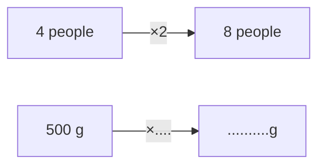

# Check! Check!

Anu has recorded the weights of the items in her house. Check if she has recorded them correctly by putting a tick against them if they look correct.

1. Iron Almirah – 40 g [ ]
2. Bed – 60 kg [ ]
3. Rice Bag – 5 kg [ ]
4. Sofa – 30 g [ ]
5. Bucket – 1 kg 800 g [ ]
6. Water Bottle – 650 g [ ]
7. Refrigerator – 50 g [ ]

# Let Us Do

Read the scales. Write the correct weight in the space given below.

<table>
  <tbody>
    <tr>
        <td>a</td>
        <td rowspan="2">A circular weighing scale with markings for 0, 1 kg, 2 kg, 3 kg, and 4 kg. The needle points to 1 kg.</td>
        <td>............g</td>
    </tr>
    <tr>
        <td>b</td>
        <td rowspan="2">A circular weighing scale with markings for 0, 1 kg, and 2 kg. The needle points halfway between 1 kg and 2 kg.</td>
        <td>......kg.......g</td>
    </tr>
    <tr>
        <td>c</td>
        <td rowspan="2">A circular weighing scale with markings for 0, 1 kg, 2 kg, 3 kg, 4 kg, 5 kg, and 6 kg. The needle points to 5 kg.</td>
        <td>......kg.......g</td>
    </tr>
    <tr>
        <td>d</td>
        <td rowspan="2">A circular weighing scale with markings for 0, 1 kg, 2 kg, 3 kg, and 4 kg. The needle points halfway between 2 kg and 3 kg.</td>
        <td>......kg.......g</td>
    </tr>
    <tr>
        <td>e</td>
        <td rowspan="2">A circular weighing scale with markings for 0, 250 g, 500 g, 750 g, and 1 kg. The needle points to 750 g.</td>
        <td>...............g</td>
    </tr>
    <tr>
        <td>f</td>
        <td rowspan="2">A circular weighing scale with markings for 0, 250 g, 500 g, 750 g, and 1 kg. The needle points to 250 g.</td>
        <td>...............g</td>
    </tr>
  </tbody>
</table>

Bags are weighed on two different weighing balances. One weighing balance displays weight in kilograms and other displays weight in grams.

The image shows two weighing scales. The first scale displays **2 kg** and the second scale displays **2000 g**. Both scales have the same bag of vegetables on them.

Match the bags that have the same weights. You can use the double number line given below.

<table>
  <tbody>
    <tr>
        <td>Weighing Balance 1</td>
        <td>Weighing Balance 2</td>
    </tr>
    <tr>
        <td>5 kg</td>
        <td>3,000 g</td>
    </tr>
    <tr>
        <td>10 kg</td>
        <td>6,000 g</td>
    </tr>
    <tr>
        <td>3 kg</td>
        <td>10,000 g</td>
    </tr>
    <tr>
        <td>6 kg</td>
        <td>30,000 g</td>
    </tr>
    <tr>
        <td>25 kg</td>
        <td>5,000 g</td>
    </tr>
    <tr>
        <td>30 kg</td>
        <td>25,000 g</td>
    </tr>
  </tbody>
</table>

> Notice the relationship between kg and g.

**Double Number Line:**

*   From 1 kg to 3 kg: $\times 3$
*   From 1 kg down to 1,000 g: $\times 1000$
*   From 1,000 g to the next mark (under 3 kg): $\times \_\_\_$

<table>
  <tbody>
    <tr>
        <td>kg</td>
        <td>1 kg</td>
        <td>3 kg</td>
        <td>8 kg</td>
        <td>____ kg</td>
        <td>20 kg</td>
        <td>____ kg</td>
        <td>30 kg</td>
    </tr>
    <tr>
        <td>g</td>
        <td>1,000 g</td>
        <td>_____ g</td>
        <td>_____ g</td>
        <td>15,000 g</td>
        <td>_____ g</td>
        <td>25,000 g</td>
        <td>_____ g</td>
    </tr>
  </tbody>
</table>

Use the double number line whenever needed to solve such problems.

Shrenu is baking cakes for her shop. She needs 3 kg 500 g flour. Her kitchen scale measures only in grams. What should her kitchen scale show for 3 kg 500 g of flour?

> 3 kg = 3,000 g
> 3 kg 500 g = 3,500 g

(The image shows a kitchen scale with a bag of flour on it, the digital display reads "3000 g".)

What would be 2 kg 250 g flour in grams?

> 2 kg = 2,000 g
> 2 kg 250 g = 2,250 g

# Let Us Find

1. Shamim and Rehan observed someone buying sugar weighing 5 kg 50 g. They thought of the quantity in grams. How much is it?

- Shamim thinks: 5,050 g
- Rehan says: "No, it is 5,500 g"

> Who do you think is right and why?

2. Complete the conversions by filling in the blanks. You can use the double number line given below on which some numbers have been marked.

<table>
  <thead>
    <tr>
        <th>kg</th>
        <th>1 kg</th>
        <th>3 kg</th>
        <th>___ kg</th>
        <th>7 kg</th>
        <th>8 kg</th>
        <th>___ kg</th>
        <th>___ kg</th>
        <th>___ kg ___ g</th>
        <th>___ kg ___ g</th>
    </tr>
    <tr>
        <th>g</th>
        <th>1,000 g</th>
        <th>____ g</th>
        <th>4,000 g</th>
        <th>____ g</th>
        <th>____ g</th>
        <th>10,000 g</th>
        <th>12,000 g</th>
        <th>____ g</th>
        <th>____ g</th>
    </tr>
  </thead>
</table>

(a) 7 kg 67 g = \_\_\_\_\_\_\_\_\_\_\_ g
(b) 3 kg 300 g = \_\_\_\_\_\_\_\_\_\_\_ g
(c) 8 kg 69 g = \_\_\_\_\_\_\_\_\_\_\_ g
(d) 10,760 g = \_\_\_\_\_ kg \_\_\_\_ g
(e) 4,080 g = \_\_\_\_\_ kg \_\_\_\_ g
(f) 12,042 g = \_\_\_\_\_ kg \_\_\_\_ g

# Comparison between Different Weights

1. Harpreet's family planned a picnic over the weekend. Her mother and father packed different food items to take along. The following is the list of fruits they carried.

> Watermelon – 3 kg
> Pineapple – 1 kg 750 g
> Apples – 1 kg 250 g
> Mangoes – 2 kg

A family of four—a mother, father, and two children—is enjoying a picnic in a park. They are sitting on a checkered mat spread on the grass under some trees. The father is cutting a large watermelon, while the others watch. A basket filled with pineapples and other fruits sits nearby, along with a water bottle and some food containers.

Among the fruits they carried, which one has the
(a) highest weight? __________
(b) least weight? __________
(c) Arrange the items in descending order of their weight.
__________ __________ __________ __________

2. Compare the weights using <, =, > signs.

<table>
  <tbody>
    <tr>
        <td>(a) 1 kg 600 g</td>
        <td>__________</td>
        <td>1,700 g</td>
    </tr>
    <tr>
        <td>(b) 1 kg 600 g</td>
        <td>__________</td>
        <td>1 kg 60 g</td>
    </tr>
    <tr>
        <td>(c) 10 kg 35 g</td>
        <td>__________</td>
        <td>10035 g</td>
    </tr>
    <tr>
        <td>(d) 1 kg 600 g</td>
        <td>__________</td>
        <td>2 kg 500 g</td>
    </tr>
    <tr>
        <td>(e) 5 kg 50 g</td>
        <td>__________</td>
        <td>4 kg 500 g</td>
    </tr>
    <tr>
        <td>(f) 900 g + 7,000 g</td>
        <td>__________</td>
        <td>7 kg + 900 g</td>
    </tr>
  </tbody>
</table>

# Milligram

How much weight can an ant carry?
How much does an ant weigh?
Ants weigh between 1 milligram and 5 milligrams. They can carry a lot more weight than their own weight.

> What is a milligram?
>
> $$1\text{ g} = 1,000\text{ milligram (mg)}$$

# Let Us Find

1. If a sugar sachet weighs 5g, how much will it be in milligrams?
2. Complete the double number line below appropriately.

<table>
  <thead>
    <tr>
        <th>1000 mg</th>
        <th>_____ mg</th>
        <th>12,000 mg</th>
        <th>20,000 mg</th>
        <th>_____ mg</th>
        <th>31,000 mg</th>
    </tr>
  </thead>
  <tbody>
    <tr>
        <td>1 g</td>
        <td>5 g</td>
        <td>12 g</td>
        <td>_____ g</td>
        <td>25 g</td>
        <td>_____ g</td>
    </tr>
  </tbody>
</table>

3. An ornament weighs 4 g 100 mg. What will be the weight in milligrams?

> Converting **g to mg** is similar to converting kg to g.
> $$4\text{ g} = 4,000\text{ mg}$$
> $$4\text{ g } 100\text{ mg} = 4,100\text{ mg}$$

4. A goldsmith has made an ornament weighing 10 g 500 mg. What will its weight be in milligrams? _____________________

> **Note for Teachers:** Discuss objects that are light and measured in milligrams (mg), like ingredients in medicine, gold ornaments, etc. Encourage the learners to explore and find similar objects around them.

5. Compare the weights using <, =, > signs.

<table>
  <tbody>
    <tr>
        <td>(a)</td>
        <td>20 g</td>
        <td>___________</td>
        <td>200 mg</td>
    </tr>
    <tr>
        <td>(b)</td>
        <td>16 g 50 mg</td>
        <td>___________</td>
        <td>50 g 16 mg</td>
    </tr>
    <tr>
        <td>(c)</td>
        <td>2,010 mg</td>
        <td>___________</td>
        <td>2 g 100 mg</td>
    </tr>
    <tr>
        <td>(d)</td>
        <td>9,000 mg</td>
        <td>___________</td>
        <td>90 g</td>
    </tr>
    <tr>
        <td>(e)</td>
        <td>5,000 g</td>
        <td>___________</td>
        <td>7,500 g</td>
    </tr>
    <tr>
        <td>(f)</td>
        <td>800 mg + 88 mg</td>
        <td>___________</td>
        <td>880 mg + 8 mg</td>
    </tr>
  </tbody>
</table>

> **Did you know?**
> 100 kg = 1 quintal
> 10 quintals = 1 tonne
> $\rightarrow$ 1,000 kg = 1 tonne

6. Observe the pictures given below and fill in the blanks.

An illustration shows an elephant labeled "5,000 kg". An arrow labeled "$\times 40$" points from the elephant to a blue whale. Below the whale is a blank space labeled "............ kg".

7. Answer the following questions.

<table>
  <tbody>
    <tr>
        <td>(a)</td>
        <td>5,000 kg</td>
        <td>=</td>
        <td>______ quintals</td>
        <td>=</td>
        <td>______ tonne</td>
    </tr>
    <tr>
        <td>(b)</td>
        <td>9,000 kg</td>
        <td>=</td>
        <td>______ quintals</td>
        <td></td>
        <td></td>
    </tr>
    <tr>
        <td>(c)</td>
        <td>______ kg</td>
        <td>=</td>
        <td>8 tonnes</td>
        <td colspan="2"></td>
    </tr>
  </tbody>
</table>

### King's Weight

In a kingdom, the king donates wheat grains equal to 10 times his weight on his birthday.

(a) If he donates 800 kg of wheat grain this birthday, what is his current weight? _______ kg.
(b) If he had donated 780 kg of wheat grain on his last birthday, what was his weight last year? _______ kg.
(c) How much weight did he gain in a year until this birthday? _______ kg.

An illustration shows a balance scale with a king sitting on the left pan and several sacks of wheat on the right pan.

# From Tiny to Big

1,000 mg = 1 g
1,000 g = 1 kg
100 kg = 1 quintal
10 quintals = 1 tonne

# The Grocery Store

Rathna went to the local grocery store and bought several items.
She bought 2 kg 500 g rice for daily use and 1 kg 750 g additional rice for the upcoming Pongal festival. How much total rice did she buy?

An illustration shows a woman carrying a bag of groceries with sugarcanes in the background, symbolizing the Pongal festival.

### Method 1: Mental Calculation
> I can think like this
> 2 kg 500 g + 1 kg 750 g
> = 3 kg + 500 g + 750 g.
> 500 g + 750 g
> = 500 g + 500 g + 250 g
> = 1 kg + 250 g
> So, total rice bought is 4 kg 250 g.

### Method 2: Column Addition (kg and g)
We can add and subtract like quantities.

<table>
  <thead>
    <tr>
        <th></th>
        <th>kg</th>
        <th colspan="3"></th>
        <th>g</th>
    </tr>
  </thead>
  <tbody>
    <tr>
        <td></td>
        <td>①</td>
        <td></td>
        <td></td>
        <td></td>
        <td></td>
    </tr>
    <tr>
        <td></td>
        <td>2</td>
        <td>5</td>
        <td>0</td>
        <td>0</td>
        <td></td>
    </tr>
    <tr>
        <td>+</td>
        <td>1</td>
        <td>7</td>
        <td>5</td>
        <td>0</td>
        <td></td>
    </tr>
    <tr>
        <th></th>
        <th>4</th>
        <th>~~1~~ 2</th>
        <th>5</th>
        <th>0</th>
        <th></th>
    </tr>
  </tbody>
</table>

### Method 3: Conversion to Grams
We can also convert the quantities into grams.
2,500 g + 1,750 g

<table>
  <thead>
    <tr>
        <th></th>
        <th colspan="4"></th>
        <th>Grams</th>
    </tr>
  </thead>
  <tbody>
    <tr>
        <td></td>
        <td>①</td>
        <td></td>
        <td></td>
        <td></td>
        <td></td>
    </tr>
    <tr>
        <td></td>
        <td>2</td>
        <td>5</td>
        <td>0</td>
        <td>0</td>
        <td></td>
    </tr>
    <tr>
        <td>+</td>
        <td>1</td>
        <td>7</td>
        <td>5</td>
        <td>0</td>
        <td></td>
    </tr>
    <tr>
        <th></th>
        <th>4</th>
        <th>~~1~~ 2</th>
        <th>5</th>
        <th>0</th>
        <th>= 4 kg 250 g</th>
    </tr>
  </tbody>
</table>
Note: 1,000 g = 1 kg

How much extra rice did she buy for household use than for the Pongal festival?

> **Note for Teachers:** Please note that three different ways have been suggested above for adding and subtracting weights. The need for these different strategies arises depending on the numbers used. If the numbers are 250, 500, 750 or even 200, 400, 500, etc., we can add and subtract numbers orally. In fact, we should encourage these mental strategies to be able to use mathematics for daily life problem-solving. When numbers are not amenable to such oral calculations, the learners can choose one of the column strategies provided here, based on their comfort. Help learners observe the similarity between subtraction of numbers and subtraction of quantities like weights.

> I can also think like this.
> We have to do 2 kg 500 g - 1 kg 750 g.
> Take away 500 g from 2 kg 500 g.
> We get 2 kg.
> Take away 1 kg from 2 kg. We get 1 kg.
> Now, take away 250 g.
> We get 750 g.

<table>
  <thead>
    <tr>
        <th>kg</th>
        <th colspan="2"></th>
        <th>g</th>
        <th>kg</th>
        <th colspan="4"></th>
        <th>g</th>
    </tr>
  </thead>
  <tbody>
    <tr>
        <td>①</td>
        <td colspan="2"></td>
        <td></td>
        <td>①</td>
        <td>⓪</td>
        <td>⑭</td>
        <td>⑩</td>
        <td></td>
        <td></td>
    </tr>
    <tr>
        <td>~~2~~</td>
        <td>1</td>
        <td>5</td>
        <td>0</td>
        <td>0</td>
        <td>~~2~~</td>
        <td>~~1~~</td>
        <td>~~5~~</td>
        <td>~~0~~</td>
        <td>0</td>
    </tr>
    <tr>
        <td>- 1</td>
        <td></td>
        <td>7</td>
        <td>5</td>
        <td>0</td>
        <td>- 1</td>
        <td></td>
        <td>7</td>
        <td>5</td>
        <td>0</td>
    </tr>
    <tr>
        <td colspan="5"></td>
        <td>0</td>
        <td></td>
        <td>7</td>
        <td>5</td>
        <td>0</td>
    </tr>
  </tbody>
</table>

> Convert 1 kg = 1000 g

<table>
  <thead>
    <tr>
        <th colspan="5">Grams</th>
        <th></th>
    </tr>
  </thead>
  <tbody>
    <tr>
        <td>①</td>
        <td>⑭</td>
        <td>⑩</td>
        <td>◯</td>
        <td></td>
        <td></td>
    </tr>
    <tr>
        <td>~~2~~</td>
        <td>~~5~~</td>
        <td>~~0~~</td>
        <td>0</td>
        <td></td>
        <td></td>
    </tr>
    <tr>
        <td>- 1</td>
        <td>7</td>
        <td>5</td>
        <td>0</td>
        <td></td>
        <td></td>
    </tr>
    <tr>
        <th>0</th>
        <th>7</th>
        <th>5</th>
        <th>0</th>
        <th>=</th>
        <th>750 g</th>
    </tr>
  </tbody>
</table>

> Convert the quantities into grams. We get 2500 g and 1750 g. Now subtract as before.

# Let Us Do

1. A restaurant owner uses 5 kg 200 g, 8 kg 900 g, and 12 kg 600 g of onions over 3 days. What is the total weight of onions used by the restaurant owner in 3 days?
2. Aarav is helping his grandfather at the fruit stall. He lifts two baskets of apples weighing 2 kg 100 g and 3 kg 950 g. What is the total weight of apples he lifted?
3. 4 kg 500 g of sand is used from a sack weighing 10 kg. How much sand is left in the sack?
4. A rice sack weighs 9 kg 750 g. After some rice is used, it weighs 3 kg 700 g. How much rice was used?
5. A delivery truck delivered 17 kg 900 g of supplies in the morning and 12 kg 700g in the afternoon. How much total supplies did it deliver?
6. A box of books weighs 14 kg 750 g. After removing some books, the weight of the box is 10 kg 500 g. What is the weight of the books removed?
7. In a community kitchen of a Gurdwara, 65 kg of flour was purchased on one day. Out of this, 42 kg 275 g flour was used for preparing langar. The next day, an additional 52 kg 500 g of flour was bought. What is the total quantity of flour now available in the kitchen store?

## More Operations on Weight

1. A farmer weighs a sack of potatoes and finds it to be 10 kg 500 g. If the farmer has 4 such potato sacks, what is the total weight of all the sacks?
   $4 \times 10 \text{ kg } 500 \text{ g}$
   $= 4 \times 10 \text{ kg and } 4 \times 500 \text{ g}$
   $= 40 \text{ kg } + 2000 \text{ g}$
   $= 40 \text{ kg } + 2 \text{ kg } = 42 \text{ kg.}$

   > You can find the product by multiplying the kg and g separately and adding the two. You can also convert the quantity into grams and then multiply.

2. A box of nuts weighing 4 kg 800 g is equally distributed into 4 smaller boxes. What is the weight of each small box in grams?
   $4 \text{ kg } \div 4 = 1 \text{ kg}$
   $800 \text{ g } \div 4 = 200 \text{ g}$
   So, $4 \text{ kg } 800 \text{ g } \div 4 = 1 \text{ kg } 200 \text{ g}$

   > We can also convert the quantity into grams and divide $4800 \div 4 = ?$

## Let Us Do

1. The cost of some grocery items is given in the following table. Find the total cost of each item.

<table>
  <tbody>
    <tr>
        <td>Item</td>
        <td>Weight</td>
        <td>Cost of 1 kg</td>
        <td>Total cost</td>
    </tr>
    <tr>
        <th>Rice</th>
        <th>12 kg 500 g</th>
        <th>₹ 60</th>
        <th></th>
    </tr>
    <tr>
        <th>Flour</th>
        <th>7 kg 250 g</th>
        <th>₹ 40</th>
        <th></th>
    </tr>
    <tr>
        <th>Sugar</th>
        <th>5 kg</th>
        <th>₹ 45</th>
        <th></th>
    </tr>
    <tr>
        <th>Chana dal</th>
        <th>3 kg 600 g</th>
        <th>₹ 70</th>
        <th></th>
    </tr>
    <tr>
        <th>Besan</th>
        <th>4 kg</th>
        <th>₹ 60</th>
        <th></th>
    </tr>
    <tr>
        <th>Jaggery</th>
        <th>1 kg 400 g</th>
        <th>₹ 50</th>
        <th></th>
    </tr>
  </tbody>
</table>

2. 4 people need 500 g rice for a meal. How much rice will be needed for 8 people if they eat similar quantity of rice?

3. 5 kg of tomatoes cost ₹ 73. How much will 10 kg of tomatoes cost?

<table>
    <tr>
        <td>5 kg</td>
        <td>$\xrightarrow{\times 2}$</td>
        <td>10 kg</td>
    </tr>
    <tr>
        <td>₹ 73</td>
        <td>$\xrightarrow{\times ....}$</td>
        <td>₹ .........</td>
    </tr>
</table>4. Nitesh is a scrap dealer. How much would he have paid for
   (a) 16 kg of old newspaper, if he paid ₹ 8 for every 1 kg of newspaper?
   (b) 20 kg iron, if he paid ₹ 200 for every 10 kg of iron?
   (c) 10 kg plastic, if he paid ₹ 30 for 5 kg of plastic?
   Make double number lines for answering (b) and (c).

An illustration shows Nitesh, a scrap dealer, riding a bicycle that is pulling a wooden cart. The cart is loaded with various scrap materials, including bundles of old newspapers and plastic bottles.

## Measuring Capacity

1. You must have seen tea being prepared at your home. How much water and milk do we need to make 2 cups of tea?
   Do we need 1 $l$ of water to make 2 cups of tea?
   Is 500 $ml$ of water enough for 2 cups of tea?
2. A bucket can hold a maximum of 20 $ml$ of water. Is this statement correct? Which unit should be used in such a situation?

## Big to Small, Small to Big

1. Ramiz brings a 500 ml water bottle to school. He drinks two bottles at school. How much water does he drink at school?
   Ramiz drinks \_\_\_\_\_\_\_\_\_\_\_ml + \_\_\_\_\_\_\_\_\_\_\_ml = \_\_\_\_\_\_\_\_\_ml.
   Ramiz drinks \_\_\_\_ $l$ of water in a day.
2. Muskaan drinks 3 $l$ of water in a day. How many times would she need to refill a 500 ml water bottle? \_\_\_\_\_\_\_\_\_\_\_\_\_\_\_\_.
   Muskaan drinks \_\_\_\_\_\_\_\_\_ ml of water in a day.

3. Write the total capacity of the following containers in each blank.

*   **Set 1:**
    *   One 1 $l$ container (marked at 500 ml)
    *   One 500 ml container (marked in 100 ml increments)
    *   One 100 ml container (marked at 50 ml)
    `________ l ________ ml`

*   **Set 2:**
    *   One 1 $l$ container (marked at 500 ml)
    *   One 500 ml container (marked in 100 ml increments)
    `________ l ________ ml`

*   **Set 3:**
    *   One 100 ml container (marked at 50 ml)
    *   One 100 ml container (marked at 50 ml)
    *   One 500 ml container (marked in 100 ml increments)
    `________ l ________ ml`

*   **Set 4:**
    *   One 1 $l$ container (marked at 500 ml)
    *   One 1 $l$ container (marked at 500 ml)
    *   One 100 ml container (marked at 50 ml)
    `________ l ________ ml`

# Different Units but Same Measure

## The Milkman’s Delivery

Khayal *chacha* delivers fresh cow milk to homes. Bhalerao’s family orders $2l$ of milk everyday.

This family has a vessel marked in $ml$ only. What mark will you see in the vessel corresponding to $2l$?

The image shows a conversion scale between liters ($l$) and milliliters ($ml$):

<table>
  <tbody>
    <tr>
        <td>1 l</td>
        <td>2 l</td>
        <td></td>
        <td>6 l</td>
        <td>8 l</td>
        <td></td>
        <td>____ l</td>
        <td>14 l</td>
        <td></td>
        <td>____ l</td>
        <td></td>
        <td>____ l</td>
    </tr>
    <tr>
        <td>1000 ml</td>
        <td>2000 ml</td>
        <td>____ ml</td>
        <td>____ ml</td>
        <td>____ ml</td>
        <td>12,000 ml</td>
        <td>____ ml</td>
        <td>20,000 ml</td>
        <td>25,000 ml</td>
        <td colspan="3"></td>
    </tr>
  </tbody>
</table>

Khayal *chacha* delivers the following amounts of milk each week to different families.

<table>
  <thead>
    <tr>
        <th>Family</th>
        <th>Milk Delivered in a Week in l</th>
        <th>Quantity in ml</th>
    </tr>
  </thead>
  <tbody>
    <tr>
        <td>Arora’s</td>
        <td>8</td>
        <td>________</td>
    </tr>
    <tr>
        <td>Nair’s</td>
        <td>14</td>
        <td>________</td>
    </tr>
    <tr>
        <td>Shrivastava’s</td>
        <td>________</td>
        <td>12,000</td>
    </tr>
    <tr>
        <td>Das’s</td>
        <td>________</td>
        <td>20,000</td>
    </tr>
    <tr>
        <td>Rao’s</td>
        <td>________</td>
        <td>25,000</td>
    </tr>
  </tbody>
</table>

Dev’s family needs $1\text{ l}$ milk every day. On Sunday, they need $500\text{ ml}$ more.
Quantity of milk they need on Sunday $= 1\text{ l} + 500\text{ ml}$
$= 1,000\text{ ml} + 500\text{ ml} = 1,500\text{ ml}$.

# Let Us Think

1. Mary and Daisy filled their bottle with $1\text{ l }400\text{ ml}$ of water. They wondered about the capacity of the bottle in $\text{ml}$. How much is it?

The image shows two girls at a "DRINKING WATER" station. One girl says, "$1,400\text{ ml}$". The other girl says, "No, it is $1,040\text{ ml}$."

> Who do you think is correct and why?

2. Convert and fill in the blanks appropriately. You can use the double number line given earlier.

(a) $3\text{ l }8\text{ ml} = \_\_\_\_\_\text{ml}$
(b) $9\text{ l }90\text{ ml} = \_\_\_\_\_\text{ml}$
(c) $14,075\text{ ml} = \_\_\_\_\text{l }\_\_\_\_\text{ml}$
(d) $8\text{ l }86\text{ ml} = \_\_\_\_\_\text{ml}$
(e) $12,200\text{ ml} = \_\_\_\_\text{l }\_\_\_\_\text{ml}$
(f) $18,350\text{ ml} = \_\_\_\_\text{l }\_\_\_\_\text{ml}$

# Let Us Compare

1. Kiran owns a petrol pump. She records the details of the sales of petrol in a day.

The image shows a petrol pump station where an attendant is filling a car with petrol.

2.

<table>
  <thead>
    <tr>
        <th>Vehicle</th>
        <th>No. of Vehicles</th>
        <th>Quantity of Fuel in Each Vehicle (in litres)</th>
        <th>Total Quantity of Fuel (in litres)</th>
    </tr>
  </thead>
  <tbody>
    <tr>
        <td>Truck</td>
        <td>3</td>
        <td>500</td>
        <td></td>
    </tr>
    <tr>
        <td>Bus</td>
        <td>6</td>
        <td>300</td>
        <td></td>
    </tr>
    <tr>
        <td>Car</td>
        <td>10</td>
        <td>50</td>
        <td></td>
    </tr>
    <tr>
        <td>Auto Rickshaw</td>
        <td>12</td>
        <td>8</td>
        <td></td>
    </tr>
    <tr>
        <td>Two-wheeler</td>
        <td>25</td>
        <td>5</td>
        <td></td>
    </tr>
  </tbody>
</table>

(a) How much more fuel is bought for buses than for trucks?
(b) What is the total quantity of fuel filled from the petrol pump on that day?

3. Compare the following quantities using the signs $<, =, >$.

(a) $5\ l\ 600\ ml$ \_\_\_\_\_\_\_\_\_\_\_ $5,400\ ml$
(b) $10\ l\ 100\ ml$ \_\_\_\_\_\_\_\_\_\_\_ $1\ l\ 600\ ml$
(c) $190\ ml + 800\ ml$ \_\_\_\_\_\_\_\_\_\_\_ $800\ ml + 109\ ml$
(d) $3\ l\ 600\ ml$ \_\_\_\_\_\_\_\_\_\_\_ $3,600\ ml$
(e) $4\ l\ 50\ ml$ \_\_\_\_\_\_\_\_\_\_\_ $4\ l\ 500\ ml$

4. Sam and Tina fill petrol in their bikes. Tina bought $2\ l\ 500\ ml$ of petrol. Sam bought $2\ l\ 800\ ml$ more petrol than Tina. How much petrol did Sam buy?

Sam found the quantity of petrol by adding like quantities.

$2\ l\ 500\ ml + 2\ l\ 800\ ml$
$= 2\ l + 2\ l$ and $500\ ml + 800\ ml$
$= 4\ l$ and $1,300\ ml$
$= 4\ l$ and $1\ l$ and $300\ ml$
$= 5\ l\ 300\ ml$.

<table>
  <tbody>
    <tr>
        <td>l</td>
        <td colspan="4">ml</td>
    </tr>
    <tr>
        <td>①</td>
        <td colspan="4"></td>
    </tr>
    <tr>
        <td>2</td>
        <td>5</td>
        <td>0</td>
        <td>0</td>
        <td></td>
    </tr>
    <tr>
        <td>+</td>
        <td>2</td>
        <td>8</td>
        <td>0</td>
        <td>0</td>
    </tr>
    <tr>
        <td>---</td>
        <td>---</td>
        <td>---</td>
        <td>---</td>
        <td>---</td>
    </tr>
    <tr>
        <td>5</td>
        <td>1</td>
        <td>3</td>
        <td>0</td>
        <td>0</td>
    </tr>
  </tbody>
</table>
*(Note: The '1' in the ml column's '13' is carried over to the l column as indicated by the circled 1 and the arrow in the original diagram.)*

> $1\ l = 1,000\ ml$

Tina converted the quantities into $ml$, that is, 2,500 $ml$ and 2,800 $ml$.

<table>
  <thead>
    <tr>
        <th></th>
        <th></th>
        <th>ml</th>
        <th></th>
        <th></th>
        <th></th>
    </tr>
  </thead>
  <tbody>
    <tr>
        <td></td>
        <td>(1)</td>
        <td></td>
        <td></td>
        <td></td>
        <td></td>
    </tr>
    <tr>
        <td></td>
        <td>2</td>
        <td>5</td>
        <td>0</td>
        <td>0</td>
        <td></td>
    </tr>
    <tr>
        <td>+</td>
        <td>2</td>
        <td>8</td>
        <td>0</td>
        <td>0</td>
        <td></td>
    </tr>
    <tr>
        <td></td>
        <td>5</td>
        <td>13</td>
        <td>0</td>
        <td>0</td>
        <td></td>
    </tr>
  </tbody>
</table>
*(Note: In the original image, the '1' in '13' is boxed and has an arrow pointing to the carry-over '(1)' above the thousands place.)*

Total quantity of petrol bought by Sam = 2,500 $ml$ + 2,800 $ml$ = 5,300 $ml$ = 5 $l$ 300 $ml$.

After refueling, Sam found his fuel gauge reading 9 $l$. How much fuel did his bike have before refueling?

Quantity of fuel Sam’s bike had before refueling is—

$9\ l - 5\ l\ 300\ ml$

> We can do this by converting both the quantities in $ml$ also, 9,000 $ml$ - 5,300 $ml$.

<table>
  <thead>
    <tr>
        <th></th>
        <th>Convert</th>
    </tr>
  </thead>
  <tbody>
    <tr>
        <td>1 l = 1,000 ml</td>
        <td></td>
    </tr>
  </tbody>
</table>
<table>
  <thead>
    <tr>
        <th></th>
        <th>l</th>
        <th></th>
        <th></th>
        <th>ml</th>
        <th></th>
        <th></th>
    </tr>
  </thead>
  <tbody>
    <tr>
        <td></td>
        <td>(8)</td>
        <td></td>
        <td>(10)</td>
        <td></td>
        <td></td>
        <td></td>
    </tr>
    <tr>
        <td></td>
        <td>~~9~~</td>
        <td></td>
        <td>~~0~~</td>
        <td>0</td>
        <td>0</td>
        <td></td>
    </tr>
    <tr>
        <td>-</td>
        <td>5</td>
        <td></td>
        <td>3</td>
        <td>0</td>
        <td>0</td>
        <td></td>
    </tr>
    <tr>
        <td></td>
        <td>3</td>
        <td></td>
        <td>7</td>
        <td>0</td>
        <td>0</td>
        <td></td>
    </tr>
  </tbody>
</table>

Sam’s bike had 3 $l$ 700 $ml$ of fuel before refuelling.

> **Note for Teachers:** Explain the addition and subtraction algorithm as was done in the case of weight. Encourage the learners to choose the strategy they are comfortable with. Teachers can create several more problems like this. To help learners master such problem-solving, choose numbers mindfully — preferably multiples of 10, 100, or 1000.

# Let Us Solve

1. Riya is filling water bottles for a picnic. She fills one $$2\ l$$ bottle and four $$500\ ml$$ bottles. Her friend, Aarav fills three $$750\ ml$$ bottles. Who filled more water, Riya or Aarav? How much more?

2. A bottle of milk is poured equally into 8 glasses, leaving $$120\ ml$$ of milk in the bottle.
    * (a) If each glass has a capacity of $$360\ ml$$, what is the total capacity of 8 glasses?
    * (b) How much milk was there in the bottle initially?
    * (c) If $$1\ l$$ of milk costs ₹ 40, how much will $$3\ l$$ milk cost?

3. A juice vendor has a $$5\ l$$ container of orange juice. Each glass has a capacity $$250\ ml$$.
    * (a) How many full glasses can he serve before the container becomes empty?
    * (b) If he has already served 10 glasses, how much juice is left?
    * (c) If $$250\ ml$$ of juice is sold at ₹ 25, how much will he earn by selling $$5\ l$$ juice?

4. In a factory, $$8\ l\ 400\ ml$$ of oil needs to be equally poured into 7 containers for storage. How much oil will each container hold?

5. If one container can hold $$1\ l\ 75\ ml$$ of buttermilk, how much buttermilk will be there in 8 such containers?

Use the double number line whenever needed to solve such problems.