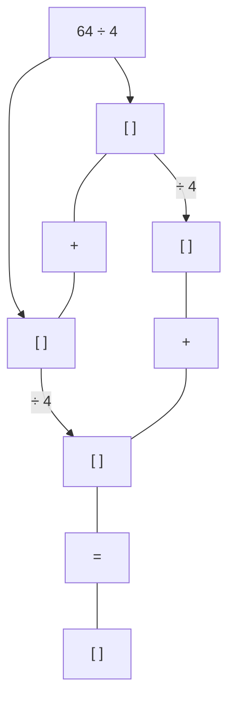
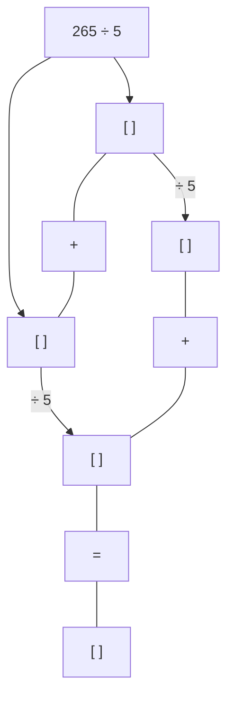
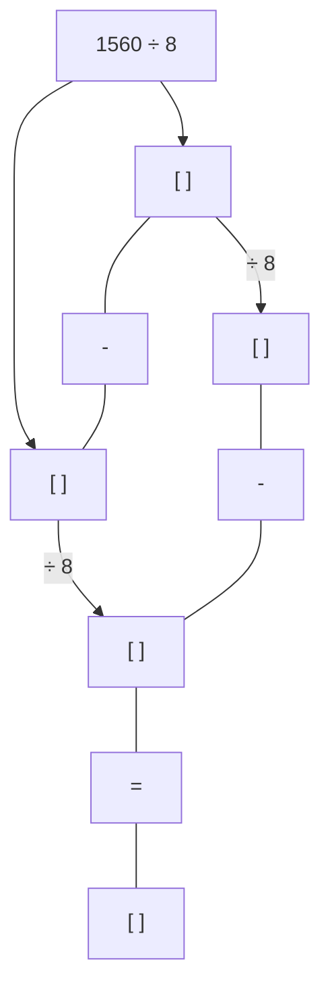
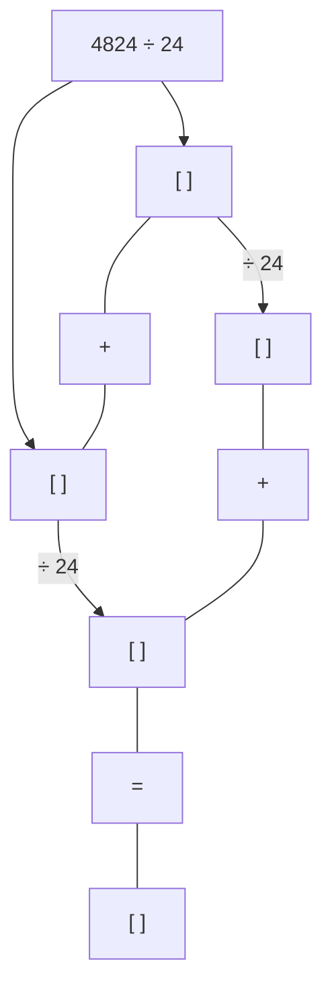
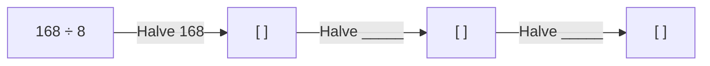
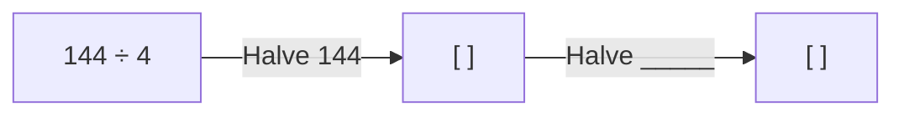
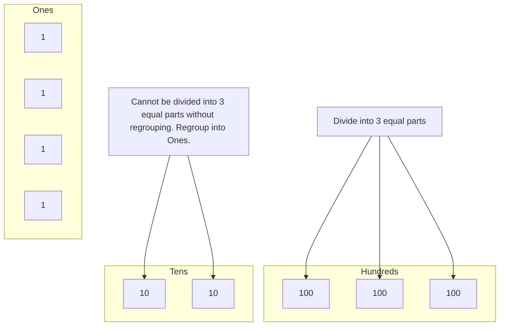
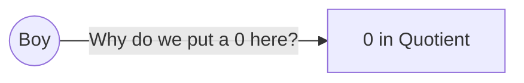

Observe the following array of coconuts. Write two division facts using the given multiplication fact.

(An array of 35 coconuts is shown, arranged in 5 rows and 7 columns. There is a box with the number 7 above the columns and a box with the number 5 next to the rows.)
$5 \times 7 = 35$

(The array is shown split vertically into 7 groups of 5 coconuts each.)
$35 \div 7 = 5$
35 split into 7 groups has 5 in each group.

(The array is shown split horizontally into 5 groups of 7 coconuts each.)
$35 \div 5 = 7$
35 split into 5 groups has 7 in each group.

> ### Think and answer
> $35 \div 1 = \_\_\_\_\_\_$

***

**Division Facts**
$5 \times 7 = 35$
$35 \div 5 = 7$
$35 \div 7 = 5$

In the equation $35 \div 7 = 5$:
*   35 is the **Dividend (N)**
*   7 is the **Divisor (D)**
*   5 is the **Quotient (Q)**

**Notice!**
**Dividend (N) = Divisor (D) $\times$ Quotient (Q)**

***

Write the appropriate multiplication fact for the array shown below. Write two division facts that follow from the multiplication fact.

(An array of 24 coconuts is shown, arranged in 4 rows and 6 columns. There is an empty box $\square$ above the columns and an empty box $\square$ next to the rows.)

<table>
    <tr>
        <td>\_\_\_\_\_\_ $\times$ \_\_\_\_\_\_ = \_\_\_\_\_\_</td>
    </tr>
    <tr>
        <td>\_\_\_\_\_\_ $\div$ \_\_\_\_\_\_ = \_\_\_\_\_\_</td>
    </tr>
    <tr>
        <td>\_\_\_\_\_\_ $\div$ \_\_\_\_\_\_ = \_\_\_\_\_\_</td>
    </tr>
</table>

# Let Us Play

Identify the numbers that can fill the circles such that the numbers in the squares are the products or the quotients of the numbers in the circles.

<table>
  <thead>
    <tr>
        <th>Square</th>
        <th>72</th>
        <th>60</th>
        <th>48</th>
        <th>36</th>
        <th>24</th>
        <th>40</th>
    </tr>
  </thead>
  <tbody>
    <tr>
        <td>Circles &amp; Operator</td>
        <td>(36) $\times$ (2)</td>
        <td>( ) $\times$ ( )</td>
        <td>( ) $\times$ ( )</td>
        <td>( ) $\times$ ( )</td>
        <td>( ) $\times$ ( )</td>
        <td>( ) $\times$ ( )</td>
    </tr>
  </tbody>
</table>
<table>
  <thead>
    <tr>
        <th>Square</th>
        <th>54</th>
        <th>42</th>
        <th>56</th>
        <th>[ ]</th>
        <th>[ ]</th>
        <th>[ ]</th>
    </tr>
  </thead>
  <tbody>
    <tr>
        <td>Circles &amp; Operator</td>
        <td>( ) $\div$ ( )</td>
        <td>( ) $\div$ ( )</td>
        <td>( ) $\div$ ( )</td>
        <td>(54) $\div$ ( )</td>
        <td>(42) $\div$ ( )</td>
        <td>(56) $\div$ ( )</td>
    </tr>
  </tbody>
</table>

# Let Us Do

1. Solve the following multiplication problems. Write two division statements in each case.

<table>
  <tbody>
    <tr>
        <td>$30 \times 30 = \_\_\_\_\_\_$ <br/> $\_\_\_\_\_\_ \div \_\_\_\_\_\_ = \_\_\_\_\_\_$ <br/> $\_\_\_\_\_\_ \div \_\_\_\_\_\_ = \_\_\_\_\_\_$</td>
        <td>$15 \times 60 = \_\_\_\_\_\_$ <br/> $\_\_\_\_\_\_ \div \_\_\_\_\_\_ = \_\_\_\_\_\_$ <br/> $\_\_\_\_\_\_ \div \_\_\_\_\_\_ = \_\_\_\_\_\_$</td>
    </tr>
    <tr>
        <td>$400 \times 8 = \_\_\_\_\_\_$ <br/> $\_\_\_\_\_\_ \div \_\_\_\_\_\_ = \_\_\_\_\_\_$ <br/> $\_\_\_\_\_\_ \div \_\_\_\_\_\_ = \_\_\_\_\_\_$</td>
        <td>$200 \times 16 = \_\_\_\_\_\_$ <br/> $\_\_\_\_\_\_ \div \_\_\_\_\_\_ = \_\_\_\_\_\_$ <br/> $\_\_\_\_\_\_ \div \_\_\_\_\_\_ = \_\_\_\_\_\_$</td>
    </tr>
  </tbody>
</table>

> *Observe the relationship between the divisor, dividend, and quotient.*

> **Note for Teachers:** Encourage the learners to recognise the connection between multiplication and division. Help them observe that every multiplication statement can lead to two related division statements. Help them notice the relationship between the number, divisor, and quotient. Provide opportunities to practice multiplication tables through games and puzzles like the ones above.

2. Solve the following division problems. Notice the patterns and discuss in class.

*How many 3s in 150?*
$\text{\_\_\_\_} \times 3 = 150$
* $150 \div 3 = \text{\_\_\_\_}$
* $80 \div 4 = \text{\_\_\_\_}$

$5 \times \text{\_\_\_\_} = 500$
* $500 \div 5 = \text{\_\_\_\_}$
* $100 \div 10 = \text{\_\_\_\_}$
* $300 \div 100 = \text{\_\_\_\_}$
* $500 \div 50 = \text{\_\_\_\_}$
* $200 \div 20 = \text{\_\_\_\_}$

$44 \times \text{\_\_\_\_} = 440$
* $440 \div 44 = \text{\_\_\_\_}$
* $630 \div 63 = \text{\_\_\_\_}$

# Patterns in Division and Place Value

$10 \times \text{\_\_\_\_} = 1000$
* $1000 \div 10 = \text{\_\_\_\_}$
* $1000 \div 100 = \text{\_\_\_\_}$
* $1600 \div 4 = \text{\_\_\_\_}$
* $2000 \div 2 = \text{\_\_\_\_}$
* $2000 \div 20 = \text{\_\_\_\_}$

$37 \times \text{\_\_\_\_} = 3700$
* $3700 \div 37 = \text{\_\_\_\_}$
* $3300 \div 3 = \text{\_\_\_\_}$
* $3300 \div 300 = \text{\_\_\_\_}$
* $4000 \div 40 = \text{\_\_\_\_}$

### Now fill the place value chart.

What is happening to the quotients in each case? Discuss.

<table>
  <tbody>
    <tr>
        <td>Problem</td>
        <td>H</td>
        <td>T</td>
        <td>O</td>
    </tr>
    <tr>
        <th>40 ÷ 10 =</th>
        <th></th>
        <th></th>
        <th>4</th>
    </tr>
    <tr>
        <th>400 ÷ 10 =</th>
        <th></th>
        <th>4</th>
        <th>0</th>
    </tr>
    <tr>
        <th>4000 ÷ 10 =</th>
        <th>4</th>
        <th>0</th>
        <th>0</th>
    </tr>
    <tr>
        <th>700 ÷ 70 =</th>
        <th></th>
        <th></th>
        <th></th>
    </tr>
    <tr>
        <th>1400 ÷ 100 =</th>
        <th></th>
        <th></th>
        <th></th>
    </tr>
    <tr>
        <th>220 ÷ 20 =</th>
        <th></th>
        <th></th>
        <th></th>
    </tr>
    <tr>
        <th>2200 ÷ 20 =</th>
        <th colspan="3"></th>
    </tr>
  </tbody>
</table>

What patterns do you notice here?

<table>
  <tbody>
    <tr>
        <td>Problem</td>
        <td>H</td>
        <td>T</td>
        <td>O</td>
    </tr>
    <tr>
        <th>110 ÷ 11 =</th>
        <th></th>
        <th></th>
        <th></th>
    </tr>
    <tr>
        <th>860 ÷ 86 =</th>
        <th></th>
        <th></th>
        <th></th>
    </tr>
    <tr>
        <th>7500 ÷ 750 =</th>
        <th></th>
        <th></th>
        <th></th>
    </tr>
    <tr>
        <th>8800 ÷ 88 =</th>
        <th></th>
        <th></th>
        <th></th>
    </tr>
    <tr>
        <th>2400 ÷ 24 =</th>
        <th></th>
        <th></th>
        <th></th>
    </tr>
    <tr>
        <th>440 ÷ 22 =</th>
        <th colspan="3"></th>
    </tr>
  </tbody>
</table>

# Let Us Do

1. Sabina cycles 160 km in 20 days and the same distance each day. How many kilometres does she cycle each day?
2. How many notes of ₹100 does Seema need to carry if she wants to buy coconuts worth ₹4200?
3. The owner of an electric store has decided to distribute ₹5500 equally amongst 5 of his employees as a Diwali gift. What amount will each employee get?
   What will happen if he distributes the same amount of money among 10 employees? Will each employee get more or less? How much money would he have to distribute if everyone must get the same amount as earlier?
4. Place the numbers 1 to 8 in the following boxes so that all the four operations, division, multiplication, addition and subtraction are correct. No number must be repeated.

<table>
  <tbody>
    <tr>
        <td>[ ]</td>
        <td>÷</td>
        <td>[ ]</td>
        <td>=</td>
        <td>[ ]</td>
    </tr>
    <tr>
        <td>-</td>
        <td></td>
        <td></td>
        <td></td>
        <td>×</td>
    </tr>
    <tr>
        <td>[ ]</td>
        <td></td>
        <td></td>
        <td></td>
        <td>[ ]</td>
    </tr>
    <tr>
        <td colspan="5">_________________________________</td>
    </tr>
    <tr>
        <td>[ ]</td>
        <td>+</td>
        <td>[ ]</td>
        <td>=</td>
        <td>[ ]</td>
    </tr>
  </tbody>
</table>

   How did you think about solving this?
   Is there more than one answer?

5. Fill in the blanks
<table>
  <tbody>
    <tr>
        <td>(a) ____ ÷ 18 = 100.</td>
        <td>(e) 870 ÷ ____ = 87.</td>
    </tr>
    <tr>
        <td>(b) ____ ÷ 10 = 610.</td>
        <td>(f) ____ ÷ 100 = 70.</td>
    </tr>
    <tr>
        <td>(c) ____ ÷ 100 = 72.</td>
        <td>(g) 200 ÷ ____ = 2.</td>
    </tr>
    <tr>
        <td>(d) ____ ÷ 100 = 10.</td>
        <td>(h) 130 ÷ ____ = 13.</td>
    </tr>
  </tbody>
</table>

> **Note for Teachers:** Encourage learners to notice relationships between simple multiplication facts and multiples of tens and hundreds in division problems like the above.

# Mental Strategies for Division

Observe the division carefully.

> I can split the number into convenient parts.

1. **$1248 \div 6$**
   $1248 = 1200 + 48$
   I know $1200 \div 6 = 200$
   and $48 \div 6 = 8$
   So, $1248 \div 6 = 200 + 8 = 208$.

> I can do it in a different way.

2. **$1992 \div 4$**
   $1992 = 2000 - 8$
   $2000 \div 4 = 500$
   $8 \div 4 = 2$
   So, $1992 \div 4 = 500 - 2 = 498$.

> Can you give 5 such examples where you can split the number conveniently?

> For which other divisors and dividend might this strategy of repeated halving work?

3. **$128 \div 4$**
   To divide by 4, I can halve twice.
   * Half of 128 is 64.
   * Half of 64 is 32.

## Try It!

1. $64 \div 4$


2. $265 \div 5$


3. $1560 \div 8$


4. $4824 \div 24$


5. $168 \div 8$


6. $144 \div 4$


Solve the following problems using strategies used in the previous question.

<table>
  <tbody>
    <tr>
        <td>(a)</td>
        <td>256 ÷ 4</td>
        <td>(c)</td>
        <td>147 ÷ 7</td>
        <td>(e)</td>
        <td>648 ÷ 12</td>
        <td>(g)</td>
        <td>775 ÷ 25</td>
    </tr>
    <tr>
        <td>(b)</td>
        <td>545 ÷ 5</td>
        <td>(d)</td>
        <td>1212 ÷ 6</td>
        <td>(f)</td>
        <td>9648 ÷ 48</td>
        <td>(h)</td>
        <td>796 ÷ 4</td>
    </tr>
  </tbody>
</table>

## Susie’s Farm in Kerala

1. Susie and Sunitha have a large coconut farm and they have harvested 1,117 coconuts in April. They sold 582 coconuts equally to 6 regular customers. How many coconuts did each customer get?
   They sold $582 \div 6$ coconuts to each customer.

An illustration shows a scenic view of a coconut farm in Kerala, with a dirt path leading through a dense grove of tall coconut palm trees under a bright sky.

### Susie’s solution
<table>
  <tbody>
    <tr>
        <td>6) 582</td>
        <td>(20+20+20+20+10+7)</td>
    </tr>
    <tr>
        <td>-120</td>
        <td>↖ Susie’s solution</td>
    </tr>
    <tr>
        <td>----</td>
        <td></td>
    </tr>
    <tr>
        <td>462</td>
        <td></td>
    </tr>
    <tr>
        <td>-120</td>
        <td></td>
    </tr>
    <tr>
        <td>----</td>
        <td></td>
    </tr>
    <tr>
        <td>342</td>
        <td></td>
    </tr>
    <tr>
        <td>-120</td>
        <td></td>
    </tr>
    <tr>
        <td>----</td>
        <td></td>
    </tr>
    <tr>
        <td>222</td>
        <td></td>
    </tr>
    <tr>
        <td>-120</td>
        <td></td>
    </tr>
    <tr>
        <td>----</td>
        <td></td>
    </tr>
    <tr>
        <td>102</td>
        <td></td>
    </tr>
    <tr>
        <td>-60</td>
        <td></td>
    </tr>
    <tr>
        <td>----</td>
        <td></td>
    </tr>
    <tr>
        <td>42</td>
        <td></td>
    </tr>
    <tr>
        <td>-42</td>
        <td></td>
    </tr>
    <tr>
        <td>----</td>
        <td></td>
    </tr>
    <tr>
        <td>00</td>
        <td></td>
    </tr>
  </tbody>
</table>

### Sunitha’s solution
> *Estimate the answer first. Do you realise that each customer will likely get less than 100 coconuts?*

<table>
  <tbody>
    <tr>
        <td></td>
        <td>9 7</td>
        <td></td>
    </tr>
    <tr>
        <td></td>
        <td>---</td>
        <td></td>
    </tr>
    <tr>
        <td>6) 582</td>
        <td>(90 + 7)</td>
        <td>← Sunitha says she has a better way to do this</td>
    </tr>
    <tr>
        <td>-540</td>
        <td></td>
        <td></td>
    </tr>
    <tr>
        <td>----</td>
        <td></td>
        <td></td>
    </tr>
    <tr>
        <td>42</td>
        <td></td>
        <td></td>
    </tr>
    <tr>
        <td>-42</td>
        <td></td>
        <td></td>
    </tr>
    <tr>
        <td>----</td>
        <td></td>
        <td></td>
    </tr>
    <tr>
        <td>00</td>
        <td></td>
        <td></td>
    </tr>
  </tbody>
</table>

Each customer gets 97 coconuts.

Do you think Sunitha’s method is better? Discuss which one you would prefer and why.

Each bag can hold 25 coconuts. How many bags would be needed to pack 97 coconuts?

3 bags will hold 75 coconuts. They will need another bag to fill the remaining coconuts. So, each person will get 4 bags.

2. They pack the remaining coconuts for drying and extracting oil. They can pack 25 coconuts in each bag. How many bags will they need to pack the remaining coconuts?

The number of coconuts left after selling 582 coconuts, is $1117 - 582 = 535$.

The number of bags needed is $535 \div 25$.

[The image shows a burlap sack filled with brown coconuts.]

*Guess the number of bags needed. Use the strategies learnt.*

<table>
  <tbody>
    <tr>
        <td colspan="2"></td>
        <td>2</td>
        <td>1</td>
        <td></td>
    </tr>
    <tr>
        <td></td>
        <td colspan="2"></td>
        <td>---</td>
        <td>---</td>
    </tr>
    <tr>
        <td>25)</td>
        <td>535</td>
        <td>(20 + 1</td>
        <td colspan="2"></td>
    </tr>
    <tr>
        <td></td>
        <td>-500</td>
        <td colspan="3"></td>
    </tr>
    <tr>
        <td></td>
        <td>-------</td>
        <td colspan="3"></td>
    </tr>
    <tr>
        <td></td>
        <td>35</td>
        <td colspan="3"></td>
    </tr>
    <tr>
        <td></td>
        <td>-25</td>
        <td colspan="3"></td>
    </tr>
    <tr>
        <td></td>
        <td>-------</td>
        <td colspan="3"></td>
    </tr>
    <tr>
        <td></td>
        <td>10</td>
        <td colspan="3"></td>
    </tr>
  </tbody>
</table>

*   *Let us take away maximum groups of 25 in multiples of tens. Can we write 30 here?* (Arrow pointing to 20 in the quotient)
*   *Remainder (R)* (Arrow pointing to 10)

They need 21 full bags and 1 more bag to pack the 10 remaining coconuts, that is, 22 bags.

# Let Us Learn to Divide

$726 \div 4$

<table>
  <tbody>
    <tr>
        <td>4)</td>
        <td>726</td>
        <td>(100 + ____ + ____</td>
    </tr>
    <tr>
        <td></td>
        <td>- ____</td>
        <td></td>
    </tr>
    <tr>
        <td></td>
        <td>-------</td>
        <td></td>
    </tr>
    <tr>
        <td></td>
        <td>326</td>
        <td></td>
    </tr>
    <tr>
        <td></td>
        <td>-320</td>
        <td></td>
    </tr>
    <tr>
        <td></td>
        <td>-------</td>
        <td></td>
    </tr>
    <tr>
        <td></td>
        <td>6</td>
        <td></td>
    </tr>
    <tr>
        <td></td>
        <td>- ____</td>
        <td></td>
    </tr>
    <tr>
        <td></td>
        <td>-------</td>
        <td></td>
    </tr>
    <tr>
        <td></td>
        <td>2</td>
        <td></td>
    </tr>
  </tbody>
</table>

*   *Could we have written 200 here?* (Arrow pointing to 100 in the quotient)

$902 \div 16$

<table>
  <tbody>
    <tr>
        <td>16)</td>
        <td>902</td>
        <td>( ____ + 6</td>
    </tr>
    <tr>
        <td></td>
        <td>-800</td>
        <td></td>
    </tr>
    <tr>
        <td></td>
        <td>-------</td>
        <td></td>
    </tr>
    <tr>
        <td></td>
        <td>96</td>
        <td></td>
    </tr>
    <tr>
        <td></td>
        <td>- 96</td>
        <td></td>
    </tr>
    <tr>
        <td></td>
        <td>-------</td>
        <td></td>
    </tr>
    <tr>
        <td></td>
        <td>6</td>
        <td></td>
    </tr>
  </tbody>
</table>

*   *What should we write here so that we get a number close to 902 but less than it? Could we have multiplied 16 by a larger tens?* (Arrow pointing to the blank space in the quotient)

Sometimes, the divisor (D) does not completely divide the dividend (N) and leaves a remainder (R). What is the relationship between the dividend (N) and divisor (D), quotient (Q), and remainder (R)? Try to find out!

Is $726 = 4 \times 181$? Yes/No. So, $726 = 4 \times 181 + \_\_\_\_\_\_.$

Is $902 = 16 \times 56$? Yes/No. So, $902 = 16 \times 56 + \_\_\_\_\_\_.$

> **N = D × Q + R**

> **Note for Teachers:** Encourage the learners to divide using partial quotients and work like Susie. But we may also push them to choose a more optimal strategy (like Sunitha’s) by choosing the multiplier or quotient more carefully to reduce the number of steps. This will help us reach closer to the standard algorithm.

## Solve the following word problems

1. Rani is planning to host a party. She estimates that 250 guests will attend. She plans to serve one samosa to each guest. Samosas are available in packs of 6 or 8. Which pack should Rani buy? Explain your answer.
2. 342 students from a school are going on a trip to the Science Park. Each bus can carry a maximum of of 41 students. How many buses does the school need to arrange ?
3. Sofia has only ₹50 and ₹20 notes. She needs to pay ₹520 using these notes. How many ₹50 and ₹20 notes does she need to make ₹520? Find out the different possible combinations.
4. Three friends decide to split the money spent on their picnic equally. They buy snacks and sweets for ₹157, juice and fruits for ₹124 and *pulav* and *paratha* for ₹136. How much should each person pay to share the cost equally?
5. Identify the remainder, if any. Check if $N = D \times Q + R$.
    - (a) $887 \div 3$
    - (b) $283 \div 8$
    - (c) $745 \div 5$
    - (d) $767 \div 26$
    - (e) $530 \div 41$
    - (f) $888 \div 67$

<page_header>
Kalpavruksha Coconut Oil
</page_header>

1. In a particular year, Susie and Sunitha used 4376 coconuts for extracting coconut oil. They can extract 1 $l$ of oil from 8 coconuts. What quantity of oil were they able to extract?

They would get $4376 \div 8$ litres of coconut oil.

The image shows a coconut oil extraction machine. Coconuts are fed into a hopper at the top, and the extracted oil flows from a spout into a bowl.

**Susie's solution**
```
8) 4376 (200+200+100+40+7
  -1600
  -----
   2776
  -1600
  -----
   1176
   - 800
  -----
    376
   -320
  -----
     56
    -56
  -----
     00
```

**Sunitha's solution**
<table>
  <tbody>
    <tr>
        <td>5</td>
        <td>4</td>
        <td>7</td>
    </tr>
  </tbody>
</table>
```
8) 4376 (500 + 40 + 7
  -4000
  -----
    376
   -320
  -----
     56
    -56
  -----
     00
```
*Sunitha shows her solution again*

They extracted 547 $l$ of oil in the year.

<table>
  <thead>
    <tr>
        <th></th>
        <th>H</th>
        <th>T</th>
        <th>O</th>
    </tr>
  </thead>
  <tbody>
    <tr>
        <td></td>
        <td>5</td>
        <td>4</td>
        <td>7</td>
    </tr>
    <tr>
        <td>x</td>
        <td>1</td>
        <td>7</td>
        <td>5</td>
    </tr>
  </tbody>
</table>

> How much will they earn if they sell the oil at ₹175 for 1 $l$?
> They will earn ₹ $547 \times 175$. Find out.

2. Coconut husk is used for making coir. Coir is a natural fibre used in gardening, farming, boat making, and making decorative items.
Susie and Sunitha’s farm sells coconut husk at ₹23 per kilogram. They earned ₹9913 from the sale of husk in May. What quantity of husk did they sell in May?
The quantity of husk sold in May is $9913 \div 23$ kg.

An image showing a pile of brown coconut husks.

> *Make a guess first.*

```
      [4] [3] [1]
   --------------
23 ) 9913 ( 400 + 30 + 1
    -9200
    -----
      713
     -690
     ----
       23
      -23
     ----
       00
```

> *What would happen if 23 is multiplied by 300 or 500?*
>
> *Let us take away maximum groups of 23 in multiples of hundreds and tens.*

Susie and Sunitha’s farm sold 431 kg of coconut husk in May.

3. In the hot summer months, tender coconuts are sold for ₹35. Ibrahim earns ₹8890 in a week. How many tender coconuts did he sell?
The number of tender coconuts sold by Ibrahim is $8890 \div 35$.

```
      [ ] [5] [ ]
   --------------
35 ) 8890 ( ____ + 50 + ____
    -7000
    -----
     1890
    -____
    -----
      140
     -____
    -----
       00
```

Ibrahim sold \_\_\_\_\_\_ tender coconuts.

Ibrahim had bought the tender coconuts for ₹20 each. How much extra money did he earn by selling the coconuts at ₹35?

The cost of \_\_\_\_\_\_ coconuts at ₹20 each = \_\_\_\_\_\_ $\times$ ₹20 = ₹\_\_\_\_\_\_.

He earned ₹8890 from the sale.

The extra amount he earned is ₹8890 – ₹\_\_\_\_\_\_ = ₹\_\_\_\_\_\_.

# Division Using Place Value

Sunitha’s mother has 62 candies to be distributed equally among 5 children. How many candies would each child get? She shows the following way of doing division using place value.

1. $62 \div 5 \rightarrow$ Divide 62 into 5 equal parts.

   *   **Visual Representation:**
       *   Initial state: 6 rods (representing 6 Tens) and 2 small blocks (representing 2 Ones).
       *   Regrouping: One rod is regrouped into 10 Ones. Now there are 5 rods and 12 Ones.
       *   Text: "We need to regroup this into 10 Ones and divide 12 Ones into 5 equal parts."
       *   Distribution: The 12 Ones are divided into 5 groups of 2, with 2 Ones left over.
       *   Text: "Remainder" pointing to the 2 leftover Ones.
       *   Result: A box shows "Each part has 12" with 1 rod and 2 small blocks.

   *   **Long Division:**
       ```
          T O
          ---
       5) 62 (1 2
         -5 ↓
         ----
          12 (Ones)
         -10
         ----
           2
       ```

2. $75 \div 8 \rightarrow$ Divide 75 into 8 equal parts.

   *   **Visual Representation:**
       *   Initial state: 7 rods (representing 7 Tens) and 5 small blocks (representing 5 Ones).
       *   Text: "Can we divide this into 8 equal parts without breaking them? What can we do?"
       *   Text: "Regrouping this into Ones, we get 75 Ones."
       *   Text: "How much is each part?"

   *   **Long Division:**
       ```
          T O
          ---
       8) 75 (0 9
         -72 (Ones)
         ----
           3
       ```

3. $324 \div 3 \rightarrow$ Divide 324 into 3 equal parts.
   $324 = 3 \text{ Hundreds} + 2 \text{ Tens} + 4 \text{ Ones}$
   $3 \text{ Hundreds} \div 3 = 1 \text{ Hundred}$.
   $2 \text{ Tens} \div 3 \rightarrow$ Not possible without regrouping, so everyone gets 0 Tens.
   Regroup 2 Tens into Ones.
   $20 \text{ Ones} + 4 \text{ Ones} = 24 \text{ Ones}$.
   $24 \text{ Ones} \div 3 = 8 \text{ Ones}$.

**Visual Representation of Place Value Blocks:**



**Long Division:**

<table>
  <tbody>
    <tr>
        <td colspan="3">H T O</td>
    </tr>
    <tr>
        <td colspan="3">┌───┐</td>
    </tr>
    <tr>
        <td>3 )	3	2	4	( 1 0 8</td>
        <td colspan="2"></td>
    </tr>
    <tr>
        <td>-3	↓</td>
        <td>(Hundreds)</td>
        <td></td>
    </tr>
    <tr>
        <td>---</td>
        <td></td>
        <td></td>
    </tr>
    <tr>
        <td>0	2	↓	(Tens)</td>
        <td colspan="2"></td>
    </tr>
    <tr>
        <td>-0</td>
        <td></td>
        <td></td>
    </tr>
    <tr>
        <td>---</td>
        <td></td>
        <td></td>
    </tr>
    <tr>
        <td>0	2	4	(Ones)</td>
        <td colspan="2"></td>
    </tr>
    <tr>
        <td>-2	4</td>
        <td></td>
        <td></td>
    </tr>
    <tr>
        <td>---	---</td>
        <td></td>
        <td></td>
    </tr>
    <tr>
        <td>0	0</td>
        <td></td>
        <td></td>
    </tr>
  </tbody>
</table>



4. $136 \div 6 \rightarrow$ Divide 136 into 6 equal parts.
   $136 = 1 \text{ Hundred} + 3 \text{ Tens} + 6 \text{ Ones}$.
   $1 \text{ Hundred} \div 6 \rightarrow$ not possible without regrouping into Tens.
   Regroup 1 Hundred into 10 Tens.
   Total 13 Tens. Continue dividing.

**Long Division:**

<table>
  <tbody>
    <tr>
        <td colspan="3">H T O</td>
    </tr>
    <tr>
        <td colspan="3">┌───┐</td>
    </tr>
    <tr>
        <td>6 )	1	3	6	( 0 2 2</td>
        <td colspan="2"></td>
    </tr>
    <tr>
        <td>-1	2	↓	(Tens)</td>
        <td colspan="2"></td>
    </tr>
    <tr>
        <td>---	---</td>
        <td></td>
        <td></td>
    </tr>
    <tr>
        <td>0	1	6	(Ones)</td>
        <td colspan="2"></td>
    </tr>
    <tr>
        <td>-1	2</td>
        <td></td>
        <td></td>
    </tr>
    <tr>
        <td>---	---</td>
        <td></td>
        <td></td>
    </tr>
    <tr>
        <td>0	0	4</td>
        <td colspan="2"></td>
    </tr>
  </tbody>
</table>

> Can you tell just by looking at the divisor and dividend, how many digits the quotient would have? Look at the problems above and find this out. Explain your thoughts.

> **Note for Teachers:** Place-value based division is commonly used by adults. Learners often struggle with long division, especially correctly placing zeros at different positions of the quotient. Encourage students to use place-value based division, but if they find it difficult, they can use the partial quotients method instead which reduces the chances of errors.

(a) $7,032 \div 6$

<table>
  <tbody>
    <tr>
        <td>6)</td>
        <td>7,032</td>
        <td>(1,000 + ____ + 70 + ____</td>
    </tr>
    <tr>
        <td>-</td>
        <td>____</td>
        <td></td>
    </tr>
    <tr>
        <td>-------</td>
        <td>-------</td>
        <td></td>
    </tr>
    <tr>
        <td></td>
        <td>1,032</td>
        <td></td>
    </tr>
    <tr>
        <td>-</td>
        <td>600</td>
        <td></td>
    </tr>
    <tr>
        <td>-------</td>
        <td>-------</td>
        <td></td>
    </tr>
    <tr>
        <td></td>
        <td>432</td>
        <td></td>
    </tr>
    <tr>
        <td>-</td>
        <td>____</td>
        <td></td>
    </tr>
    <tr>
        <td>-------</td>
        <td>-------</td>
        <td></td>
    </tr>
    <tr>
        <td></td>
        <td>12</td>
        <td></td>
    </tr>
    <tr>
        <td>-</td>
        <td>____</td>
        <td></td>
    </tr>
    <tr>
        <td>-------</td>
        <td>-------</td>
        <td></td>
    </tr>
    <tr>
        <td></td>
        <td>____</td>
        <td></td>
    </tr>
  </tbody>
</table>

$7,032 \div 6$

<table>
  <tbody>
    <tr>
        <td colspan="2">Th	H	T	O</td>
    </tr>
    <tr>
        <td>6)	7,032	(	1	1	7	2</td>
        <td></td>
    </tr>
    <tr>
        <td>-6	↓	[colspan=4] (Thousands)</td>
        <td></td>
    </tr>
    <tr>
        <td>-------	-------	[colspan=4] (Hundreds)</td>
        <td></td>
    </tr>
    <tr>
        <td>10</td>
        <td></td>
    </tr>
    <tr>
        <td>- 6	↓</td>
        <td></td>
    </tr>
    <tr>
        <td>-------	-------</td>
        <td></td>
    </tr>
    <tr>
        <td>43	[colspan=4] (Tens)</td>
        <td></td>
    </tr>
    <tr>
        <td>-42	↓</td>
        <td></td>
    </tr>
    <tr>
        <td>-------	-------</td>
        <td></td>
    </tr>
    <tr>
        <td>12	[colspan=3] (Ones)</td>
        <td></td>
    </tr>
    <tr>
        <td>- 12</td>
        <td></td>
    </tr>
    <tr>
        <td>-------</td>
        <td></td>
    </tr>
    <tr>
        <td>0</td>
        <td></td>
    </tr>
  </tbody>
</table>

(b) $3,005 \div 5$

<table>
  <tbody>
    <tr>
        <td>5)</td>
        <td>3,005</td>
        <td>( ____ + ____</td>
    </tr>
    <tr>
        <td>-3,000</td>
        <td></td>
        <td></td>
    </tr>
    <tr>
        <td>-------</td>
        <td>-------</td>
        <td></td>
    </tr>
    <tr>
        <td></td>
        <td>5</td>
        <td></td>
    </tr>
    <tr>
        <td>-</td>
        <td>____</td>
        <td></td>
    </tr>
    <tr>
        <td>-------</td>
        <td>-------</td>
        <td></td>
    </tr>
    <tr>
        <td></td>
        <td>0</td>
        <td></td>
    </tr>
  </tbody>
</table>

$3,005 \div 5$

<table>
  <tbody>
    <tr>
        <td colspan="2">Th	H	T	O</td>
        <td colspan="3"></td>
    </tr>
    <tr>
        <td>5)	3,005	(	____	____	0	____</td>
        <td colspan="4"></td>
    </tr>
    <tr>
        <td>-30	↓	[colspan=4] (Hundreds)</td>
        <td colspan="4"></td>
    </tr>
    <tr>
        <td>-------	-------</td>
        <td colspan="4"></td>
    </tr>
    <tr>
        <td>00</td>
        <td colspan="4">(Tens)</td>
    </tr>
    <tr>
        <td>-00	↓</td>
        <td colspan="4"></td>
    </tr>
    <tr>
        <td>-------	-------</td>
        <td colspan="4"></td>
    </tr>
    <tr>
        <td>0	[colspan=4] (Ones)</td>
        <td colspan="4"></td>
    </tr>
    <tr>
        <td>- 5</td>
        <td colspan="4"></td>
    </tr>
    <tr>
        <td>-------</td>
        <td colspan="4"></td>
    </tr>
    <tr>
        <td>0</td>
        <td colspan="4"></td>
    </tr>
  </tbody>
</table>
*Discuss why we have to write this 0 here.* (Note pointing to the 0 in the Tens place of the quotient)

(c) $2,874 \div 14$

<table>
  <tbody>
    <tr>
        <td>14)</td>
        <td>2,874</td>
        <td>( ____ + ____</td>
    </tr>
    <tr>
        <td>-2,800</td>
        <td></td>
        <td></td>
    </tr>
    <tr>
        <td>-------</td>
        <td>-------</td>
        <td></td>
    </tr>
    <tr>
        <td>-</td>
        <td>____</td>
        <td></td>
    </tr>
    <tr>
        <td>-------</td>
        <td>-------</td>
        <td></td>
    </tr>
  </tbody>
</table>

$2,874 \div 14$

<table>
  <tbody>
    <tr>
        <td colspan="2">Th	H	T	O</td>
    </tr>
    <tr>
        <td>14)	2,874	(	____	____	____	____</td>
        <td></td>
    </tr>
    <tr>
        <td>-28	↓	[colspan=4] (Hundreds)</td>
        <td></td>
    </tr>
    <tr>
        <td>-------	-------</td>
        <td></td>
    </tr>
    <tr>
        <td></td>
        <td>(	)</td>
    </tr>
    <tr>
        <td>-	____</td>
        <td></td>
    </tr>
    <tr>
        <td>-------	-------</td>
        <td></td>
    </tr>
    <tr>
        <td>7	(	)</td>
        <td></td>
    </tr>
    <tr>
        <td>-	____</td>
        <td></td>
    </tr>
    <tr>
        <td>-------</td>
        <td></td>
    </tr>
  </tbody>
</table>

(d) $9,805 \div 32$

$32 \overline{) 9,805} (\text{ \_\_\_\_ } + \text{ \_\_\_\_ }$
$\frac{-}{\text{205}}$
$\frac{-}{\text{ }}$

$9,805 \div 32$

<table>
    <tr>
        <th>Th</th>
        <th>H</th>
        <th>T</th>
        <th>O</th>
    </tr>
    <tr>
        <td>32</td>
        <td>) 9,</td>
        <td>8</td>
        <td>0</td>
        <td>5</td>
        <td>( \_\_\_\_ \_\_\_\_ \_\_\_\_ \_\_\_\_</td>
    </tr>
    <tr>
        <td></td>
        <td>-</td>
        <td></td>
        <td></td>
        <td></td>
        <td>(Hundreds)</td>
    </tr>
    <tr>
        <td></td>
        <td></td>
        <td></td>
        <td></td>
        <td></td>
        <td>( )</td>
    </tr>
    <tr>
        <td></td>
        <td></td>
        <td></td>
        <td></td>
        <td></td>
        <td>( )</td>
    </tr>
</table>Compare both solutions. Also, remember to put 0 in the right places.

### Let Us Do

1. Find the missing numbers such that there is no remainder. Remember, there could be more than one solution.

<table>
    <tr>
        <td>$4 \overline{) 4 8 0} (\ \boxed{\phantom{0}} \ \boxed{\phantom{0}} \ 0$</td>
        <td>$3 \overline{) 9 0 6} (\ \boxed{\phantom{0}} \ 0 \ \boxed{\phantom{0}}$</td>
    </tr>
    <tr>
        <td>$20 \overline{) 4 0 0} (\ \boxed{\phantom{0}} \ 0$</td>
        <td>$50 \overline{) 1 0 0 \ \boxed{\phantom{0}}} (\ \boxed{\phantom{0}} \ 0$</td>
    </tr>
    <tr>
        <td>$\boxed{\phantom{0}} \overline{) 8 \ \boxed{\phantom{0}} \ 8} (\ 2 \ 1 \ \boxed{\phantom{0}}$</td>
        <td>$3 \overline{) \boxed{\phantom{0}} \ 3 \ 6} (\ 3 \ \boxed{\phantom{0}} \ \boxed{\phantom{0}}$</td>
    </tr>
    <tr>
        <td>$\boxed{\phantom{0}} \overline{) 8 8} (\ \boxed{\phantom{0}} \ \boxed{\phantom{0}}$</td>
        <td>$\boxed{\phantom{0}} \overline{) 9 \ \boxed{\phantom{0}} \ 0} (\ \boxed{\phantom{0}} \ \boxed{\phantom{0}}$</td>
    </tr>
    <tr>
        <td>$\boxed{\phantom{0}} \overline{) 1 8 0} (\ \boxed{\phantom{0}} \ \boxed{\phantom{0}}$</td>
        <td>$\boxed{\phantom{0}} \overline{) 6, 4 8 0} (\ \boxed{\phantom{0}} \ \boxed{\phantom{0}}$</td>
    </tr>
</table>> I am a 3-digit number.
> * If you divide me by 5, you get 42.
> * If you multiply me by 2, you get 420.
> What number am I?

# Let Us Solve

1. A theatre company can accommodate 45 people during one show.
    (a) A total of 475 people bought tickets for a puppet show. How many shows are needed to seat all the people who bought tickets?
    (b) There are 2 shows in a day. How many days will be needed to accomodate all the people?

2. Naina bought 5 kg of ice cream as a birthday treat for her 23 friends. 400 g ice cream was left after everyone had an equal share. How much ice cream did each of her friends eat?

3. Megha packs 15 packets of ragi-oats biscuits for a 4-day group trip. Each packet contains 8 biscuits. There are 6 people in the group. If distributed evenly, how many biscuits can one person have each day.

4. Solve the following and identify the remainder, if any. Check whether $N = D \times Q + R$ in each case.
    (a) $9,045 \div 5$
    (b) $1,034 \div 4$
    (c) $2,504 \div 7$
    (d) $8,900 \div 15$
    (e) $9,876 \div 32$
    (f) $7,506 \div 24$

5. Find the solutions for part A. Observe the relations between the quotient, divisor and dividend and use it to answer parts B and C.

### A.
(a) $340 \div 34 = 10$
(b) $340 \div 17 = \_\_\_$
(c) $680 \div 17 = \_\_\_$
(d) $680 \div 34 = \_\_\_$
(e) $170 \div 17 = \_\_\_$
(f) $680 \div 68 = \_\_\_$

### B.
(a) $192 \div 4 = 48$
(b) $192 \div 8 = \_\_\_$
(c) $384 \div 8 = \_\_\_$
(d) $384 \div 4 = \_\_\_$
(e) $384 \div 8 = \_\_\_$
(f) $86 \div 2 = \_\_\_$

### C.
(a) $352 \div 11 = 32$
(b) $704 \div 22 = \_\_\_$
(c) $704 \div 11 = \_\_\_$
(d) $352 \div 22 = \_\_\_$
(e) $1,408 \div 44 = \_\_\_$

6. A company in Mumbai organises cycle rallies from Mumbai to Panjim, Goa every year. They aim to cover 576 km in 12 days.
    (a) How much distance should they cycle every day, to cover the distance evenly?
    (b) After reaching Ratnagiri, they rest for 1 day. How much distance should they cycle each day to reach Goa in 4 days? Assume that they cover the distance evenly.

    The accompanying map shows the route from Mumbai to Goa:
    - Mumbai to Ratnagiri: 344 Km
    - Ratnagiri to Goa: 232 Km
    - Total distance (Mumbai to Goa): 576 Km

7. Given below are a few problems. You may need some additional information to solve these. Identify the missing information. Write the missing information and find the answer.
    (a) A fruit vendor sells 6 baskets of mangoes. Each basket contains 12 mangoes. How much did the vendor earn in total?
    (b) A school has 8 classrooms, and each classroom has an equal number of desks. How many desks are there in each classroom?
    (c) Rahul buys 5 cricket bats for his team. The total bill is ₹3500. How much does one bat cost?
    (d) A restaurant serves 125 plates of *idlis* in a day. The total earnings from selling all the *idli* plates is ₹6250. How many *idlis* are there in each plate?

8. To make one bookshelf, a carpenter needs the following things—
    - 4 long wooden panels
    - 8 short wooden panels
    - 16 small clips
    - 4 large clips
    - 32 screws

    [The image shows a wooden bookshelf with four shelves.]

    The carpenter has a stock of 264 long wooden panels, 306 short wooden panels, 2400 small clips, 120 large clips, and 2800 screws. How many bookshelves can the carpenter make? Discuss your thoughts.

~~not to be republished~~

# Vegetable Market

Munshi Lal has a big farm in Bihar. Every Saturday, he sells the vegetables from his farm at Sundar Sabzi Mandi. *Munshi ji* maintains a detailed record of the quantity of vegetables he sends to the Mandi and the cost of each vegetable. The following table shows his record book on one Saturday.

His naughty grandson has erased some numbers from his record book. Help Munshi Lal complete the table.

<table>
  <thead>
    <tr>
        <th>S.No.</th>
        <th>Vegetable</th>
        <th>Cost of 1 kg</th>
        <th>Quantity Supplied (in kg)</th>
        <th>Total Amount</th>
        <th></th>
    </tr>
  </thead>
  <tbody>
    <tr>
        <td>1.</td>
        <td>Radish</td>
        <td>₹26</td>
        <td>78</td>
        <td>₹ ______</td>
        <td></td>
    </tr>
    <tr>
        <td>2.</td>
        <td>Potato</td>
        <td>₹20</td>
        <td>______</td>
        <td>₹2,240</td>
        <td></td>
    </tr>
    <tr>
        <td>3.</td>
        <td>Cabbage</td>
        <td>₹32</td>
        <td>56</td>
        <td>₹ ______</td>
        <td></td>
    </tr>
    <tr>
        <td>4.</td>
        <td>Green peas</td>
        <td>______</td>
        <td>125</td>
        <td>₹3,125</td>
        <td></td>
    </tr>
    <tr>
        <td colspan="3">Total money earned through the sale</td>
        <td></td>
        <td></td>
        <td>______</td>
    </tr>
  </tbody>
</table>

*What information is recorded in this table?*

> **ACTIVITY**
>
> Ask students to collect bills from shops and read them carefully to identify the information recorded. Discuss in class.
>
> Role-play—Students can take turns to be the shopkeeper and issue bills to their customers. Students posing as customers can calculate and pay their bills.

# Let Us Solve

Divide the following. Try dividing using place values, whenever you can. Identify the remainder, if any, and check whether $$N = D \times Q + R$$.

1. 506 ÷ 5
2. 918 ÷ 8
3. 8,126 ÷ 7
4. 9,324 ÷ 4
5. 876 ÷ 6
6. 7,008 ÷ 3
7. 934 ÷ 12
8. 829 ÷ 23
9. 705 ÷ 18
10. 8,704 ÷ 32
11. 6,790 ÷ 45
12. 5,074 ÷ 21

1. Find out whether the following statements are True (T) or False (F). A true sentence is one where both sides of the ‘=’ sign have the same value.
    (a) $8 \times 9 = 70 + 2$
    (b) $20 - 6 = 7 \times 3$
    (c) $48 \div 3 = 4 \times 4$
    (d) $89 - 9 = 90 + 0$
    (e) $25 + 10 = 45 - 10$

2. Complete the following statements such that they are true.
    (a) $7 \times 6 = \_\_\_\_ + 17$
    (b) $87 + 6 = \_\_\_\_ \times 31$
    (c) $63 + \_\_\_\_ = 74 - 4$
    (d) $\_\_\_\_ \div 9 = 16 \div 2$

3. Think about the following statements and find examples as suggested below.
    (a) “When two odd numbers are added, the sum is even.”
    Find 5 examples for the above statement. Can you find an example to show that the statement can be false?
    *(Handwritten note: Always true)*

    (b) “Multiplying a number by 2 can give an odd number.”
    Give some example for this statement. Can you find any?
    *(Handwritten note: Never true)*

    (c) “Halving a number always leads to an even number.”
    Give 3 examples for the statement. Can you find 3 examples when this is not true?
    *(Handwritten note: Sometimes true)*

4. Tick in the appropriate cell for the following statements.

<table>
  <thead>
    <tr>
        <th>Statement</th>
        <th>Always True</th>
        <th>Sometimes True</th>
        <th>Never True</th>
    </tr>
  </thead>
  <tbody>
    <tr>
        <td>Adding 10 to a number gives a multiple of ten.</td>
        <td></td>
        <td></td>
        <td></td>
    </tr>
    <tr>
        <td>Changing the order of the numbers in subtraction makes no difference.</td>
        <td></td>
        <td></td>
        <td></td>
    </tr>
    <tr>
        <td>In multiplication, doubling one number and halving the other keeps the product the same.</td>
        <td></td>
        <td></td>
        <td></td>
    </tr>
    <tr>
        <td>Multiplication by an odd number gives an even number.</td>
        <td></td>
        <td></td>
        <td></td>
    </tr>
    <tr>
        <td>Multiplying a number by 5 leads to numbers which have ‘0’ in the Ones place.</td>
        <td colspan="3"></td>
    </tr>
  </tbody>
</table>