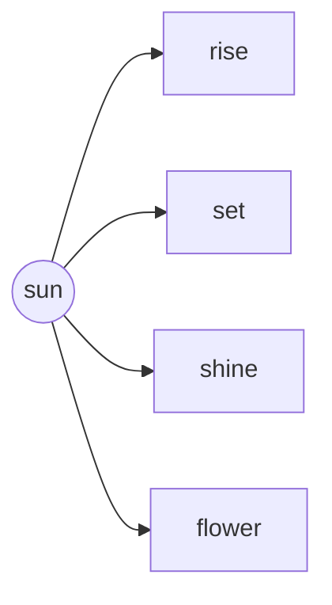
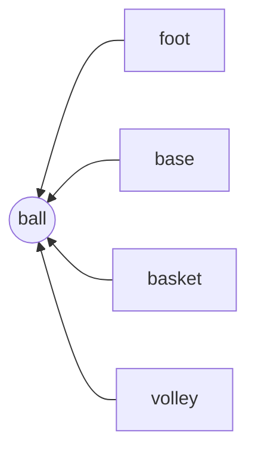

# 2 Gone with the Scooter

## Let us Read

A small cartoon character with a single hair strand is sitting and reading a blue book.

It was a summer afternoon. Gopi was sitting in the veranda, reading a book.

Suddenly, he heard something rustling past and falling with a thud in the garden. He wondered what it could be. Perhaps, it was a mango falling from the tree. Immediately, Gopi put his book aside, got up, and ran into the garden.

The illustration shows a bright, sunny day. Gopi, a young boy with dark hair, wearing a blue t-shirt with yellow stripes and pink shorts, is running through a garden. In the background, there are green hills, a large mountain, and a blue house with a red roof. A bright sun and white clouds are in the sky. A butterfly flies near some tall green plants.

He searched in between the thick grass near the garden fence. But, he found nothing. He looked among the bushes. Nothing was there again. Then, his eyes fell on a heap of dry leaves. There was a white ball on the heap. Gopi reached out and took the ball in his hands. It was a hockey ball.

At the bottom of the page, there is a wooden picket fence with blue and white flowers growing in front of it. Behind the fence, a white dimpled hockey ball lies on a heap of dry leaves and grass.

Gopi wondered, “Whose ball could this be?” He looked around, and peeped outside the gate, but could see no one. Just then he heard his mother calling. “Gopi! What are you doing out in the garden? It’s very hot. Come inside.”

A young boy named Gopi is walking through a garden with a wooden fence and blooming flowers. He is wearing a yellow t-shirt and pink shorts, and he holds a small white ball in his hand while looking up thoughtfully at the sky.

Gopi went inside, and drank a glass of water. He lay down on the mat, and said to himself, “I can’t keep this ball for myself. I will ask around.”

In the evening, Gopi went to the nearby playground where all his friends regularly gathered to play hockey.

“Friends, this afternoon I found a ball. Did any of you lose your ball recently?”

Manoj said, “I lost a ball four months ago.”

Gopi said, “So, the ball that I found cannot be yours.”

Ramani said, “Then the ball is mine.”

Gopi is at a playground with three of his friends. He is showing them the white ball he found. His friends, two boys and a girl, are all holding hockey sticks, ready to play. They are standing on a dirt path surrounded by green grass and trees.

“How do you know?” asked Gopi. “What colour is it?”

“Show me the ball and I will tell you,” said Ramani smilingly.

Another friend Deepak boasted that his father had bought him a brand-new football the previous day. “The ball I found is a hockey ball,” said Gopi.

Everyone laughed. Gopi took out the ball from his pocket. Manoj grabbed it and tossed it over to Deepak.

Seeing this, Gopi said at the top of his voice, “Stop! I say, stop! Let’s play before it gets dark.”

Manoj went to the goalpost as he liked to be a goalkeeper. Gopi stood at the centre of the field holding the hockey stick. He passed the ball to Deepak, who drove the ball towards Ramani. Ramani dribbled the ball with the stick and it went to Jay.

The illustration shows five children playing hockey on a grassy field. In the foreground, a boy in a blue and yellow jersey is dribbling a white hockey ball with his stick. To his right, a girl in a purple shirt and orange shorts is also playing with a hockey stick. On the far right, another boy in a white and red striped shirt is running with his stick. In the middle ground, a smaller boy in a white and blue striped shirt is running towards the center. In the background, a boy in a yellow shirt is acting as a goalkeeper in front of a small goalpost. The scene is set outdoors under a light blue sky with soft clouds.

An airplane flies through white clouds in the upper right corner of the page.

“Come on Jay, play the shot and drive it towards the goalpost,” Manoj said loudly.

Jay tightened his wrist around the stick with the flat side touching the ball. He hit the ball so hard that it went past the playground gate and fell into the basket of a passing scooter. The scooterist who was unaware of what had happened, drove past. By the time the children ran to the gate, the scooter was gone... and so was the ball. They looked at each other and burst into laughter.

To the right of the text, an illustration shows a boy in a blue and purple sports outfit swinging a hockey stick at a white ball on a sandy ground with green bushes.

© NCERT
not to be republished

A larger illustration at the bottom shows a person wearing a red helmet and yellow jacket riding a blue scooter on a road. In the background, a group of five children holding hockey sticks stands by an open gate, watching the scooter drive away.

### New Words
dribble rustling grab boast unaware thud

# Let us Think

## A. Answer the following questions.

1. What was Gopi doing on the veranda?
2. What sound did Gopi hear before he went to the garden?
3. Describe Gopi’s search for the ball.
4. Complete the table given below.

<table>
  <tbody>
    <tr>
        <td>S. No.</td>
        <td>Dialogue</td>
        <td>The dialogue was said by</td>
        <td>The dialogue was said to</td>
    </tr>
    <tr>
        <th>a.</th>
        <th>The ball I found is a hockey ball.</th>
        <th></th>
        <th></th>
    </tr>
    <tr>
        <th>b.</th>
        <th>My father bought me a brand-new football.</th>
        <th></th>
        <th></th>
    </tr>
    <tr>
        <th>c.</th>
        <th>I lost a ball four months ago.</th>
        <th></th>
        <th></th>
    </tr>
    <tr>
        <th>d.</th>
        <th>Show me the ball and I will tell you.</th>
        <th colspan="2"></th>
    </tr>
  </tbody>
</table>

5. Who grabbed the ball from Gopi? How did the game start?
6. Why did everyone laugh at the end of the story?

## B. Think and answer

1. What would you have done if, like Gopi, you had found a ball that did not belong to you?
2. Imagine what happens to the hockey ball after it is taken away by the scooter. Where does it go? Who finds it?
3. Notice that the scooterist is wearing a helmet. Why is it important to wear a helmet? Should the pillion rider also wear a helmet?

An illustration shows a young boy with dark hair, wearing a blue t-shirt with yellow stripes and pink shorts, holding a red ball in his hand.

<table>
  <tbody>
    <tr>
        <td>Note to the Teacher</td>
        <td>Initiate a discussion on various aspects of road safety.</td>
    </tr>
  </tbody>
</table>
An illustration shows a male teacher with glasses, wearing a green shirt and yellow trousers, holding a red book.

An icon shows a child's head behind an open green book.

## Let us Learn

### A. Match the following

<table>
  <thead>
    <tr>
        <th>Word</th>
        <th></th>
        <th></th>
        <th>Meaning</th>
    </tr>
  </thead>
  <tbody>
    <tr>
        <td>Dribble</td>
        <td>●</td>
        <td>●</td>
        <td>a soft crackling sound</td>
    </tr>
    <tr>
        <td>Boast</td>
        <td>●</td>
        <td>●</td>
        <td>take something with a sudden movement</td>
    </tr>
    <tr>
        <td>Rustle</td>
        <td>●</td>
        <td>●</td>
        <td>moving a ball with small taps while playing hockey</td>
    </tr>
    <tr>
        <td>Grab</td>
        <td>●</td>
        <td>●</td>
        <td>to speak too proudly</td>
    </tr>
  </tbody>
</table>

## B. Complete the following story using the words given in the box.

> since, however, because, when

Gopi completed his work ........................ he wanted to go outside and play. ........................ when he reached the playground nobody was there. ........................ his friends were yet to join him, he decided to take a walk. After 15 minutes, five of them came and everyone started to discuss the games. They decided to play hopscotch ........................ they got to know that Ramani would not be joining them.

## C. Read the following sentence

> Gopi **usually** plays hockey at school but **today** he is studying for his test.
>
> The adverb ‘usually’ tells us that **an action happens many times**. This sentence tells us that the action of playing hockey happens most of the time. The adverb ‘today’ tells us the time of the action (studying).

The page features an illustration of a young boy playing hockey on a green field. He is wearing a blue t-shirt, pink shorts, and black shoes with white socks. He is bent over, using a hockey stick to hit a small white ball. In the bottom right corner, there are decorative line drawings of children's faces.

## Now encircle the adverbs in the following sentences.

<table>
  <thead>
    <tr>
        <th>How many times the action happens/happened</th>
        <th>Time of the action</th>
    </tr>
  </thead>
  <tbody>
    <tr>
        <td></td>
        <td>a. Gopi immediately got up and ran into the garden.</td>
    </tr>
    <tr>
        <td></td>
        <td>b. Shama often writes in her diary.</td>
    </tr>
    <tr>
        <td></td>
        <td>c. All his friends regularly gathered to play hockey.</td>
    </tr>
    <tr>
        <td></td>
        <td>d. I always complete my homework.</td>
    </tr>
    <tr>
        <td></td>
        <td>e. Yesterday I ate an ice cream after lunch.</td>
    </tr>
    <tr>
        <td></td>
        <td>f. Monika never eats junk food.</td>
    </tr>
    <tr>
        <td></td>
        <td>g. Now they are going to sing their favourite song.</td>
    </tr>
  </tbody>
</table>

An illustration shows a teacher, a woman with dark hair tied in a bun, wearing a yellow and orange saree and holding a pink book. Next to her is a green box containing notes for the teacher.

> **Note to the Teacher**
> * You may share the meanings of the adverbs with your learners.
> * Explain the difference between the adverbs of frequency and adverbs of time, using examples from daily life.
> * Once the learners have understood the concept, you may introduce forming questions as a part of identifying adverbs for example ‘for adverbs of frequency’ answer the question of ‘how many times?’ and ‘for adverbs of time’ answer the question ‘when’? Encourage learners to frame questions using this method.

# Let us Listen

A. Listen to your teacher. Follow the instructions and draw accordingly in the space provided below.

* Draw a few big dry leaves at the centre with no gap between the leaves. Draw a ball in the middle of the leaves.
* Draw a few twigs here and there.
* Colour the leaves yellow and brown. Colour the twigs brown.
* Now you have found the ball.

A large rectangular area with a dashed blue border is provided for the drawing activity. A diagonal watermark text "© NCERT not to be republished" is printed across this area.

# Let us Speak

**A. The teacher starts a story with one sentence. Each student adds a sentence to continue the story.**

For example:

> Teacher: “Once upon a time, a boy found a magic key.”
>
> Student 1: “The key opened a door to a secret garden.”
>
> Student 2: “In the garden, he saw a talking rabbit.”

**B. The title of this textbook is ‘Santoor’. Say the word ‘book’. Next, say the word ‘Santoor’. Do you notice the difference? Although, both the words have ‘oo’ in them, the sound of ‘oo’ in ‘book’ is short; the sound of ‘oo’ in ‘Santoor’ is long.**

**Say aloud the following words. Encircle the words which have a long ‘oo’ sound.**

<table>
  <tbody>
    <tr>
        <td>1. Hood</td>
        <td>2. School</td>
    </tr>
    <tr>
        <td>3. Foot</td>
        <td>4. Maroon</td>
    </tr>
    <tr>
        <td>5. Scooter</td>
        <td>6. Shook</td>
    </tr>
    <tr>
        <td>7. Bloom</td>
        <td>8. Food</td>
    </tr>
    <tr>
        <td>9. Look</td>
        <td>10. Moon</td>
    </tr>
    <tr>
        <td>11. Book</td>
        <td>12. Took</td>
    </tr>
  </tbody>
</table>

The page features an illustration of a woman in traditional Indian clothing sitting on the ground and playing a santoor, a trapezoid-shaped stringed instrument, with wooden mallets. There are also illustrations of birds and flowering branches. At the bottom left, a teacher character is shown holding a book.

<table>
  <tbody>
    <tr>
        <td>Note to the Teacher</td>
        <td>* Continue the story till all the learners get a chance to add one sentence each to the story. * Ensure the learners pronounce the long and the short vowel sounds clearly.</td>
    </tr>
  </tbody>
</table>

# Let us Write

A. By the time the children ran to the gate, the scooter was gone... and so was the ball. They looked at each other and burst into laughter.

**Write a possible conversation between Gopi and his friends after this incident?**

Gopi: ....................................................................................................................
Ramani: ....................................................................................................................
Deepak: ....................................................................................................................
Manoj: ....................................................................................................................
Jay: ....................................................................................................................

B. **Form new words by following the examples given below:**

<table>
  <tbody>
    <tr>
        <td>sun + rise = sunrise</td>
        <td>foot + ball = football</td>
    </tr>
    <tr>
        <td>............................................................</td>
        <td>............................................................</td>
    </tr>
    <tr>
        <td>............................................................</td>
        <td>............................................................</td>
    </tr>
    <tr>
        <td>............................................................</td>
        <td>............................................................</td>
    </tr>
  </tbody>
</table>

**Write a sentence using each of these words in your notebook.**

C. You have already noticed that the word ‘scooter’ has ‘oo’ in the middle. Using the clues given below, write ten words that have ‘ai’ in the middle. One has been done for you?

<table>
  <thead>
    <tr>
        <th>Clue</th>
        <th>Word</th>
    </tr>
  </thead>
  <tbody>
    <tr>
        <td>1. Something that has four legs, on which you generally sit.</td>
        <td>chair ...................</td>
    </tr>
    <tr>
        <td>2. Water that falls from clouds.</td>
        <td>...................</td>
    </tr>
    <tr>
        <td>3. A vehicle that runs on tracks.</td>
        <td>...................</td>
    </tr>
    <tr>
        <td>4. You use this to colour your wall or pictures.</td>
        <td>...................</td>
    </tr>
    <tr>
        <td>5. The part of body that helps you think.</td>
        <td>...................</td>
    </tr>
    <tr>
        <td>6. A slow moving creature with a shell.</td>
        <td>...................</td>
    </tr>
    <tr>
        <td>7. Letters and packages you send or receive.</td>
        <td>...................</td>
    </tr>
    <tr>
        <td>8. The movements of boats on water.</td>
        <td>...................</td>
    </tr>
    <tr>
        <td>9. All animals have them, long or short.</td>
        <td>...................</td>
    </tr>
    <tr>
        <td>10. Steps that takes us from one floor to another.</td>
        <td>...................</td>
    </tr>
  </tbody>
</table>

# Let us Do

Prepare a board game to play ‘Tigers and Goats’.

The image shows a game board for ‘Tigers and Goats’ on a light brown background. The board consists of a triangular grid with a central vertical line and three horizontal lines. There are circular markers at the intersections: three red markers representing tigers and several green markers representing goats. The corners of the board are decorated with illustrations: a tiger head in the top-left and bottom-right, and a goat head in the top-right and bottom-left. A watermark reading "© NCERT not to be republished" is visible diagonally across the center of the image.

1. Take a square piece of cardboard.
2. Paste a chart paper on it.
3. Draw the pattern as shown in the picture.
4. Collect two different types of pebbles — three big pebbles and thirteen smaller ones. Paint them red for tigers and green for goats. Keep three similar pebbles for tigers and thirteen similar pebbles for goats.

# How to play the game?

* At least two players are needed to play the game. One player represents the ‘Goat’ and the other represents the ‘Tiger’.
* If you are playing as the ‘Tiger’, your objective would be to ‘defeat’ five goats. If you are playing as the ‘Goat’, your objective would be to surround all three tigers such that the tigers cannot make a move.
* Both the pebbles can be placed on the intersecting points. The goat player places a pebble first on any intersection Next, the tiger places a tiger stone on any intersection, as indicated.
* The tiger may jump over the goat to the next intersection. If so, the goat is considered ‘captured’ and will be out of the board.
* In order to prevent the tiger from jumping over the goat, the next intersection has to be covered. So the goat player places another pebble at that intersection.
* The goat player places one goat on the board at a time. The tiger player can either place the tiger stone or move.
* But, the goats cannot move until all thirteen of them are on the board. The tigers must attempt to ‘capture’ the goats by jumping over them into a free space, the goat is then taken off the board.

# Let us Explore

## A. Prepare a chart with the following categories

© NCERT not to be republished

<table>
  <thead>
    <tr>
        <th>S. No.</th>
        <th>Name of the game</th>
        <th>Outdoor/ indoor</th>
        <th>Players needed</th>
        <th>Equipment needed</th>
    </tr>
  </thead>
  <tbody>
    <tr>
        <td>1.</td>
        <td>Kabaddi</td>
        <td>outdoor</td>
        <td>team</td>
        <td>nil</td>
    </tr>
    <tr>
        <td>2.</td>
        <td></td>
        <td></td>
        <td></td>
        <td></td>
    </tr>
    <tr>
        <td>3.</td>
        <td></td>
        <td></td>
        <td></td>
        <td></td>
    </tr>
    <tr>
        <td>4.</td>
        <td></td>
        <td></td>
        <td></td>
        <td></td>
    </tr>
    <tr>
        <td>5.</td>
        <td></td>
        <td></td>
        <td></td>
        <td></td>
    </tr>
    <tr>
        <td>6.</td>
        <td></td>
        <td></td>
        <td></td>
        <td></td>
    </tr>
    <tr>
        <td>7.</td>
        <td></td>
        <td></td>
        <td></td>
        <td></td>
    </tr>
    <tr>
        <td>8.</td>
        <td></td>
        <td></td>
        <td></td>
        <td></td>
    </tr>
    <tr>
        <td>9.</td>
        <td></td>
        <td></td>
        <td></td>
        <td></td>
    </tr>
    <tr>
        <td>10.</td>
        <td colspan="4"></td>
    </tr>
  </tbody>
</table>

B. Write a mini biography about a famous sports person of your choice. You may use the following hints:

> * Name of the sportsperson.
> * Name of the sport the person is famous for.
> * When and where the person was born?
> * List one or two achievements.
> * Why the person is famous/inspiring?

C. Find out about a famous hockey player and talk about them.

An illustration shows a young girl with pigtails, wearing a purple polka-dot top and a pink skirt, sitting on the ground. A crutch lies on the grass beside her. A speech bubble from her says:

> I can name all the players of the Indian women’s hockey team!
> 
> Can you?