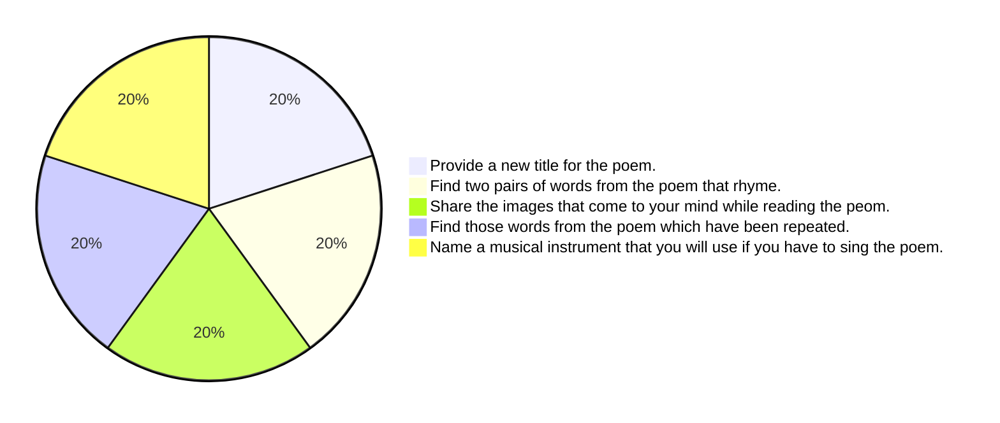

# 3 The Rainbow

[A QR code is present in the top right corner with the text 0532CH03 below it.]

## Let us Recite

Boats sail on the rivers,
And ships sail on the seas;
But clouds that sail across the sky
Are prettier far than these.

There are bridges on the rivers,
As pretty as you please;
But the bow that bridges heaven,
And overtops the trees,
And builds a road from earth to sky,
Is prettier far than these.

— CHRISTINA ROSSETTI

The page is decorated with colorful illustrations. At the top, a bright sun with a smiling face shines next to a large, vibrant rainbow that arches across the page. Below the rainbow, the title "3 The Rainbow" is written in pink. A small cartoon character holding a book is next to the "Let us Recite" heading. To the right of the second stanza, there is an illustration of a large sailing ship on the sea. At the bottom of the page, a large red bridge spans across a river. Two small wooden boats with people rowing are in the river below the bridge. Lush green trees and bushes line the riverbanks.

# New Words

overtops &emsp; bridges &emsp; bow

# Let us Think

Beside the heading "Let us Think", there is a cartoon illustration of a smiling character with a lightbulb above its head, suggesting an idea.

## A. Answer the following

1. Explain the meaning of the word ‘bow’ used in the poem.
2. Which bridge does the poet like more and why?
3. The word ‘these’ is used for different things in stanzas one and two. What are the things for which ‘these’ has been used in each stanza?
4. State whether the following are True or False.
    a. Ships sail on the river.
    b. Boats sail on the sea.
    c. Bridges are built on the river.
    d. A road is built from earth to the sky.

## B. Think and discuss

1. What are the ways in which you can cross a river?
2. Have you ever seen a rainbow in real life or in pictures? How did you feel?
3. If you could walk on a rainbow, where do you think it would take you?

An illustration at the bottom right shows a man and a boy in a wooden boat. They are both holding oars and rowing on blue water. The man is wearing a blue hat and a purple shirt, and the boy is wearing a yellow hard hat and a white t-shirt with blue sleeves.

A. Rearrange the letters of each word to form a meaningful word from the poem. Write them in the space provided.

<table>
  <tbody>
    <tr>
        <td>1. sial</td>
        <td>S</td>
        <td>A</td>
        <td>I</td>
        <td>L</td>
        <td colspan="4"></td>
    </tr>
    <tr>
        <td>2. vierr</td>
        <td colspan="5"></td>
        <td colspan="3"></td>
    </tr>
    <tr>
        <td>3. sae</td>
        <td colspan="3"></td>
        <td colspan="5"></td>
    </tr>
    <tr>
        <td>4. oduscl</td>
        <td colspan="6"></td>
        <td colspan="2"></td>
    </tr>
    <tr>
        <td>5. risebgd</td>
        <td colspan="7"></td>
        <td></td>
    </tr>
    <tr>
        <td>6. nhveea</td>
        <td colspan="6"></td>
        <td colspan="2"></td>
    </tr>
    <tr>
        <td>7. eoptvros</td>
        <td colspan="8"></td>
    </tr>
    <tr>
        <td>8. owb</td>
        <td colspan="3"></td>
        <td colspan="5"></td>
    </tr>
    <tr>
        <td>9. droa</td>
        <td colspan="4"></td>
        <td colspan="4"></td>
    </tr>
  </tbody>
</table>

B. Work in pairs. One of you moves a finger around in the circle. When your partner says ‘Stop’, perform the action indicated by the segment that the finger lands on.

# Let us Listen

Sit in a circle and listen to the words read aloud by your teacher. Give five rhyming words for each word as indicated.

* Ship – chip, trip, ............, ............, ............
* Tree – ............, ............, ............, ............, ............
* Bow – ............, ............, ............, ............, ............
* Rain – ............, ............, ............, ............, ............
* Sun – ............, ............, ............, ............, ............
* Sea – ............, ............, ............, ............, ............
* Sail – ............, ............, ............, ............, ............
* And – ............, ............, ............, ............, ............
* Sky – ............, ............, ............, ............, ............
* Far – ............, ............, ............, ............, ............

<table>
  <tbody>
    <tr>
        <td>Note to the Teacher</td>
        <td>Draw learners’ attention to the aspect of sound. The focus should be on the sound and not on the spelling. You may select more words according to the level of your learners.</td>
    </tr>
  </tbody>
</table>

# Let us Speak

Recite the poem given below in three ways:
a. In a happy voice
b. In an angry voice
c. In a surprised voice

1. **Colours**

   *You have a few crayons,*
   *Red, yellow and blue.*
   *Green, purple and black,*
   *I have some too*
   *I need the red*
   *and you need the black.*
   *If we share our crayons,*
   *we have a full pack!*

   — Santoor, Grade 3

An illustration shows a young girl and a boy sitting on a circular blue rug, sharing a box of crayons. The girl, wearing a green striped shirt and white patterned trousers, is handing a red crayon to the boy, who is wearing a red shirt and blue trousers. In the background, there is a wooden cabinet with a teddy bear on top, pink curtains on either side of a window, and a green lamp on a side table.

## 2. Aachoo!

*Once a mighty elephant,*
*Got a mighty cold.*
*It went to buy a handkerchief,*
*Where handkerchiefs were sold.*

*“A hanky for an elephant?”*
*The sales girl was surprised,*
*“Sorry sir but we don’t have*
*A handkerchief that size.”*

*“AACHOO!” said the elephant.*
*And shook its mighty head,*
*“Forget about the handkerchief*
*Give me a sheet instead.”*

*– Santoor, Grade 3*

An illustration depicts a large grey elephant sneezing forcefully, with "AACHOO!" written near its trunk. A saleswoman with glasses and a blue dress stands behind a shop counter, looking surprised. Colorful cloths hang from the shop's eaves. The scene is set outdoors with a path, trees, and a blue sky with clouds in the background.

<table>
  <tbody>
    <tr>
        <td>Note to the Teacher</td>
        <td>You may recite another poem in ‘different’ voices to demonstrate different emotions. Ask learners about feelings that the person reciting the poem is trying to convey. Draw their attention towards gestures and expressions. Learners may recite the poems individually or in pairs.</td>
    </tr>
  </tbody>
</table>

In the bottom left corner, there is a small illustration of a boy with glasses holding a red book.

# Let us Write

A. The poem *The Rainbow* mentions boats and ships and their journey across the water bodies. You too may have travelled to different places. Share your experience of travelling to any one place with your class.

**Write a short paragraph of 80–100 words about your journey to a place you visited recently.**

You may include the following points in your paragraph:
* Time of journey and destination
* Purpose of travel
* Whom you travelled with
* Things you liked or disliked during your travel
* Local dishes and snacks
* Monument, landmark or scenery

<table>
  <tbody>
    <tr>
        <td>Note to the Teacher</td>
        <td>* Focus should be on the experience of travelling and not on the place visited by the learners. * Learners may share experiences of travelling to meet their relatives. * Revisit the rules of past tense before assigning this activity. * Facilitators are also encouraged to share their travelling experiences with the learners.</td>
    </tr>
  </tbody>
</table>

## B. A word joins a ‘friend word’ to make new words, as shown below. Complete the table.

<table>
  <thead>
    <tr>
        <th></th>
        <th>Word</th>
        <th>Friend word</th>
        <th>New word</th>
        <th>Illustration</th>
    </tr>
  </thead>
  <tbody>
    <tr>
        <td>1.</td>
        <td>rain</td>
        <td>bow</td>
        <td>rainbow</td>
        <td>A rainbow with clouds</td>
    </tr>
    <tr>
        <td>2.</td>
        <td>tea</td>
        <td>cup</td>
        <td>........................</td>
        <td>A cup of tea on a saucer</td>
    </tr>
    <tr>
        <td>3.</td>
        <td>wrist</td>
        <td>........................</td>
        <td>........................</td>
        <td>A wristwatch</td>
    </tr>
    <tr>
        <td>4.</td>
        <td>arm</td>
        <td>........................</td>
        <td>........................</td>
        <td>A wooden armchair</td>
    </tr>
    <tr>
        <td>5.</td>
        <td>earth</td>
        <td>........................</td>
        <td>earthworm</td>
        <td>An earthworm</td>
    </tr>
    <tr>
        <td>6.</td>
        <td>........................</td>
        <td>........................</td>
        <td>sunflower</td>
        <td>A sunflower</td>
    </tr>
    <tr>
        <td>7.</td>
        <td>table</td>
        <td>cloth</td>
        <td>........................</td>
        <td>A table with a tablecloth</td>
    </tr>
    <tr>
        <td>8.</td>
        <td>note</td>
        <td>........................</td>
        <td>notebook</td>
        <td>An open notebook</td>
    </tr>
    <tr>
        <td>9.</td>
        <td>........................</td>
        <td>........................</td>
        <td>earring</td>
        <td>A gold earring</td>
    </tr>
    <tr>
        <td>10.</td>
        <td>tooth</td>
        <td>........................</td>
        <td>........................</td>
        <td>A tube of toothpaste</td>
    </tr>
  </tbody>
</table>

On the left side of the page, there is a decorative vertical border. At the bottom left, next to the page number, there is an illustration of two children reading a book with the word 'STORIES' on it.

> Read the following sentences.
>
> a) I have seen a **bridge** made of roots in Meghalaya.
>
> In the above sentence, the word ‘bridge’ is a noun.
>
> b) Some planks of woods were used to **bridge** the stream.
>
> In the above sentence, the word ‘bridge’ is a verb.

### C. The following words are both nouns and verbs. Create two sentences for each word, once as a noun and then as a verb and write them in your notebook.

1. cut
2. bat
3. picture
4. cry
5. filter
6. dance
7. plant
8. paint
9. fly
10. face

An illustration of a teacher holding a book is on the left. At the bottom right, there is a decorative illustration of children's faces.

<table>
  <tbody>
    <tr>
        <td>Note to the Teacher</td>
        <td>* Create sentences using the above words and share them with learners. * Encourage the learners to work in pairs or small groups and share their sentences with their peers.</td>
    </tr>
  </tbody>
</table>

# Let us Explore

D. 1. Write the opposites of the following words in the space provided. All your answers must begin with an ‘S’.

   a. large × small
   b. weak × s........................
   c. fast × s........................
   d. rough × s........................
   e. dull × s........................
   f. curved × s........................
   g. finish × s........................
   h. addition × s........................
   i. complicated × s........................
   j. mild × s........................
   k. blunt × s........................

   Now, make sentences using the words that you have written in the blanks. Write them in your notebook.

2. In small groups, choose a letter of the English alphabet and create an exercise similar to the one above.

NCERT not to be republished

An illustration shows a teacher in a yellow saree and red blouse holding books.

<table>
  <thead>
    <tr>
        <th>Note to the Teacher</th>
        <th>• Learners may require support with vocabulary, which can be provided during the activity. • A dictionary may be brought to the class for reference.</th>
    </tr>
  </thead>
</table>

## E. VIBGYOR—The colours of the rainbow.

VIBGYOR is an easy way to remember the seven colours of the rainbow in order.

V – Violet
I – Indigo
B – Blue
G – Green
Y – Yellow
O – Orange
R – Red

> When sunlight passes through rain droplets, it splits into these seven beautiful colours forming a rainbow in the sky.

## F. The following items, generally found in kitchens, add colour and taste to the food. What colours are they? Write them in the column. What do you call them in your mother tongue?

<table>
  <thead>
    <tr>
        <th>Item</th>
        <th>Colour</th>
        <th>Name in mother tongue</th>
    </tr>
  </thead>
  <tbody>
    <tr>
        <td>clove</td>
        <td></td>
        <td></td>
    </tr>
    <tr>
        <td>cinnamon</td>
        <td></td>
        <td></td>
    </tr>
    <tr>
        <td>dry chilli</td>
        <td></td>
        <td></td>
    </tr>
    <tr>
        <td>garlic</td>
        <td></td>
        <td></td>
    </tr>
    <tr>
        <td>curry leaves</td>
        <td></td>
        <td></td>
    </tr>
    <tr>
        <td>peppercorns</td>
        <td></td>
        <td></td>
    </tr>
    <tr>
        <td>fennel seeds</td>
        <td></td>
        <td></td>
    </tr>
    <tr>
        <td>cumin seeds</td>
        <td></td>
        <td></td>
    </tr>
    <tr>
        <td>mustard seeds</td>
        <td colspan="2"></td>
    </tr>
  </tbody>
</table>

## G. Welcome to the land of flowerpots! Design and colour a Flowerpot Friend!

The page features a creative activity for designing and coloring. On the left side, there are three small, colored examples of "Flowerpot Friends":

*   The first example is a flowerpot with a smiling face and red roses growing from the top. It is wearing a colorful, patterned dress and sitting on a small brown chair.
*   The second example is a flowerpot with a smiling face and pink and blue flowers. It is wearing a striped shirt and a pink skirt, sitting on a small brown chair.
*   The third example is a flowerpot with a smiling face and green leafy plants. It is wearing a green shirt and red overalls, sitting on a small brown chair.

The main area of the page, enclosed in a dotted rectangular border, contains a large, uncolored line drawing of a flowerpot with flowers sitting on a chair. This is intended for the student to design and color.

© NCERT
not to be republished

# Let us Do

Do you know these colour combinations? Colour within the outline and write the name of the new colour.

<table>
  <thead>
    <tr>
        <th>No.</th>
        <th>Color Combination</th>
        <th>Resulting Color</th>
    </tr>
  </thead>
  <tbody>
    <tr>
        <td>1.</td>
        <td>red + blue =</td>
        <td>p _ _ _ _ e</td>
    </tr>
    <tr>
        <td>2.</td>
        <td>yellow + blue =</td>
        <td>g _ _ _ n</td>
    </tr>
    <tr>
        <td>3.</td>
        <td>red + yellow =</td>
        <td>o _ _ _ _ e</td>
    </tr>
    <tr>
        <td>4.</td>
        <td>red + white =</td>
        <td>p _ _ k</td>
    </tr>
    <tr>
        <td>5.</td>
        <td>red + black =</td>
        <td>m _ _ _ _ n</td>
    </tr>
    <tr>
        <td>6.</td>
        <td>red + yellow + blue =</td>
        <td>b _ _ _ n</td>
    </tr>
  </tbody>
</table>

# Let us Explore

A. Make a list of different types of boats. Collect pictures and information about the listed types of boats. Make a presentation to depict the differences among them.

B. Split the class into two groups. One group can talk about human-made things like ships and bridges. While the other discusses natural things like clouds and rainbows. Let them share their thoughts!

> ### Did You Know?
>
> Isaac Newton created a spinning disc painted with the seven colours of the rainbow to show that white light is actually made of many colours! When the disc spins very fast, your eyes see white instead of all the colours.
>
> The image shows a circular disc divided into seven colored segments representing the colors of the rainbow: red, orange, yellow, green, blue, indigo, and violet.