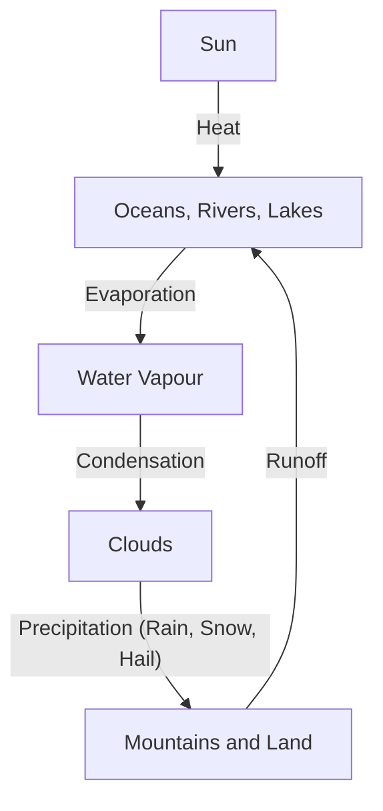

# Life Around Us

### About the Unit

This unit at the preparatory stage highlights the crucial role of nature as a home to animals, birds and insects. Students in Grades 3 and 4 have explored soil, air and water. They also learned how life evolves in different landforms depending upon the availability of soil, air, water and sunlight.

This unit in Grade 5 presents the importance of water in life and ecosystems. It also covers its various forms, movement, and role in shaping land and supporting habitats. The unit conveys water as a unique and limited essence of life—showing how it helps in sustaining the life on Earth.

It also gives examples from the lives of people, who stay close to nature. They enjoy clean treasures from nature and develop various materials available from nearby forest and surroundings. Their lifestyles and productions with locally available materials reflect how life can be happy, and creative in the lap of nature.

The page features a large, colorful illustration of a vibrant ecosystem centered around a body of water. In the scene:
* An elephant stands in the water, using its trunk to spray water over its back.
* A deer is at the water's edge, leaning down to drink.
* Several monkeys are perched on the branches of a large, leafy tree.
* A variety of birds are present: a blue bird and a pink bird fly in the air, a large white bird with a yellow beak stands on the shore, and several ducks swim on the water's surface.
* Below the water's surface, several pink fish are swimming, and a turtle is seen near the bottom.
* The background includes lush green trees, rocky outcrops, and a clear blue sky.

# Note to the Teacher

This unit includes two chapters: Chapter 1 ‘Water— The Essence of Life’ and Chapter 2 ‘Journey of a River’. Following are the key concepts covered in these chapters.

## Chapter 1: Water—The Essence of Life

* ‘Water—The Essence of Life’ introduces students to its various forms and different sources (freshwater and saltwater) of water. It also highlights the importance of water in different activities in the society. This chapter introduces the continuous movement of water in different forms through the water cycle. It also explores how water shapes the land and supports life in freshwater habitats, and highlights the need to conserve water.

## Chapter 2: Journey of a River

* This chapter follows the story of the river Godavari from its origin to its delta. Through maps, stories and illustrations, it explores the tributaries of Godavari and aquatic life in the river. It familiarises students with the dams built on the river. Students learn how the river gets polluted. This chapter highlights the ways rivers support ecosystems, people and culture. After reading this chapter students will understand that water is a limited and shared resource which must be used wisely.

An illustration shows a woman in a pink saree pointing to a globe, representing a teacher or facilitator.

## How to Facilitate

* Encourage students to think about water bodies near their homes or schools. Inspire them to explore where the water comes from and where it goes.
* The Activity 6 in Chapter 1 on mustard seed shows how rivers flow from higher to lower ground and follow the shape of the land. Use the map of India to explore which rivers flow into which seas and how landforms (like mountains) guide their direction.
* Talk about what happens to rainwater in their school or neighbourhood. Use this to start a conversation on how cities and villages plan for water.
* Help students list different ways in which water plays an important role in our life. Connect this to ideas of sharing and saving water. Let them think about how water is stored in their homes (tanks, pots, etc.) and how a dam works as a big water storing unit.
* Engage students in role-plays to critically think about both the scarcity and excess of water.
* Encourage students to discuss with their parents or grandparents about festivals, stories, or memories connected to rivers. This will help them see rivers not just as physical things, but as part of their community and culture.

An illustration at the bottom of the page depicts two children in traditional tribal attire holding hands on the bank of a river. In the background, there are green trees, an elephant, and a blue bird flying over the water.

# 1 Water—The Essence of Life

It is raining. Afreen rushed to the window where Jyoti was already watching tiny raindrops slide down the glass. “Where do you think all this water comes from, and where does it go?” asked Afreen.

Come, let us follow the journey of water.

But first, let us see how much water there is on Earth.

Although most of the Earth’s surface is covered with water, the majority of it is salty, leaving less

An illustration depicts a woman in a red saree and three children in school uniforms standing by a body of water. The water is filled with fish and orange water lilies. Two white cranes stand on the bank, and the background features lush trees and birds.

*‘Johads’ in Rajasthan are traditional small earthen dams built to collect rainwater and recharge groundwater.*

amount of freshwater. All living beings—people, animals, birds, and plants—depend on freshwater to survive. It is essential for drinking, growing crops, and carrying out daily activities. Many plants and animals also live in freshwater. Without water, life would not be possible.

Now, imagine if all the water on earth were in this glass, then the freshwater would only be as much as in a teaspoon!

© NCERT not to be republished

<table>
  <thead>
    <tr>
        <th></th>
        <th>A glass of water</th>
        <th>A teaspoon of water</th>
    </tr>
  </thead>
  <tbody>
    <tr>
        <td></td>
        <td>200 ml of water</td>
        <td>5 ml of water</td>
    </tr>
  </tbody>
</table>

# Discuss

1. Do you think we can drink the water present in the oceans?
2. What can ocean water be used for?

> ## Do you know?
> 
> The salt pans of Gujarat are vast flatlands where seawater is dried to collect salt. It is one of the largest salt producing areas in India.
>
> [An illustration shows workers in a salt pan, using long-handled rakes to gather salt into piles within shallow, rectangular evaporation ponds.]

[At the bottom of the page, an illustration depicts a natural landscape with a body of water, featuring various animals like deer and birds, and a group of people in the background.]

> Wular Lake in Jammu and Kashmir is one of the largest freshwater lakes in Asia. It helps regulate river flow to prevent floods.

## Activity 1

Where can we find freshwater? Identify the different freshwater sources from the images given below and write their names.

<table>
  <tbody>
    <tr>
        <td>[Image of a pond]</td>
        <td>[Image of an ocean]</td>
        <td>[Image of icebergs and glaciers]</td>
    </tr>
    <tr>
        <td>________________</td>
        <td>________________</td>
        <td>________________</td>
    </tr>
    <tr>
        <td>[Image of a lake and mountains]</td>
        <td rowspan="2">**Sources of Water**</td>
        <td>[Image of groundwater layers]</td>
    </tr>
    <tr>
        <td>________________</td>
        <td>________________</td>
    </tr>
    <tr>
        <td>[Image of a river]</td>
        <td>[Image of a well]</td>
        <td>[Image of rain from a cloud]</td>
    </tr>
    <tr>
        <td>________________</td>
        <td>________________</td>
        <td>________________</td>
    </tr>
  </tbody>
</table>

Jyoti was curious, “Is there water in the air too? And is snow a form of water?”.

## Water has Different Forms

We already know the different forms of water—liquid (as in rain), solid (as in ice) and vapour (as in steam). Let us understand more about this through a simple activity!

## Activity 2

Take a steel glass. Put some ice cubes in it. Observe the small water droplets forming on the glass.

(a) Where do these water droplets come from?
__________________________________________________________________

(b) What happens to the ice cubes after they are left in the glass for some time?
__________________________________________________________________

(c) If we heat water, what will happen to it?
__________________________________________________________________

The activity is illustrated with images of a steel glass containing ice cubes, another steel glass with water and condensation droplets on its exterior, a mug with steam rising from it, and a pot of water boiling on a stove.

In the above activity, what forms of water do you see?
__________________________________________________________________

### Observing Changes

<table>
  <thead>
    <tr>
        <th>Activity</th>
        <th>I Observe</th>
    </tr>
  </thead>
  <tbody>
    <tr>
        <td>Ice melting</td>
        <td></td>
    </tr>
    <tr>
        <td>Water boiling</td>
        <td></td>
    </tr>
    <tr>
        <td>Water in sunlight for three days</td>
        <td></td>
    </tr>
  </tbody>
</table>

Through these experiments, we found out that water can change into ice and steam, and it can also return to its liquid form.

# Water Cycle

Let us understand how such changes take place in nature.

## Activity 3

* Take a transparent bag.
* Use a marker to draw the sun, clouds, trees and arrows on it as shown in the picture.
* Fill one-third of it with coloured water.
  Tip: You can use blue paint or food dye for this.
* Seal the bag tightly to prevent any leaks.
* Place it in the sunlight.
* After a few hours, observe the changes inside the bag.

The illustration shows a transparent plastic bag containing blue water at the bottom. On the surface of the bag, there are drawings of a sun, clouds, rain droplets, a tree on a hill, and arrows indicating a cycle: upward arrows from the water representing evaporation, and a downward arrow from a cloud representing precipitation.

<table>
  <tbody>
    <tr>
        <td>I Observe</td>
        <td>I Wonder</td>
        <td>It is because of...</td>
    </tr>
    <tr>
        <td>Water heats up</td>
        <td>How does water heat up?</td>
        <td>Sunlight</td>
    </tr>
    <tr>
        <td>Water droplets formed inside the cover</td>
        <td colspan="2"></td>
    </tr>
  </tbody>
</table>

> [Note: The following text is oriented vertically in the right sidebar]
> The Fishing Cat, found in India's wetlands, has partially webbed paws, making it an excellent swimmer who dives for fish.

An illustration at the bottom of the page depicts a vibrant wetland ecosystem. It shows various animals including deer, an elephant, and birds like cranes and a kingfisher. People are also shown near the water, with one person fishing.

The Keibul Lamjao National Park in Manipur is the only floating national park in the world. It is famous for its unique 'phumdis' (floating islands) and the endangered Sangai deer.

As you have seen in the above activity, the Sun’s heat causes the water to turn into water vapour. When the water vapour cools, it forms small droplets inside the bag. Eventually, these droplets fall back down.

Similarly in nature, heat causes water from different sources, like oceans and rivers, to become water vapour. Water vapour forms the clouds, which come down as rain, snow and hail. This water goes back into rivers, lakes and oceans.

This constant circular movement of water in nature is called the water cycle.

The illustration above depicts the water cycle: the sun shines over a landscape with mountains, an island, and the sea. Red arrows indicate the process of evaporation from the water surface, condensation into clouds, and precipitation as rain falling onto the mountains and land, eventually flowing back into the sea.

## Groundwater

Let us find out what happens to rainwater when it comes down.

# Activity 4

*   Take a transparent glass.
*   Fill half of it with soil.
*   Slowly pour water into the soil using a spoon.
*   Observe what happens.

An illustration shows a transparent glass half-filled with soil. A hand is using a spoon to slowly pour water into the glass.

When it rains, some water is soaked up by the soil. This water sinks through the layers of soil and rocks. The water that gets stored deep underground is called groundwater. We dig wells, borewells, tube wells and handpumps to draw this water from the ground for our use.

# Activity 5

Tick the image that will help in groundwater recharge.

<table>
  <thead>
    <tr>
        <th>An image of a concrete road winding through green hills.</th>
        <th>An image of a green lawn with several trees.</th>
        <th>An image of a paved stone path through a garden.</th>
    </tr>
  </thead>
  <tbody>
    <tr>
        <td>Concrete road [ ]</td>
        <td>Green lawn [ ]</td>
        <td>Paved area [ ]</td>
    </tr>
  </tbody>
</table>

In cities with many cemented surfaces, rainwater cannot go into the ground easily, which stops groundwater from getting recharged.

> ### Do you know?
> Open, uncovered areas allow water to seep into the ground. Soak pits, ponds, human-made lakes, and planting more trees help rainwater return underground.

A decorative illustration at the bottom shows people, birds, and a deer near a body of water with plants.

# Surface Water

Rivers, ponds, lakes, etc., are the natural sources of freshwater in addition to groundwater.

Do you ever wonder how river flows?

A river often begins its journey from up in the mountains and flows down across the land. Let us understand this through an activity.

## Activity 6

**Material Required:** An old newspaper and a cup of mustard seeds or any other small seeds.

**Procedure**
* Take a sheet from a newspaper and crumple it to create folds.
* Take another sheet and place it over the crumpled paper.
* Press it down so that the slopes are gentle.
* Now, slowly pour the mustard seeds from the cup on to the highest point of the slope.
* Observe the movement of the seeds.

The illustration shows a hand pouring small dark seeds from a cup onto the peak of a sheet of paper that has been draped over crumpled newspaper to create a miniature mountain-like terrain with ridges and valleys. The seeds are spreading out as they fall down the slopes.

1. What did you observe about the mustard seeds?
   \___________________________________________________________________________

2. Are they moving in a straight line, or do they spread out in different directions?
   \___________________________________________________________________________

At the bottom of the page, there is a colorful illustration of a riverbank scene featuring people, a deer, and birds in a lush environment.

3. Are they collecting in some areas? Do they gather like water gathers in lakes, rivers and so on?

---

Water flows, stops or curves according to the shape of the land formations in its path. The flow of water can also change the shape of land.

### Discuss

On the basis of Activity 6 with mustard seeds, discuss how some rivers flow towards the Arabian Sea while some flow towards the Bay of Bengal.

> ### Do you know?
>
> The Luni river, originating in the Aravalli Range in Rajasthan, is the only major Indian river that does not drain into a sea. Instead, it ends up in the marshy lands of the Rann of Kutch in Gujarat.
>
> [An illustration of a wide, shallow river with sandy banks and muddy patches. People are walking along the far bank, which is lined with green trees and shrubs. The water reflects the sky and the surrounding landscape.]

*Note: A watermark reading "NCERT not to be republished" is visible across the center of the page.*

***

**[Vertical text in the right margin]**
Hiware Bazar in Maharashtra is a successful example of a water-positive village. Local communities have contributed to its watershed management and rainwater harvesting.

The illustration depicts a landscape with various geographical features labeled:
* Ice cap
* Mountains
* Glacier
* Waterfall
* River
* Valley
* Lake
* Dune
* Desert

An inset map of India shows the following major rivers:
* Brahmaputra
* Ganga
* Yamuna
* Narmada
* Tapti
* Godavari
* Krishna
* Kaveri

*Map not to scale

# Our Lifeline — Rivers in India

This map of India shows some of the major rivers of our country.

A small illustration at the bottom of the page shows people, a deer, and birds in a riverbank setting.

## Follow the Flow!

In the map, you can see the rivers flowing in different directions. Some flow into the Bay of Bengal and some into the Arabian Sea.

Observe and fill in the table.

<table>
  <thead>
    <tr>
        <th>Name of the River</th>
        <th>Moves towards the Bay of Bengal</th>
        <th>Moves towards the Arabian Sea</th>
    </tr>
  </thead>
  <tbody>
    <tr>
        <td>Godavari</td>
        <td></td>
        <td></td>
    </tr>
    <tr>
        <td>Narmada</td>
        <td></td>
        <td></td>
    </tr>
    <tr>
        <td>Ganga</td>
        <td colspan="2"></td>
    </tr>
  </tbody>
</table>

India's first water museum—Jal Shakti Museum in New Delhi—celebrates India's water heritage and innovation, inspiring citizens to conserve water.

The page features an illustration of a natural landscape with a winding river flowing through mountains and a lush green forest. The word "Forest" is written over the trees.

> **Note to the Teacher**
> The teacher can guide the students to observe and trace the flow of the rivers towards the Bay of Bengal or the Arabian Sea on the map.

# Life in Water

Afreen noticed that the rain had filled up the pond near the school ground. She called out to Jyoti, “Come and look!”. They could see tiny fish swimming and a small frog sitting on a lotus leaf.

It is wonderful to see the variety of plants and animals living in water! How are they different from those living on land?

Complete the following table discussing with peers about the characteristics of animals on land and animals in water.

The illustration shows a pond ecosystem with life both above and below the water's surface. Above the water, a blue and orange kingfisher is perched on tall reeds, dragonflies are flying, a green frog sits on a lotus leaf, and a pink wading bird stands among lotus flowers and leaves. Below the water's surface, several small orange fish are swimming, and a yellow and black striped water snake glides near the bottom. The pond bed is covered with pebbles and aquatic plants.

<table>
  <thead>
    <tr>
        <th>Animals on Land</th>
        <th>Animals in Water</th>
    </tr>
  </thead>
  <tbody>
    <tr>
        <td>Cannot breathe in water.</td>
        <td>Have fins to swim.</td>
    </tr>
  </tbody>
</table>

The page features a large illustration of a wetland ecosystem, showing life both above and below the water's surface.

**Above the water surface:**
* Several species of birds are present: a large grey stork-like bird on the left bank, a purple swamphen on floating vegetation, a brown heron in the center, and a black-and-white stilt on the right bank.
* A green frog is sitting on a lily pad.
* Pink water lilies are in bloom.
* Water striders are seen on the surface of the water.
* The background consists of dense green trees and tall reeds.

**Below the water surface:**
* A turtle is swimming in the middle of the water column.
* Various small, colorful fish (orange, red, and yellow) are swimming around.
* Underwater plants are growing from the bottom, which is composed of rocks and sand.

<table>
  <tbody>
    <tr>
        <td>**Dragonfly** Flies fast and lays eggs near water, eats mosquitoes.</td>
        <td>**Water Scorpion** Insect with pincers, lives underwater, breathes using a tail tube.</td>
    </tr>
    <tr>
        <td>**Pond Heron** A bird with long legs that stands still to catch fish.</td>
        <td>**Freshwater Turtle** A soft-shelled turtle that lives in ponds and rivers.</td>
    </tr>
    <tr>
        <td>**Water Snake** A harmless water snake that eats fish and frogs.</td>
        <td>**Reeds (Edge Plants)** Grow along the edges of ponds, tall and grass-like.</td>
    </tr>
    <tr>
        <td>**Lotus and Water Lily (Rooted Floating)** Flowers float on water, roots stay in the pond bed.</td>
        <td>**Water Hyacinth (Free-floating)** A fast-growing plant that floats and spreads on water.</td>
    </tr>
  </tbody>
</table>

# Activity 8

Visit a local water body like a pond, lake or an aquarium with your teacher or parents, and observe life in and around the water body.

1. Based on your observations, complete the following table.

© NCERT not to be republished

<table>
  <thead>
    <tr>
        <th>Name of the Bird or Animal</th>
        <th>Mouth or Beaks</th>
        <th>Movement through Legs, Feet, Fins</th>
        <th>Rough Diagram</th>
    </tr>
  </thead>
  <tbody>
    <tr>
        <td>Fish</td>
        <td>Round mouth facing upwards</td>
        <td>Fins</td>
        <td>[Image: A simple line drawing of a fish with scales and fins]</td>
    </tr>
    <tr>
        <td>Pond heron</td>
        <td>Long and pointed</td>
        <td>Thin legs</td>
        <td>[Image: A simple line drawing of a pond heron in flight]</td>
    </tr>
  </tbody>
</table>

**Note to the Teacher**
Ensure that students are accompanied by adults, take all safety precautions and guide them not to touch or disturb any plants, or animals during the visit.

2. Draw the plants that you saw during the visit and label them with their local name.

<table>
  <thead>
    <tr>
        <th>Types</th>
        <th>Names</th>
        <th>Local Name</th>
    </tr>
  </thead>
  <tbody>
    <tr>
        <td>Plants floating (above water)</td>
        <td>Lily</td>
        <td></td>
    </tr>
    <tr>
        <td>Plants under water</td>
        <td></td>
        <td></td>
    </tr>
    <tr>
        <td>Plants whose roots are in the water bed, but are seen above the water</td>
        <td colspan="2"></td>
    </tr>
  </tbody>
</table>

### Activity 9

1. Take a piece of paper and put a drop of water on it. Observe.
2. Colour the paper with a wax crayon. Now, put a drop of water on it. Do you observe any change?

The image shows a large green lotus leaf with several small, spherical water droplets resting on its surface. Next to it is an illustration of a hand using a blue wax crayon to color a piece of paper. On the colored portion of the paper, several clear water droplets are seen sitting on top of the wax layer without being absorbed.

Write your observation.
___________________________________________________________________________
___________________________________________________________________________

The waxy coating on leaves make them waterproof and keeps too much water from getting inside the plant. This helps the plant stay healthy and not get damaged.

# Activity 10

> **Who Eats Whom?—A River Food Chain Game**
>
> * Distribute slips of paper to students. Each student writes what they choose to be (for example, small fish, big fish, frog, bird, human, crocodile, otter, etc.)
> * Ask the students to think about what they eat, and who eats them.
> * Use a string to connect the students who depend on each other for food.
> * Discuss what would happen if one animal disappears (for example, what if all the fish are gone?).

## Types of Plants in Water

Through this activity, we discovered the rich variety of plants and animals that live in freshwater habitats. These living beings have special features—like floating leaves, fins, or long roots—that help them survive and grow in water. This reminds us how essential freshwater is for supporting life on Earth.

In this chapter, we learned that water exists in different forms—ice, water, and vapour. We saw how water keeps moving through the water cycle; changing its form as it travels through the air, land, and sky. We also explored how aquatic plants and animals live in and around water, and depend on water for their survival.

An illustration at the bottom of the page depicts a vibrant river ecosystem. It shows various animals like birds, a deer, a crocodile, and an elephant. People are also shown near the water, some sitting and some standing. The landscape includes trees, grass, and aquatic plants, illustrating the interdependence of life and water.

# Let us reflect

1. Match the following:
<table>
  <tbody>
    <tr>
        <td>(i) Ocean water</td>
        <td>(a) Solid form of water</td>
    </tr>
    <tr>
        <td>(ii) Snow</td>
        <td>(b) Vapour form of water</td>
    </tr>
    <tr>
        <td>(iii) Steam</td>
        <td>(c) Not fit for drinking</td>
    </tr>
    <tr>
        <td>(iv) Rainwater</td>
        <td>(d) Freshwater</td>
    </tr>
  </tbody>
</table>

2. Why do you think most of the water on Earth cannot be used for drinking or farming?
3. Large number of living beings live near water bodies. Why?
4. What would happen if it did not rain in your region for two years?
5. What do you think happens to rainwater in a forest compared to a city?
6. Can you design a house or school that conserves water wisely? What would it include?
7. Let us make a fish by folding a piece of paper.

The following diagrams show the steps to create an origami fish:

<table>
  <tbody>
    <tr>
        <td>Step 1</td>
        <td>Step 2</td>
        <td>Step 3</td>
    </tr>
    <tr>
        <td>A square piece of paper is folded in half horizontally.</td>
        <td>The paper is folded again to create a narrower rectangular shape.</td>
        <td>The corners of the folded paper are pulled outwards to begin forming a triangular shape.</td>
    </tr>
    <tr>
        <td>Step 4</td>
        <td>Step 5</td>
        <td>Step 6</td>
    </tr>
    <tr>
        <td>The paper is folded into a double-triangle or waterbomb base.</td>
        <td>The side flaps are folded over each other to create the fish's tail.</td>
        <td>The paper is flipped over to reveal the finished fish, and an eye is drawn on it.</td>
    </tr>
  </tbody>
</table>