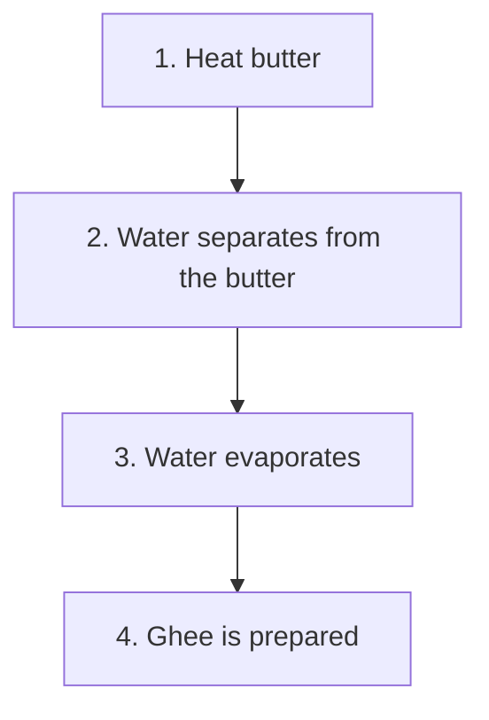

# Health and Well-being

## About the Unit

This unit at the preparatory stage familiarises students with different types of food, importance of balanced food, healthcare, and maintaining good health with regular exercise and rest. Students also learn how traditional agricultural, and cultural practices supported health and well-being in sync with changes in seasons.

This unit in Grade 5 helps students explore how everyday choices support personal and collective well-being. Students learn how to take care of food and explore various traditional Indian methods of food preservation. They learn about the role of good microbes and cultural practices that help keep the food safe.

This unit also encourages students to take care of their home and surroundings for better health. They learn how to make their school a greener, cleaner and more caring place through actions like waste management, water conservation, and practising kindness.

An illustration shows an elderly woman sitting on a woven mat outdoors with two young children, a girl and a boy. The woman, dressed in a red sari, is gesturing with her hand as she speaks to the children, who are listening attentively. In front of them are two large glass jars filled with preserved food items. On a white cloth spread on the ground, many small, round, yellow food items, possibly papads or sun-dried snacks, are laid out to dry. There are also some green leaves on a pink paper nearby. The background features a large green tree, some bushes, and a small traditional house with a thatched roof, set against a landscape of distant hills under a clear sky.

# Note to the Teacher

This unit consists of two chapters. Chapter 3 ‘The Mystery of Food’ and Chapter 4 ‘Our School—A Happy Place’.

## Chapter 3: The Mystery of Food

* ‘The Mystery of Food’ follows detective Disha as she explores how food spoils due to microbes and why certain foods last longer. It covers the science behind food preservation, various preservation methods and their cultural significance. It also touches on the role of good microbes, the importance of proper food storage, and consumption in promoting health, and hygiene.

## Chapter 4: Our School—A Happy Place

* ‘Our School—A Happy Place’ introduces the idea of green school—a space that is clean, safe and caring for students, teachers, and the environment. Students are encouraged to reflect on improving their school through waste management, water conservation and tree plantation, while learning the importance of kindness, respect and positive behaviour in creating a pleasant school environment.

An illustration at the bottom of the page shows a vibrant school scene. A single-story school building with a red roof and the word "SCHOOL" on a sign above the entrance is surrounded by a green lawn. Children are seen playing: two boys are playing with a red ball, a girl is running, and another child is on a slide. There are small trees, bushes, and birds flying in the sky, creating a cheerful atmosphere.

An illustration in the top right corner shows a teacher in a pink saree and yellow blouse, smiling and gesturing towards a globe.

## How to Facilitate

* Encourage active observation and experimentation. Help students record their findings in a ‘Food Detective’ or ‘School Explorer’ notebook.
* Guide students in sharing personal stories or small-group discussions based on their family’s food habits, or preservation techniques.
* Encourage students to explore and share any local or cultural traditions related to food preservation.
* Use real objects and school areas (like the kitchen, garden or corridors) as learning spaces.
* Arrange for students to interact with elders, kitchen staff, recyclers or local vendors to learn about food preservation, waste management, and community practices.
* Motivate students to think critically about their food habits, the role of microbes in health, and how these concepts relate to environmental sustainability.

[An illustration at the top of the page shows an elderly woman and two children sitting on a mat outdoors under a tree. They are spreading out small, round food items (possibly papads) on a cloth to dry in the sun. Three glass jars containing preserved food items are placed on the mat next to them. In the background, there are rolling hills and greenery.]

# 3 The Mystery of Food

## Food Spoilage

### The Forgotten Tiffin Box!

It was a sunny Monday morning. Disha was a curious girl, always eager to explore things around her. She found the lunch box she had forgotten in school last Friday. There was one of her favourite foods *uttapam* left in it three days ago, she remembered. When she opened the box, a foul smell came out of it. Her yummy *uttapam* had some coloured patches. What happened to my *uttapam*, she wondered! This was a mystery for Disha.

Disha was eager to find out what had caused it—detective Disha was now ready to solve the mysteries of the world around her. Food is an important part of our world. Disha started her enquiry about the food.

[An illustration at the bottom of the page shows a classroom setting. Disha is sitting at her wooden desk, looking into her open green tiffin box with a concerned expression. Other students are visible at their desks in the background. A "Time Table" chart is hanging on the wall to the left.]

## Mystery #1: What made my uttapam spoil?

As soon as she reached home, Disha ran to her Anna (elder brother in Tamil) Aditya, who was in Grade 8.

“Anna, what are these coloured patches on the food? It does not smell good!”, Disha asked.

He looked and smiled, “That’s mould, Disha. These tiny living things are called microbes, which grew on your food and changed it.”

Disha enquired, “Microbes? Are they like little lice?”.

“Even smaller!”, said Anna. “So tiny, you need an instrument called a microscope to see them; they are everywhere, all around us. They grow on different things and make changes to them. Some microbes help us in making curd and digesting our food. They also change the taste and smell of the uttapam, and other food items. We can see this mould as it is made up of a colony of thousands of microbes.”

The illustration shows Aditya and Disha in a science laboratory. Aditya is pointing towards a microscope on a table. There are several microscopes, a notebook, and a piece of food with mould on it. A circular inset provides a magnified view of various microbes like bacteria and fungi. In the background, a diagram of the human digestive system is visible on the wall.

Disha’s eyes lit up with curiosity. She quickly noted it down in her notebook—

## Finding #1

Microbes: Found in soil, water, the air around us; in plants, animals, and inside us!

### Think

Have you ever had an upset stomach? Do you know what could have caused it? What could happen if spoiled food is eaten by mistake? What did you do to get well? Share your experiences with the class.

## Mystery #2: Why do some foods spoil faster?

That afternoon, Disha noticed a slice of bread that she had left on the balcony for a cat, that did not come for two days. It had coloured patches on it, but the pickles her Paati (grandmother in Tamil) had made two months ago were still delicious as it was covered with oil!

"Strange!", whispered Disha. "Why does some food spoil fast, and some last for a long time?"

### Write

Why do you think food gets spoiled?

_______________________________________________________________

She went back to her Anna and asked, “What do these microbes need to grow?”.

Anna replied, “Microbes need moisture, air and the right temperature to grow. If we remove any one of these, we can stop them in their tracks. All life needs water and air to survive”.

## Finding #2
We need to keep air and water away from the microbes.

# Food Preservation

## Mystery #3: How do we save our food from spoilage?
Detective Disha decided to look for answers at home.

### Let us observe

#### Drying and Dehydration
She saw her Amma (mother) and Appa (father) drying chillies on a mat under the Sun on the balcony. “Why are you drying these, Amma?”, she asked. “To make chilli powder. This should last us for the entire year!”, Amma answered.

An illustration shows a family on a balcony. A man (Appa) is sitting on the left, a woman (Amma) is kneeling in the middle, and a young girl (Disha) is standing on the right. They are spreading out many red chillies on the floor to dry in the sun. There is a small bucket of chillies next to the man.

# Finding #3

Drying in the Sun removes the moisture from the chillies. Without moisture, microbes cannot grow!

## Write

[The image shows four illustrations of food preservation through sun-drying: a basket of round yellow items (possibly papads or dried fruit), people working in a field to dry crops, sliced green and yellow produce spread out, and a basket filled with red chillies.]

What other things are dried so that they remain unspoilt throughout the year?

______________________________________________________________________

## Activity 1

What items can be made from mangoes to enjoy them for longer durations? Write their names in the space given below.

[The following section contains an illustration of a bunch of ripe mangoes on a branch, surrounded by six pink rectangular boxes for user input.]

<table>
  <tbody>
    <tr>
        <td>[ ]</td>
        <td>[ ]</td>
    </tr>
    <tr>
        <td>[ ]</td>
        <td>[ ]</td>
    </tr>
    <tr>
        <td>[ ]</td>
        <td>[ ]</td>
    </tr>
  </tbody>
</table>

[Watermark text diagonally across the page: NCERT not to be republished]

[Vertical text on the left margin:]
Our Wondrous World
44

[Illustration at the bottom of the page shows a group of people, including children, engaged in food preparation and drying activities outdoors.]

# Activity 2
1. Take a tomato and cut it into slices.
2. Put the slices of tomatoes on a tray and place it on the window where the sunlight comes through.
3. What changes did you observe in the fruit?
***
Can you think of a way to preserve items like tomato?

## Let us observe
### Pickling and Oiling
In the kitchen, her Paati was pouring mustard oil into a jar of pickled green mangoes. "But why is oil added to the pickle?", Disha asked eagerly.
"Oil stops air from getting in", Paati explained. "That keeps the pickles safe!"

### Finding #4
Oil keeps out air and stops the growth of microbes.

# Discuss
What would happen to this pickle if no oil had been added?

## Let us observe
### Refrigeration and Freezing
The next morning, Disha opened the fridge. Milk, vegetables, butter and a cake were stored inside.
"Fridges make the temperature too cold for microbes to grow", Appa explained.

An illustration at the bottom of the page shows four people in a rural setting. One person is carrying a basket on their head. Two people are sitting on the ground, working with food items in large flat baskets. A fourth person stands nearby, observing.

### Finding #5
Cold temperature slows down microbes.

> ### Do you know?
> **Matka as a Cooler**
> We use clay pots (*matkas*) to keep water cool.

Why does butter need refrigeration and ghee does not?

**Hint:** Find out how butter and ghee are made at home.

There are many ways to preserve food. Disha’s grandfather told her that people used salt, sugar, and spices like pepper to keep food from spoiling. We still use these methods today.

### Activity 3

Find out about food preservation practices at your family by asking the elders at home. Write at least one such practice.  ___________________________________________________________________________

### Finding #6

There are many ways in which food is being preserved.

> ### Do you know?
>
> 'Black pepper' is a common spice in our homes. In the past, black pepper had become so popular as a spice that Vasco da Gama crossed oceans to collect it from India.
>
> A photograph shows a small heap of dried black peppercorns.

Anna told Disha that in food factories food is preserved in air tight cans and packaging to keep microbes away from the food.

> ### Do you know?
>
> Insects preserved food long before humans did. Solitary wasps, particularly hunting wasps, preserve food for their larvae.
>
> An illustration depicts a yellow and black solitary hunting wasp resting on a green leaf.

### How are Idlis made?

An illustration shows a woman in a kitchen, wearing a red and green saree, placing idli plates into a steamer. A young girl in a white shirt stands beside her, watching intently.

Disha watched her mother make idlis at home. Can you find out how idlis are made? Is there something that makes the idli batter fluffy? Do you know what is it?

An illustration at the bottom of the page shows four children sitting on the ground outdoors, sharing food and interacting with each other.

### Finding #7
Microbes in the air help make idli batter rise.

### Indigestion and Home Remedies
Aditya Anna has an upset stomach after eating food in a fair.

> **Think**
>
> Did you ever have an upset stomach, vomiting or indigestion? Did you use any home remedies? Write about the home remedy given to you.

Have your parents given you curd or some product like buttermilk made from it, for an upset stomach. There are small microbes in curd that join the good microbes in your stomach to help in digestion. If the problem is severe, you may have to consult a doctor and take medicines.

### Finding #8
Sometimes, bad eating habits can also lead to indigestion.

Disha’s notebook was now full of her findings.

### My Food, My Pride
During her investigations, Disha learned that there are many traditional practices related to food being passed on from one generation to another in the family.

She made her detective case diary on ‘My Food, My Pride’. Let us look at some new entries in Disha’s diary and help her complete some of them.

An illustration at the bottom of the page depicts a family gathering outdoors. Two women and two children are seated on the ground, engaged in preparing or sorting food items in large woven baskets. Another child stands nearby, holding a glass.

# A Visit to the Vegetable Market

Thatha (grandfather) goes to the vegetable market daily. He buys fresh fruits and vegetables. It was fun to be in the vegetable market with him. Disha observed how he carefully examined the fruits or vegetables at the market before he bought them.

## Activity 4

> Do you ever accompany your elders for buying vegetables and fruits? During such visits, observe how elders select fruits and vegetables in the market.
> 
> Write one thing that you learnt from your shopping trip and write it as a Finding #9, the way Disha would write.

# The Joy of Eating Seasonal Fruits!

It was raining. Appa bought lychees on his way home. Disha exclaimed with delight, “Yummy lychees, after almost a year!”. Appa said, “Lychee is a seasonal fruit so we need to wait for it!”. Disha could see the joy on everyone’s face as they peeled and shared the delicious fruits with each other.

An illustration shows a family gathered in a living room. A grandmother sits on a traditional indoor swing (jhoola), while a grandfather, a father, a mother, and two children sit around her on the floor. They are all smiling and enjoying fresh lychees together. A small pile of lychees is on the floor in front of them.

Appa added, “But nothing to beat our local mangoes, they are so fresh because they did not have to travel far to reach us!”.

> In the Northeast region of India, bamboo is used in making houses and in cooking. Tender bamboo shoots can be turned into tasty curries.

An illustration at the bottom of the page shows children outdoors, some sitting and some standing, with baskets containing small round items, possibly fruits or seeds.

# Finding #9
Fruits taste best when they are eaten in their season. Waiting for them increases the joy.

## Write
Name three seasonal fruits or vegetables of your region. For example, *amla* in winter and *jamun* in summer.
___________________________________________________________________________
___________________________________________________________________________

# Chew Right!

## Investigation: What happens to food inside your mouth?
Detective Disha was not done solving mysteries yet. "What happens to food after we eat it?", she wondered. She looked in the mirror, opened her mouth wide and said, "Aaaaah!".

## Activity 5
> When you eat, try chewing each item properly till it breaks down into smaller pieces and then into mush. Which teeth did you use to cut and chew? Look at the diagram given on the next page and name them.
> ___________________________________________________________________________
> ___________________________________________________________________________

An illustration at the bottom of the page shows a group of people, including adults and children, sitting together outdoors and working on food preparation. They are peeling or processing small items into large woven baskets. There are several jars and containers around them, and a small child is standing nearby holding a bowl.

# Teeth and Chewing

Anna said, “We have different teeth—incisors to cut, canines to tear, premolars to crush and molars to grind”.

<table>
  <tbody>
    <tr>
        <td colspan="3">Incisor</td>
        <td></td>
    </tr>
    <tr>
        <td>Canine</td>
        <td rowspan="4">(Illustration of an open mouth showing the arrangement of teeth)</td>
        <td>Canine</td>
        <td></td>
    </tr>
    <tr>
        <td>Premolar</td>
        <td>Premolar</td>
        <td></td>
    </tr>
    <tr>
        <td>Molar</td>
        <td>Molar</td>
        <td></td>
    </tr>
    <tr>
        <td>Premolar</td>
        <td>Premolar</td>
        <td></td>
    </tr>
    <tr>
        <td></td>
        <td colspan="3">Canine Incisor Canine</td>
    </tr>
  </tbody>
</table>
Types of teeth

Disha wondered whether more saliva come out when you chew the food for long.

---

“And chewing properly releases saliva which helps digest the food”, he added.

> *Eating with your hands is common in India, it helps you feel the texture of food, and prepares your stomach for digestion!*

An illustration at the bottom of the page shows a group of children sitting together outdoors on the grass, sharing a meal and eating with their hands.

NCERT not to be republished

### Finding #10
Chewing food properly breaks down the food and releases saliva which helps in digestion.

### Finding #11
Different types of teeth have different uses.

## Oral Hygiene
Disha was having a toothache. She visited the dentist with her parents. The doctor found a cavity—a hole in the tooth and treated it.

“Rinse your mouth after eating. Brush your teeth regularly”, the dentist advised. “Eat fewer sweets.”

### Finding #12
Oral hygiene is important. For a dental check-up or if any of your teeth are aching, you may need to see a dentist.

## The Danger of Choking
“Do not gulp down your food!”, warned Amma at dinner. “Chew your food properly!”

### Finding #13
I must eat my food slowly to avoid choking on it.

> **Note to the Teacher**
> The teacher needs to make sure to bring learner’s attention towards taking smaller mouthfuls and chewing them properly before swallowing. Also, advise them to avoid talking or laughing with food in their mouth.

An illustration at the bottom of the page shows a group of people, including adults and children, sitting outdoors and working together. They appear to be processing food, possibly drying grains or seeds on large flat baskets.

# ? Write

How can you avoid choking?

___________________________________________________________________________

___________________________________________________________________________

___________________________________________________________________________

# Food in Our Body

## Final Discovery

Some microbes spoil our food while some help us to make food items. They also help us digest food.

Finally, the food mystery was solved.

Eat right, preserve and store right, and also chew well and thank the good microbes.

Mystery solved! Detective Disha closed her notebook with a smile.

> Fermented rice (called pakhala, kanji, etc.) is eaten in many parts of India, it cools the body and is full of good bacteria!

## Let us reflect

1. Why do some food items last for weeks and others spoil in just a few days?
2. You are going on a field trip for two days. List five food items you will carry. How will you keep them from getting spoiled?
3. What if food cannot be preserved? Imagine a world without food preservation and discuss the consequences.

An illustration at the bottom of the page shows a family or group of people engaged in traditional food preservation. Two children are sitting on the ground, spreading food items onto a large, flat, woven basket to dry in the sun. A woman sits nearby, carefully placing prepared food into glass jars, with several already filled jars lined up on the ground. A boy stands to the side, holding a small bowl.

4. Match the following.
Which method is used to preserve the following food items (A) to make the final product (B)?

*Note: A diagonal watermark across the table reads "© NCERT not to be republished".*

<table>
  <thead>
    <tr>
        <th>Item (A)</th>
        <th>Methods of Preservation</th>
        <th>Product (B)</th>
    </tr>
  </thead>
  <tbody>
    <tr>
        <td>*Roti*</td>
        <td>Dehydration</td>
        <td>*Khakhra*</td>
    </tr>
    <tr>
        <td>*Papad*</td>
        <td>Dried in sun</td>
        <td>Dried *papads*</td>
    </tr>
    <tr>
        <td>Mango</td>
        <td></td>
        <td>*Aam papad*</td>
    </tr>
    <tr>
        <td>Lemon</td>
        <td></td>
        <td>Lemon pickle</td>
    </tr>
    <tr>
        <td>Butter</td>
        <td></td>
        <td>Ghee</td>
    </tr>
    <tr>
        <td>Juice</td>
        <td></td>
        <td>Canned juice</td>
    </tr>
    <tr>
        <td>Chillies</td>
        <td></td>
        <td>Chilli powder</td>
    </tr>
    <tr>
        <td>Fish</td>
        <td></td>
        <td>Dried fish</td>
    </tr>
  </tbody>
</table>

An illustration at the bottom of the page shows a community or family activity involving food preservation. Two women and two children are outdoors; one woman is pouring liquid from a pot, another woman and two children are sitting on a mat spreading out food items to dry in the sun. Several glass jars containing preserved food are visible on the ground.