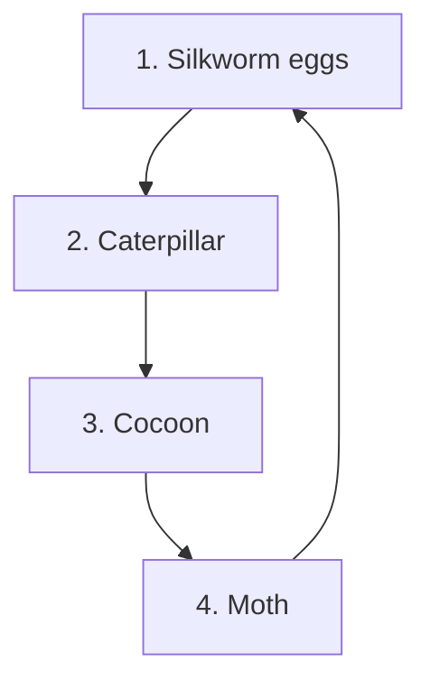

0535CH08

An illustration at the top of the page depicts several people engaged in traditional textile-making activities. A woman in a white and red sari is spinning thread using a charkha (spinning wheel). Next to her, a woman in a blue outfit is knitting with orange yarn. A man in a purple shirt is weaving on a small wooden handloom. To the right, two women are working with raw fibers, one pulling them into long strands.

# 8 Clothes—How Things are Made

## Patterns with Threads

Look closely around you. Do you see birds building nests or spiders spinning webs? Nature is full of hidden artists—animals, birds and insects who weave, stitch, design, and even glue things together. What do you see in the picture below?

An illustration shows a weaver bird with a yellow head and brown body perched on a branch. Next to it are two large, intricately woven nests hanging from the branches of a leafy tree. The nests are elongated and bulbous, made from tightly interwoven strands of grass or twigs.

Did you know we have a hidden artist around us who has been weaving long before humans ever did?

A small illustration at the bottom right shows a group of children and adults in a park-like setting, observing nature and birds.

The Indian handloom sector employs over 45 lakh people, especially women and rural artisans, making it one of the largest cottage industries in the world.

The male baya weaver is a weaverbird, who builds beautiful hanging nests from grass. They weave the strands over and under to make the nest strong. The nest is shaped like a pouch and hangs from the branches of a tree. The expert weaverbird weaves very fine nests, while the young ones who are just learning make rather rough ones.

Weaving combines strips or threads of a material into a patterned fabric like cloth. One set of thread is placed vertically and the other goes horizontally. When these threads are carefully crossed over and under each other, they form a unified fabric such as a mat, a basket or many other things.

NCERT not to be republished

The page contains several illustrations of weaving:
- A woman weaving a large green basket under a bamboo structure.
- A close-up of hands weaving green leaves.
- A traditional woven winnowing tray.
- A small woven hand fan.
- A person kneeling on a brick floor, weaving a large mat from long green palm leaves.
- Two people sitting on the floor, one weaving a basket and the other working on a small woven stool.

For a long time, people have been weaving many kinds of natural materials into mats, baskets or sheets from coconut fibre or palm reeds, bamboo, grass, jute and cotton or silk.

# Discuss

Have you seen products woven out of natural material at home or elsewhere? What are they?

# Activity 1

1. Take 5–6 strips of blue paper and tape them at the top of a surface.
2. Take another set of yellow paper strips and weave them through—over, under, over, under.
3. Keep repeating until you get a mat.
4. Can you use this method to make a basket?

The following illustrations show the steps of weaving:
- Five blue vertical strips are taped at the top.
- A yellow horizontal strip is woven through the blue strips in an over-under pattern.
- Multiple yellow horizontal strips are woven through, creating a grid pattern.
- A completed square mat with a blue and yellow checkerboard pattern.

Try using materials other than paper, such as strings, ropes, ribbons or reeds.

The page includes several examples of woven items:
- A photograph of three small, handmade woven baskets of different sizes and patterns.
- An illustration of a small green and yellow woven basket with a handle.
- An illustration of an oval-shaped mat with a red and blue woven center.
- An illustration of a hand holding a small, green woven object made from leaves.

> Indian muslin was so fine that it was known as 'woven air' and a whole saree could pass through a ring.

Clothes — How Things are Made

> ### ? Think
>
> [An illustration shows a young boy sitting on a wooden stool, holding and examining a piece of blue cloth.]
>
> What can you find in your classroom that is woven? If we weave with threads instead of paper strips, it becomes cloth.

### Activity 2

> Look at a piece of cloth through a magnifying glass or by using zoom on a mobile phone camera. It could be a shirt or something you are wearing. Can you see the amazing criss-cross pattern?
>
> [An illustration shows a pink t-shirt. A magnifying glass is held over the chest area of the shirt, revealing a detailed close-up of the woven criss-cross pattern of the fabric.]

## Traditions of Weaving

[An illustration depicts the interior of a traditional weaving workshop. Several large, wooden handlooms are arranged in rows. Each loom has threads stretched vertically, and some have partially woven white cloth on them. The room has high ceilings with hanging lamps.]

People in India knew how to weave even 4,000 years ago! Traditional weaving is done by hand on an instrument called loom. The cloth made this way is called the handloom fabric. India has some of the best handloom weavers, who are experts at their craft.

> ### ? Do you know?
>
> There are many handloom traditions in India, each with its unique technique and pattern like *Kanjeevaram* from Tamil Nadu, *Pashmina* from Kashmir, and *Ikat* from Odisha and Gujarat.

[At the bottom left, there is a small illustration of people, including children and adults, in a park or garden setting with trees.]

An illustration shows two people, a woman in a red sari and an elderly man in a white shirt, working on traditional wooden handlooms to weave fabric.

> [Vertical text in right margin]: India was the first country to cultivate and use cotton to make clothes, revolutionising textiles worldwide.

Weaving is not just about making clothes. It also provides work to many families, and keeps our traditional skills and designs alive. That is why weaving is so special for India—both for its culture and for the people who depend on it for their livelihood.

Textile mills use modern machines to spin thread and weave cloth in large quantities.

## Thread

We have seen how threads can be woven together to form a cloth. But how are threads made?

### Activity 3

*   Take a ball of cotton and gently pull it out to make a strand.
*   Now, try twisting the strand slowly with your fingers. Notice how it becomes stronger as you pull it in a spin.
*   Take a pencil. Now, wind your cotton strand onto your pencil, by twisting and adding more cotton to your ball.

An illustration of a spindle (takli) with white cotton thread wound around its shaft is shown next to the activity steps.

This process of twisting cotton fibres together to make thread or yarn is called spinning. A *charkha* or spinning wheel, helps to spin the thread from cotton, just like the pencil does.

This thin hair-like thread you get when untwisting the cotton strand is called a fibre.

> **Do you know?**
>
> Gandhi ji showed us how important it is for us to become self-sufficient. Knowing how to make our own cloth by spinning thread from cotton and weaving it into a fabric, became a symbol of the freedom struggle and the path to becoming *atmanirbhar*. The cloth made this way is known as khadi.

We do not get fibres only from cotton. There are many other natural sources too.

### Natural fibres

The following are examples of natural fibres:
- Bamboo (represented by an illustration of bamboo stalks)
- Cotton (represented by an illustration of a cotton boll)
- Linen (represented by an illustration of a blue flax flower)
- Wool (represented by an illustration of a sheep)
- Silk (represented by an illustration of a silk cocoon)

<table>
  <tbody>
    <tr>
        <td>Bamboo</td>
        <td>Cotton</td>
        <td>Linen</td>
        <td>Wool</td>
        <td>Silk</td>
    </tr>
  </tbody>
</table>

Silk comes from the cocoon of a small insect called the silk moth. The cocoons are put in hot water, the silk thread is gently pulled out, and then made into thread that is used to make silk fabric.

> **Note to the Teacher**
>
> The teacher may arrange a visit to a textile mill or a place where handloom cloth is made. Otherwise, the teacher may invite a local handloom weaver to the school.

> India is the largest producer of jute in the world.

### Life cycle of Silkworm

Synthetic fibres are made by humans using artificial materials. We all use things made from both natural and synthetic fibres.

### Synthetic fibres

*   **Nylon**: A bundle of blue and teal synthetic fibres.
*   **Rayon**: A bundle of multi-colored (blue, brown, gold) synthetic fibres.
*   **Polyster**: Several fluffy balls of synthetic fibre in various colors (blue, red, yellow, white, green).
*   **Terylene**: A folded piece of orange and pink synthetic fabric.

> **Note to the Teacher**
>
> The teacher may introduce the 'life cycle' as the pattern of growth and change that every living thing goes through—from birth and growth to death. For example, a butterfly or a mango tree. Show pictures or videos to make it engaging and relatable.

# Activity 4

Look at some clothes, bags or other things you use every day. List some of the materials that you have used. Are they made from natural or synthetic fibres? Then, write one thing you like about it in the table below.

<table>
  <thead>
    <tr>
        <th>Item</th>
        <th>Natural</th>
        <th>Synthetic</th>
        <th>What I Like About It?</th>
    </tr>
  </thead>
</table>

## Crafting with Needle and Thread

Nature is full of amazing things.

Do you know that there is a tiny little green bird that stitches its own nest?

It is the tailorbird.

With its beak, it sews the edges of a big leaf together by using plant fibres or spider silk. It pokes holes along the edge of the leaf and pulls the thread through its beak like how tailors sew a cloth with a needle and thread to make

An illustration shows a tailorbird perched on a vine, using its beak to sew large green leaves together with thin white fibres. Inside the leaf-nest, a small chick is visible. The background consists of a soft green foliage pattern.

At the bottom left, there is a vertical sidebar containing the text "Our Wondrous World" and the page number "138". Below this, there is a small illustration of people and children in a park setting with trees.

a sleeve. It pads up this green sleeve to make a soft and safe nest to lay its eggs, and raise its babies.

> Pashmina wool comes from a special goat called the Changthangi, found high in the cold mountains of Ladakh. People hand-spin and weave this wool into very soft shawls.

## Activity 5

In small groups, collect fresh leaves of *palash*, teak, jackfruit or similar broad leaves. If leaves are not available, try using paper.

Also, collect some small twigs like toothpicks.

Now, using the leaves or pieces of paper and the toothpicks, pin them together to create a plate or a spoon.

The illustrations show the process of making a leaf plate:
- A finished bowl-shaped plate made of several overlapping brown and green leaves.
- Hands holding and overlapping green leaves.
- A single green leaf with a small twig pinned through it.

## Activity 6

Have you ever tried stitching? You will need a needle and thread to stitch a piece of fabric together. Can you fix a tear or sew a button? Let us learn simple stitching.

### Think

1. Have you ever seen someone stitching at home or in your neighbourhood? What were they making or fixing?
2. Look at your shirt or school bag. Can you find where the pieces have been stitched together?

At the bottom right corner, there is an illustration of people sitting and walking in a park with green trees.

# Activity 7

Let us begin by learning the basic running stitch.

The diagram illustrates a running stitch on a piece of fabric. A blue thread is shown passing through the cloth at specific points:
- **Point A**: Needle comes up from the back.
- **Point B**: Needle goes down into the cloth.
- **Point C**: Needle comes up again.
- **Point D**: Needle goes down again.
The process continues in a straight line, creating a series of dashed stitches. A needle is shown at the end of the thread.

1. Take a piece of thread through a needle. Tie a knot at one end of the thread.
2. Start from the back of the cloth. Bring the needle up at Point A.
3. Push the needle down at Point B.
4. Bring it up at Point C, then down at Point D.
5. Keep going—up, down, up, down—in a straight line.
6. This is called a running stitch.

# Activity 8

## Stitching Clothes Together

Now, let us use this stitch to bring two pieces of cloth together.

1. Collect small cloth pieces left over at a tailor’s shop or some pieces of old cloth.
2. Lay one piece of cloth flat on the table. Place the second piece of cloth on top of it, slightly overlapping it.

> ### Note to the Teacher
> Stitching with a needle and thread must be done carefully. Show the steps slowly and keep a close watch. Students should not play with needles — handle with caution to avoid injury. Clear instructions need to be given to the students before the activity.

3. Now, use a needle and thread to do a simple running stitch to join them together.
4. Add more pieces to create a table cloth, mat, coaster, cleaning cloth or any material of your interest.

The illustrations show hands holding various colorful fabric scraps, hands using a needle and thread to sew two pieces of white fabric together, and four examples of different fabric patterns: one with blue and white circles, one with green and white stripes, one with yellow and red dots, and one with red and white floral patterns.

Where else can we use running stitches in daily life?
__________________________________________________________________

If one thread breaks in your stitching, what do you think will happen to the rest of the stitches?
__________________________________________________________________

## Stitch and Decorate

Did you know that in different parts of India, people use many different kinds of stitches? Not just to join cloth, but to decorate it beautifully too. Each stitch tells us a story of a place, people and their tradition.

Bandhani is a type of tie-dye where small parts of the cloth are tied and dyed to make dots, circles, and patterns. It is done by hand using just fingers and thread.

<table>
  <thead>
    <tr>
        <th></th>
        <th colspan="4">Traditional Embroideries of India and Their Origin</th>
    </tr>
  </thead>
  <tbody>
    <tr>
        <td>1.</td>
        <td>An illustration shows a hand using a needle and thread to embroider a floral pattern on a light green fabric.</td>
        <td>Chikan or Chikankari</td>
        <td>Originated from Lucknow, Uttar Pradesh</td>
        <td></td>
    </tr>
    <tr>
        <td>2.</td>
        <td>An illustration shows a hand embroidering a colorful pattern with small mirrors on a red fabric.</td>
        <td>Banjara</td>
        <td>Originated from Rajasthan</td>
        <td></td>
    </tr>
  </tbody>
</table>

An illustration at the bottom shows a group of people, including children and adults, in a park or garden setting with trees and bushes.

Kala (black) cotton grows without chemicals or extra water. It is hand-spun and woven into strong, eco-friendly fabric by weavers in Gujarat.

<table>
  <thead>
    <tr>
        <th>3.</th>
        <th>[Image of Kantha embroidery: A white fabric with colorful floral and leaf patterns stitched in red, yellow, and green.]</th>
        <th>*Kantha*</th>
        <th>Originated from East Indian states like West Bengal, Odisha and Tripura</th>
    </tr>
  </thead>
  <tbody>
    <tr>
        <td>4.</td>
        <td>[Image of Gota embroidery: A yellow fabric with intricate gold and orange circular patterns and a decorative border.]</td>
        <td>*Gota*</td>
        <td>Originated from Rajasthan</td>
    </tr>
    <tr>
        <td>5.</td>
        <td>[Image of Phulkari embroidery: A blue fabric with geometric patterns in bright colors like orange, yellow, and red.]</td>
        <td>*Phulkari*</td>
        <td>Originated from Punjab</td>
    </tr>
    <tr>
        <td>6.</td>
        <td>[Image of Toda embroidery: A black fabric with red and black geometric patterns, featuring a central red section.]</td>
        <td>*Toda*</td>
        <td>Originated from Tamil Nadu</td>
    </tr>
    <tr>
        <td>7.</td>
        <td>[Image of Kashmiri embroidery: A black fabric with intricate paisley and floral patterns in various colors.]</td>
        <td>*Kashmiri*</td>
        <td>Originated from Kashmir</td>
    </tr>
    <tr>
        <td>8.</td>
        <td>[Image of Khneng embroidery: A person's hands working on a piece of dark fabric with colorful floral embroidery.]</td>
        <td>*Khneng embroidery*</td>
        <td>Originated from Meghalaya</td>
    </tr>
  </tbody>
</table>

## Recycle

People in our country rarely throw clothes. If the clothes no longer fit us, we usually give them over to a younger sibling or to anyone who can use them. Sometimes an elder may make something else from it. There is also an old tradition in our country of making beautiful quilts by joining small pieces together.

# Exhibition

You have created a set of wonderful materials. Display your mats, stitched cloth pieces and leaf cutlery. Add name tags and short notes explaining how you made them. Invite other classmates or your parents to visit.

> Handloom weaving supports thousands of families, and uses no electricity, making it eco-friendly and sustainable.

The illustration shows an exhibition display window. Inside, three long, decorated dresses are displayed on hangers. On a table in front of the dresses, there are several small items, likely the mats and leaf cutlery mentioned in the text, each accompanied by a small identification card.

## Let us reflect

1. Have you ever reused or recycled an old piece of cloth? What did you or your family make from it?
2. If one thread breaks in a stitched cloth or in a woven mat, what might happen? Why is each thread important?
3. Visit a tailor’s shop or a handloom store with an adult. What tools or machines did you see being used there?
4. Find out what kind of weaving or stitching work is famous in your area or state. Name it.
5. We should not throw the old clothes away. Why?
6. Below are the jumbled-up steps of the life cycle of a moth. Read and number them from 1 to 6 in the correct order.
   [ ] Adult moth comes out of the cocoon.
   [ ] Eggs hatch into tiny caterpillars.
   [ ] Silk moth lays eggs.
   [ ] The cycle begins again.
   [ ] Caterpillars eat mulberry leaves and grow big.
   [ ] Caterpillars spin cocoons around themselves.

Clothes—How Things are Made

An illustration at the bottom right shows children playing and interacting in a green park with trees.

7. Bring 5–6 pieces of different types of clothes from home or nearby tailors (leftover scraps). Observe the material closely and complete the table. Ask an elder or search in your book to find out whether it is made from cotton, wool, silk, jute, polyester or nylon.

<table>
  <thead>
    <tr>
        <th>Cloth Piece No.</th>
        <th>How does it feel? (smooth, rough)</th>
        <th>Thick/ Thin</th>
        <th>Shiny (Yes/ No)</th>
        <th>Stretchy (Yes/ No)</th>
        <th>What do you think it is made of?</th>
    </tr>
  </thead>
  <tbody>
    <tr>
        <td>1</td>
        <td></td>
        <td></td>
        <td></td>
        <td></td>
        <td></td>
    </tr>
    <tr>
        <td>2</td>
        <td></td>
        <td></td>
        <td></td>
        <td></td>
        <td></td>
    </tr>
    <tr>
        <td>3</td>
        <td></td>
        <td></td>
        <td></td>
        <td></td>
        <td></td>
    </tr>
    <tr>
        <td>4</td>
        <td></td>
        <td></td>
        <td></td>
        <td></td>
        <td></td>
    </tr>
    <tr>
        <td>5</td>
        <td colspan="5"></td>
    </tr>
  </tbody>
</table>

An illustration shows a group of people enjoying a day in a park with lush green trees and grass. On the left, an elderly man wearing a blue turban and white traditional clothing sits on a wooden seesaw opposite a young girl in a pink shirt and brown pants. In the center, a boy in white traditional attire runs while flying a yellow and orange kite. To his right, a boy in a blue t-shirt plays with an orange ball, followed by a girl in a red and orange saree running, and a boy in a purple shirt and white shorts also running. Two purple birds are flying in the sky. At the bottom left, a smaller inset illustration shows more people walking and playing in a similar park setting.